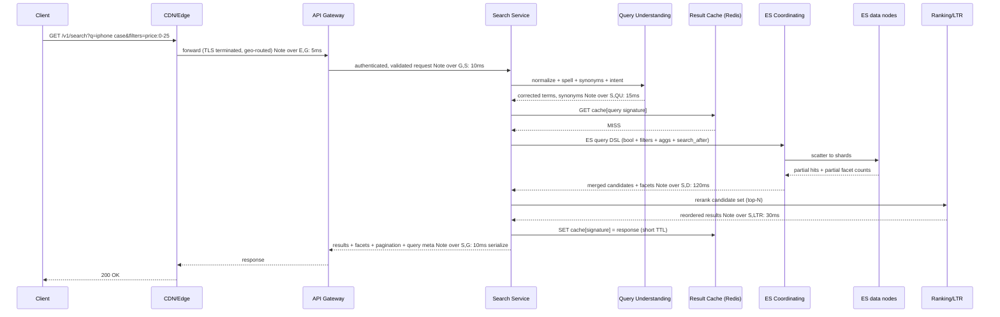
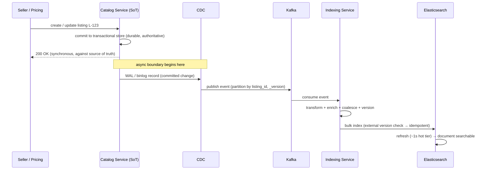

# Chapter 5 — High-Level Design

In Chapters 1–4 we did the disciplined groundwork: we scoped the problem
(Chapter 1), turned it into numbers — ~35K average / ~100K peak search QPS,
10B documents, ~20 TB raw corpus, ~100K catalog writes/sec (Chapter 2) —
locked down the API surface (Chapter 3), and settled the product-listing
document and its source-of-truth question (Chapter 4). This chapter is where
those pieces snap together into a single picture. By the end you should be
able to walk up to a whiteboard, draw GlobalMart Search from memory, and
narrate a search request and an indexing event end-to-end without hand-waving.

The design has one organizing idea that everything else hangs from:
**the read path and the write path are separate systems that meet only inside
Elasticsearch.** Buyers search a fast, read-optimized, horizontally-scaled
index. Sellers and pricing systems write to a transactional store that is the
real source of truth. A pipeline asynchronously projects those writes into the
search index. If you internalize that split, the rest of the architecture is
mostly a matter of naming the boxes and being honest about the boundaries
between them.

---

## 5.1 The End-to-End Architecture

Let's start with the canonical diagram from the design brief (§5) and then
expand it. Here is the brief's picture, reproduced faithfully:

```
                         ┌──────────── Search (read) path ────────────┐
Client ─▶ CDN/Edge ─▶ API Gateway ─▶ Search Service ─▶ ES Coordinating nodes ─▶ ES data nodes
                                        │   ├─ Query Understanding (spell, synonyms, tokenize)
                                        │   ├─ Result Cache (Redis)
                                        │   └─ Ranking / Learning-to-Rank reranker
                                        └─ returns results + facets

                         ┌──────────── Indexing (write) path ─────────┐
Catalog Service (source of truth) ─▶ CDC ─▶ Kafka ─▶ Indexing Service ─▶ ES bulk API ─▶ ES
   (product/price/inventory changes)             (transform, enrich, dedupe, version)
```

That is the skeleton every later chapter refers back to. Now let's put flesh on
it. The expanded diagram below keeps the exact component names but shows the
shared Elasticsearch cluster in the middle where the two paths converge, the
supporting stores, and the observability plane:

```
                          ╔═══════════════════════════════════════════════╗
   READ PATH (buyers)     ║                                               ║      WRITE PATH (sellers/pricing)
                          ║                                               ║
  ┌────────┐              ║                                               ║              ┌───────────────────┐
  │ Client │              ║                                               ║              │  Catalog Service  │
  │ (app/  │              ║              ELASTICSEARCH CLUSTER            ║              │ (source of truth: │
  │  web)  │              ║   ┌───────────────────────────────────────┐  ║              │  sharded SQL /    │
  └───┬────┘              ║   │  Coordinating nodes  (query routers)  │  ║              │  NoSQL doc store) │
      │                   ║   ├───────────────────────────────────────┤  ║              └─────────┬─────────┘
      ▼                   ║   │  data-hot   data-hot   data-hot  ...   │  ║                        │ commit
  ┌────────┐              ║   │  data-warm  data-warm    (~60–100)    │  ║                        ▼
  │CDN/Edge│              ║   │  3 × dedicated master nodes           │  ║              ┌───────────────────┐
  └───┬────┘              ║   └───────────────▲───────────────▲───────┘  ║              │       CDC         │
      │                   ╚═══════════════════╪═══════════════╪══════════╝              │ (binlog/changefeed│
      ▼                                       │ scatter-gather│ bulk index             │  tailer)          │
  ┌────────────┐          ┌──────────────┐    │               │                        └─────────┬─────────┘
  │ API Gateway│─────────▶│Search Service│────┘               │                                  │ events
  │(TLS, auth, │          │(orchestrator)│                    │                                  ▼
  │ throttle)  │          └──┬────┬────┬──┘                   │                        ┌───────────────────┐
  └────────────┘             │    │    │                      │                        │      Kafka        │
                             │    │    │                      │                        │ (partitioned log, │
              ┌──────────────┘    │    └───────────┐          │                        │  by listing_id)   │
              ▼                    ▼                ▼          │                        └─────────┬─────────┘
      ┌───────────────┐   ┌──────────────┐  ┌─────────────┐   │                                  │ consume
      │Query          │   │Result Cache  │  │Ranking /LTR │   │                        ┌─────────────────────┐
      │Understanding  │   │  (Redis)     │  │  reranker   │   └────────────────────────│  Indexing Service   │
      │(spell,synonym,│   └──────────────┘  └─────────────┘                            │ (transform, enrich, │
      │ tokenize)     │                                                                │  dedupe, version)   │
      └───────────────┘                                                                └─────────────────────┘

     ── Observability plane (all components): metrics, tracing, structured logs, DLQ dashboards ──
```

### The design philosophy

Three principles justify almost every box and arrow above. State them out loud
in an interview; they signal seniority far more than the boxes themselves.

**1. Separate read and write paths (CQRS-like).** Search reads and catalog
writes have almost nothing in common. Reads are latency-critical
(p99 ≤ 200 ms), fan-out-heavy (one query hits hundreds of shards), and
must survive at 99.99% because they are directly revenue-generating. Writes
are throughput-heavy (~100K mutations/sec, mostly price/inventory), can
tolerate a second of lag, and are allowed to fall behind briefly under load.
Optimizing one path punishes the other if they share machinery. So we split
them into two pipelines that are scaled, deployed, and failure-isolated
independently, and let them meet only at the Elasticsearch index.

**2. Elasticsearch is a derived, rebuildable index — never the source of
truth.** The authoritative product/price/inventory data lives in the Catalog
Service's transactional store (Chapter 4). Elasticsearch holds a *projection*
of that data, shaped for retrieval and ranking. If the whole cluster burned
down, we could rebuild it from the catalog by replaying a snapshot plus the
Kafka log. This is liberating: we are free to reshape mappings, re-analyze
text, add ranking signals, and re-shard aggressively (Chapter 6's reindex-via-
alias), because we are never risking the only copy of the truth.

**3. Indexing is asynchronous.** A seller's price change does not
synchronously write to Elasticsearch. It commits to the Catalog store, and a
change-data-capture (CDC) pipeline carries it through Kafka to the Indexing
Service and into ES within our ~1s freshness budget. Asynchrony is what lets
the write path absorb 100K writes/sec spikes without ever touching the read
path's latency, and it is the precise place where **eventual consistency**
lives (§5.7). The buyer briefly sees a stale price; that is an accepted
trade-off (NFR6: AP over CP on the search path).

Everything else — caching layers, LTR reranking, hot/warm tiering — is
optimization *on top of* these three decisions.

### Decisions at a glance

Before we walk each box, here is the set of top-level choices this chapter
commits to, each with its one-line justification and the requirement it serves.
An interviewer will appreciate you stating the *shape* of the design before the
detail:

| Decision | Why | Serves |
|---|---|---|
| Separate read & write paths (CQRS-like) | Reads and writes have opposite optimization goals; isolate their failures and scaling | NFR1, NFR2, NFR3 |
| ES as derived, rebuildable index | Frees us to reshape/re-shard/re-analyze; catalog stays authoritative | NFR6, FR8 |
| Async indexing via CDC → Kafka | Absorb 100K writes/sec spikes without touching the read path | NFR4, FR8 |
| Two-phase retrieval + LTR rerank | Can't run a learned model over 10B docs; rank only a candidate set | FR7, NFR5 |
| Stateless services + stateful ES/Kafka/Redis | Scale the cheap tier trivially; concentrate care on data-bearing nodes | NFR3 |
| Three caching tiers | Deflect head traffic before the expensive scatter-gather | NFR1, NFR3 |
| Separate light autocomplete path | 500K QPS of keystrokes must not run the full 200 ms pipeline | NFR1 |
| Multi-region read stack | Latency locality + survive a regional failure | NFR1, NFR2 |

The rest of the chapter is, in effect, the defense of this table.

---

## 5.2 Component Responsibilities

One subsection per canonical component. For each: what it owns, and why it
exists as a separate thing rather than being folded into a neighbor.

### CDN / Edge
**Owns:** TLS termination at the network edge, geographic request routing to
the nearest region, absorbing volumetric DDoS, and serving cacheable responses
(static assets, and a small slice of *extremely* hot, non-personalized search
and autocomplete responses) close to the user.

**Why it exists:** Physics. A buyer in Jakarta should not pay a round-trip to a
US data center for TLS setup. The edge shaves tens of milliseconds off every
request before our budget clock even starts, and it deflects a meaningful
fraction of traffic (popular head queries, repeated autocomplete prefixes) so
it never reaches origin. In the latency budget the edge/LB hop is allotted
**5 ms** — that's the origin-side LB portion; the client↔edge leg is largely
outside our 200 ms server budget but very much inside the user's perceived
latency.

### API Gateway
**Owns:** authentication (validating the buyer's short-lived JWT), rate
limiting and per-tenant throttling, request validation against the API
contract (Chapter 3), TLS, routing to the right backend, and coarse
observability (request logging, tracing headers). For internal indexing
endpoints it enforces **mTLS** service auth rather than JWT.

**Why it exists:** It is the single, hardened front door. Centralizing cross-
cutting concerns here means the Search Service and every other backend can
assume every request that reaches them is authenticated, rate-limited, and
well-formed — they never re-implement auth. Budget: **API + auth ≈ 10 ms**.

### Search Service
**Owns:** orchestration of the entire read path. It is the brain of a search
request but holds **no durable state of its own** (it is horizontally
scalable and disposable). For one `GET /v1/search` it: parses and validates
params, calls Query Understanding, checks the Result Cache, builds the
Elasticsearch query DSL (bool queries, filters, facet aggregations,
`search_after` cursors), sends it to the ES coordinating nodes, hands the
candidate set to the Ranking/LTR reranker, assembles the response
(results + facets + pagination + query metadata), and writes back to cache.

**Why it exists:** Something has to own the *composition* of the many
subsystems a search touches. Keeping that logic in a dedicated stateless
service (rather than smearing it across the gateway or ES plugins) means we can
deploy ranking changes, query-building tweaks, and cache policy independently
and roll them back fast. It is the natural seam for A/B experiments.

### Query Understanding
**Owns:** transforming raw user text into a structured, corrected, enriched
query. Concretely: tokenization/normalization, language/locale detection,
spell correction ("iphn" → "iphone"), synonym expansion
("trainers" ↔ "sneakers"), stop-word and unit handling, and intent hints
(does "under $500" imply a price filter?). It emits the corrected terms and
applied synonyms that the API returns as query metadata (FR6).

**Why it exists:** Relevance quality (NFR5) lives or dies here, and this logic
evolves on its own cadence (new synonym dictionaries, retrained spell models).
Isolating it lets the language/relevance team iterate without redeploying the
Search Service. Budget: **query understanding ≈ 15 ms** — deliberately tight,
so heavy models are precomputed/cached, not run inline per keystroke.

### Result Cache (Redis)
**Owns:** short-TTL caching of fully-assembled search and facet responses,
keyed by a normalized query signature (`q` + filters + sort + page + size +
locale + market). Also backs rate-limit counters and can hold hot autocomplete
results.

**Why it exists:** Search traffic is extremely head-heavy — a small set of
queries ("iphone", "airpods", trending items) make up a large share of volume.
Caching their results turns an expensive scatter-gather + rerank into a
sub-millisecond Redis lookup, cutting both latency and load on the ES cluster.
TTLs are short (seconds to low minutes) to respect freshness. High-level here;
full cache design is **Chapter 9**.

### Ranking Service / LTR reranker
**Owns:** the final ordering of results. Elasticsearch does first-pass
retrieval and scoring (BM25 + business-signal function scoring) to produce a
candidate set (say top few hundred per query). The LTR reranker then applies a
learned model that blends textual relevance with business signals — popularity,
conversion, seller_rating, price competitiveness, availability (FR7) — to
reorder the top-N the buyer actually sees.

**Why it exists:** A learned ranking model is expensive and should only run on
a *candidate set*, not on 10B documents. Splitting retrieval (cheap, in ES)
from reranking (smart, in a dedicated service) is the standard two-phase
pattern. It also lets the ranking team ship model updates independently.
Budget: **ranking/rerank ≈ 30 ms**. Depth in **Chapter 7**.

### Catalog Service
**Owns:** the **source of truth** for products, listings, prices, and
inventory, in a transactional store (sharded SQL or a NoSQL document store,
per Chapter 4). It handles seller writes, enforces invariants, and emits an
authoritative change stream.

**Why it exists:** Someone must hold the authoritative, consistent copy with
real transactions (you cannot oversell inventory on eventual consistency). ES
is explicitly *not* this. The Catalog Service is the head of the write path;
everything downstream is a projection.

### CDC (Change Data Capture)
**Owns:** capturing every committed change in the Catalog store — inserts,
updates, deletes — by tailing the database's write-ahead log / binlog /
changefeed, and publishing those changes as ordered events.

**Why it exists:** It decouples the write path from the Catalog Service without
asking it to do dual-writes. The Catalog Service just commits to its own DB (as
it always would); CDC observes the log and turns it into a stream. This is far
more reliable than application-level "write to DB then publish to Kafka" (which
can lose events on crash between the two). CDC guarantees we capture exactly
what was durably committed. Detail in **Chapter 6**.

### Kafka
**Owns:** the durable, partitioned, replayable event log that buffers changes
between CDC and the Indexing Service. Partitioned by `listing_id` so all events
for one listing land on the same partition and stay ordered.

**Why it exists:** It is the shock absorber and the replay tape. When catalog
writes spike to 100K/sec or the Indexing Service slows, Kafka buffers the
backlog instead of dropping data or backpressuring the Catalog Service. Its
retention lets us **replay** to rebuild an index or recover from a bad
transform. Partition-level ordering plus event versioning is what makes
idempotent, in-order updates possible (Chapter 6).

### Indexing Service
**Owns:** consuming Kafka events and turning them into Elasticsearch documents.
Responsibilities: **transform** (map the catalog row into the listing document
of Chapter 4), **enrich** (attach denormalized fields and ranking signals like
popularity), **dedupe/coalesce** (collapse a burst of price updates for one
listing into the latest), **version** (honor `_version` / external version so a
stale event never overwrites a newer one), and batch into **ES bulk API**
calls.

**Why it exists:** The mapping between "a row changed in SQL" and "a document
should be updated in ES" is non-trivial and stateful (versioning, batching,
retries, DLQ). Concentrating it in one horizontally-scaled consumer group keeps
the Catalog Service and ES ignorant of each other's shapes. Budget-wise this is
off the read path entirely; its SLA is the ~1s freshness target.

### Elasticsearch cluster (coordinating vs data nodes)
**Owns:** the searchable, derived index — inverted indices, doc values, and
completion/edge-ngram structures over ~10B documents, ~600 primary shards + 1
replica (~1,200 shards, ~48 TB on disk).

Node roles matter, so name them explicitly:

| Node role | Owns | Why separate |
|---|---|---|
| **Dedicated master (×3)** | cluster state, shard allocation, index metadata. Never serves queries. | Cluster stability. A busy data node must never be able to destabilize consensus; isolating masters prevents split-brain and GC-induced instability. |
| **Coordinating nodes** | receive the query, scatter it to the right data-shards, gather + merge partial results, return to the Search Service. Hold no data. | They are the query routers / fan-out reducers. Separating them means query coordination CPU doesn't compete with indexing/search on data nodes, and the Search Service has a stable, stateless endpoint to talk to. |
| **data-hot** | recent/popular listings; high-QPS shards on fast NVMe + lots of RAM. | Most queries hit hot data; put it on the fastest hardware. |
| **data-warm** | older / less-popular locales, lower query rate. | Cheaper hardware for cold data; keeps hot tier lean and cost sane. |

Full topology, sharding math, and hot/warm tiering are **Chapters 8 and 9**.
The key HLD point: **coordinating nodes fan out, data nodes hold shards, masters
stay out of the data plane.**

---

## 5.3 The READ (Search) Path — End to End

Now the happy path. A buyer types "iphone case" with a price filter and hits
search. Here is the request, hop by hop, with each hop mapped to the latency
budget (target p99 = 200 ms):

**Walkthrough**

1. **Client → CDN/Edge.** The client issues
   `GET /v1/search?q=iphone+case&filters=price:0-25&locale=en-US&market=US`.
   The edge terminates TLS near the user and routes to the nearest region. For
   a red-hot, non-personalized query the edge may serve a cached response and
   the request ends here. Assume a cache miss. *(Edge/LB ≈ 5 ms of server
   budget.)*
2. **CDN → API Gateway.** The gateway validates the JWT, applies rate limits,
   validates params against the contract, and forwards to the Search Service.
   *(API + auth ≈ 10 ms.)*
3. **Search Service → Query Understanding.** The Search Service asks Query
   Understanding to normalize and enrich: tokenize, detect locale, spell-correct,
   expand synonyms (e.g. "case" → {case, cover, sleeve}), and detect the price
   intent. It returns corrected terms + applied synonyms. *(≈ 15 ms.)*
4. **Search Service → Result Cache (Redis).** The service computes a normalized
   cache key from the understood query + filters + sort + page + locale + market
   and checks Redis. **On hit**, it can skip straight to serialization (huge
   win). Assume **miss**; continue. *(sub-ms.)*
5. **Search Service → ES Coordinating nodes.** The service builds the ES query
   DSL: a `bool` query (must: text match on title/description/brand; filter:
   `price ≤ 25`, `market=US`, `in_stock=true`), facet aggregations
   (category, brand, rating buckets), sort, and a `search_after` cursor for
   paging. It sends this to a coordinating node.
6. **Coordinating → data nodes (scatter-gather).** The coordinating node
   scatters the query to the relevant primary-or-replica shards across data
   nodes, each of which runs retrieval + first-pass scoring (BM25 + function
   scoring on business signals) locally and returns its top candidates plus
   partial facet counts. The coordinating node merges them into a single ranked
   candidate list + merged facets. **This is the dominant cost.** *(ES query,
   scatter-gather ≈ 120 ms.)*
7. **Search Service → Ranking / LTR reranker.** The candidate set (top few
   hundred) goes to the reranker, which applies the learned model to reorder the
   top results the buyer will see, blending relevance with popularity,
   conversion, seller_rating, availability. *(≈ 30 ms.)*
8. **Search Service assembles + caches + responds.** It builds the JSON
   response (results + facets + pagination cursor + query metadata like
   corrected spelling and applied synonyms), writes it to the Result Cache with
   a short TTL, and returns up through the gateway and edge to the client.
   *(serialization ≈ 10 ms; + 10 ms buffer.)*

**Budget roll-up**

| Hop | Component | Budget (p99) |
|---|---|---:|
| 1 | Edge / LB | 5 ms |
| 2 | API Gateway + auth | 10 ms |
| 3 | Query Understanding | 15 ms |
| 5–6 | ES scatter-gather (coordinating + data) | 120 ms |
| 7 | Ranking / LTR rerank | 30 ms |
| 8 | Serialization | 10 ms |
| — | Buffer | 10 ms |
| | **Total** | **200 ms** |

(Step 4, the cache check, is effectively free on the timeline; a cache *hit*
collapses steps 5–7 and returns in ~15–20 ms.)

**Sequence diagram**



Two things to emphasize when narrating this: (a) the ES scatter-gather is
where the milliseconds go, so most read-path optimization (caching, shard
sizing, request routing) targets step 6; and (b) retrieval and ranking are
**two phases** — cheap-and-wide in ES, smart-and-narrow in the reranker.

**The autocomplete sub-path.** `GET /v1/autocomplete` is a deliberately
*different, lighter* read path with a tighter budget (p99 ≤ 100 ms) and much
higher volume (~500K QPS — 5–8 keystrokes per search). It does **not** run the
full pipeline: no LTR rerank, minimal query understanding, and it queries a
purpose-built ES completion/edge-ngram suggester (or a dedicated prefix store)
rather than the full retrieval query. Because the prefix space is small and
head-heavy, autocomplete is aggressively cached at the edge and in Redis, so a
large fraction of keystrokes never reach ES at all. Keeping it a separate path
matters: if every keystroke ran the 200 ms search pipeline, we would multiply
our most expensive path by 5–8× for the least valuable requests. This path is
detailed in **Chapter 7**; at the HLD level, know that it forks off after the
API Gateway and shares only the caching and ES infrastructure.

**A worked cache example (why the Result Cache is the biggest lever).** Search
traffic follows a steep head/tail (Zipf-like) distribution. Suppose the top few
thousand normalized queries account for ~50% of the 100K peak QPS. If the
Result Cache serves those at, say, a 60% hit rate on the head, we deflect on the
order of 30K QPS from the ES cluster — roughly a third of peak — turning each of
those into a sub-millisecond Redis GET instead of a 120 ms scatter-gather. That
single tier both flattens our tail latency (cache hits have almost no variance)
and buys back a large slice of ES capacity, which is exactly why it, not the
compute tier, is where we invest first (§5.6, Chapter 9).

---

## 5.4 The WRITE (Indexing) Path — End to End

The write path never touches the buyer's request. It moves committed catalog
changes into the index within the ~1s freshness budget. Let's trace the two
canonical events. (Depth — versioning internals, transform DSL, bulk tuning,
DLQ — is **Chapter 6**; this is the HLD-level flow.)

### Event A: a price change (the common case, ~100K/sec class)

1. **Seller/pricing system → Catalog Service.** A seller drops the price of
   listing `L-123` from $25 to $19. The Catalog Service **commits the update to
   its transactional store** — this is the durable, authoritative moment. The
   buyer-facing acknowledgement to the seller happens here, synchronously,
   against the source of truth.
2. **Catalog store → CDC.** CDC is tailing the DB's write-ahead log. It observes
   the committed row change and emits an ordered change event:
   `{listing_id: L-123, op: update, fields: {price}, _version: 1235}`.
3. **CDC → Kafka.** The event is published to Kafka, partitioned by
   `listing_id`, so every change for `L-123` is ordered on one partition.
4. **Kafka → Indexing Service.** A consumer in the Indexing Service consumer
   group reads the event. It **coalesces** any burst of price updates for
   `L-123` to the latest, **transforms** it into a partial ES document, and
   attaches the **version** for idempotency.
5. **Indexing Service → ES bulk API.** The change is batched with others into a
   bulk request against the `products` alias. ES applies it with external
   version checking — if a newer `_version` already landed, this stale update is
   dropped (no clobbering).
6. **ES refresh → searchable.** On the next refresh (interval tuned ~1s on the
   hot tier), the updated document becomes visible to search. The buyer now sees
   $19. Total lag: well within the ~1s inventory/price target (FR8/NFR4).

### Event B: a brand-new listing

1. **Seller → Catalog Service.** A seller creates a new listing. The Catalog
   Service assigns a `listing_id`, validates, and commits it to the source of
   truth.
2. **CDC → Kafka.** CDC emits an `insert` event for the new `listing_id`.
3. **Kafka → Indexing Service.** The Indexing Service consumes it, then does the
   heavier **transform + enrich** work a brand-new document needs: build the
   full listing document (Chapter 4 schema), denormalize category_path, attach
   initial ranking signals (popularity may start at a prior/default),
   normalize attributes.
4. **Indexing Service → ES bulk API.** It issues a create (indexed by
   `listing_id`, `_version = 1`) via the bulk API into `products-vN` behind the
   alias.
5. **ES refresh → searchable.** After the next refresh the new listing is
   discoverable. New listings searchable "within seconds" (FR8) — a looser
   target than price changes because a brand-new document is a larger,
   enrich-heavy write.

**Sequence diagram (both events share this shape)**



The critical detail: step "commit to transactional store" is synchronous and
strongly consistent; **everything after it is asynchronous and eventually
consistent.** That vertical line in the diagram is where the consistency model
changes, and it's worth pointing at explicitly in an interview.

**Backpressure and why the write path can't hurt the read path.** The two
events above run at very different rates — a trickle of new listings, a torrent
of price/inventory mutations (~100K/sec peak). Kafka is what makes that torrent
harmless. If the Indexing Service or ES bulk endpoint slows, events simply
accumulate in Kafka; the Catalog Service keeps committing at full speed because
CDC is only *reading* its log, never blocking its writes. The worst case under
sustained overload is that freshness lag grows from ~1s toward several seconds —
a graceful, bounded degradation of the *write* path's SLA — while the buyer
read path is entirely unaffected because it never touches Kafka or the Indexing
Service. Contrast this with a naive synchronous "update ES on every catalog
write" design, where an ES hiccup would stall seller writes and a write spike
would compete with buyer queries for the same ES resources. Decoupling through
a durable log is what buys us that isolation. The full treatment of lag alarms,
DLQ handling for poison events, and consumer-group scaling is **Chapter 6**.

---

## 5.5 Why Elasticsearch, and Where the Source of Truth Sits

**Why Elasticsearch for retrieval.** The functional requirements are, almost
line for line, a description of what Lucene/Elasticsearch does well: full-text
search over analyzed fields with BM25 relevance (FR1), a completion/edge-ngram
suggester for autocomplete (FR2), aggregations for faceting with counts (FR3),
`doc_values`-backed sort (FR4), `search_after` deep pagination (FR5), analyzers
+ synonym/phonetic token filters for spell/synonyms (FR6), and `function_score`
  / the LTR plugin for blending business signals (FR7). Reimplementing an
  inverted index, a scatter-gather query layer, and a faceting engine over 10B
  docs from scratch would be years of work; ES gives it to us with a mature
  operational story (sharding, replication, snapshots). We revisit the "why not
  build our own / why not a plain SQL LIKE / why not a vector-only store"
  alternatives in **Chapter 11**.

**Where the source of truth sits.** *Not* in Elasticsearch. The authoritative
copy of products, prices, and inventory lives in the **Catalog Service's
transactional store** — sharded SQL or a NoSQL document store (Chapter 4). That
store gives us ACID transactions where we truly need them (you cannot oversell
inventory on an eventually-consistent index) and a clean change stream for CDC.

**The CQRS-like split.** This is Command/Query Responsibility Segregation in
spirit, not dogma:

| | Command side (writes) | Query side (reads) |
|---|---|---|
| Store | Catalog transactional DB | Elasticsearch (derived) |
| Consistency | Strong, transactional | Eventual (~1s lag) |
| Optimized for | Correctness, write throughput | Latency, fan-out reads, ranking |
| Scaling driver | Write rate (~100K/s) | Query rate (~100K QPS) |
| Rebuildable? | It *is* the truth | Yes — replay from catalog + Kafka |

The command model and the query model are **different shapes of the same data**,
kept in sync by the async pipeline. That is exactly why ES can be denormalized,
re-analyzed, and re-sharded freely: it is a read model, not a system of record.

**Why not just search the SQL store directly?** A relational `LIKE '%term%'`
cannot use an index, so it degrades to a full scan; it has no notion of BM25
relevance, no analyzers for stemming/synonyms, no cheap faceting with counts,
and no scatter-gather across 600 shards. At 10B rows and 100K QPS this is a
non-starter. The transactional store is optimized for point reads/writes and
transactional integrity, not ranked full-text retrieval — which is precisely
the division of labor CQRS formalizes. **Why not a vector-only store?** Dense
retrieval is a powerful *addition* for semantic matching (and a natural
extension, hinted at in the brief's image-search note), but on its own it is
weaker at exact keyword/attribute matching, faceting, and cheap filtering that
e-commerce demands. The pragmatic answer is a lexical inverted index now, with
vectors layered in later — covered in **Chapter 11**.

---

## 5.6 Caching Layers (High Level)

Caching appears at three tiers, each catching a different slice of traffic
before it reaches the expensive scatter-gather. Full policy, invalidation, and
sizing are **Chapter 9**; here is the map:

| Tier | Where | Caches what | Keyed by | TTL / invalidation | Catches |
|---|---|---|---|---|---|
| **CDN / Edge** | Network edge | A thin slice of ultra-hot, non-personalized search & autocomplete responses | Full URL + locale/market | Very short TTL | Head queries, repeated prefixes, geographically clustered traffic |
| **Result Cache (Redis)** | Beside Search Service | Fully-assembled responses (results + facets) | Normalized query signature (q + filters + sort + page + locale + market) | Seconds–minutes; freshness-bounded | The head of the query distribution — the biggest single lever |
| **ES request cache / query cache** | Inside ES data nodes | Per-shard results of `size:0` aggregation-heavy and filter queries | ES-internal shard-level key | Invalidated on refresh | Repeated facet/filter computations across many similar queries |

The mental model: the CDN catches the *identical* hot request cheapest and
closest; the Result Cache catches the *normalized* hot query even when URLs
differ slightly; the ES request cache catches *repeated shard-level sub-work*
(especially facet counts) that survives across otherwise-different queries.
Because the index is only eventually consistent anyway, short cache TTLs cost us
little additional staleness — the caching and the freshness model are aligned
rather than in tension.

---

## 5.7 Sync vs Async Boundaries; Where Eventual Consistency Lives

Draw the line and name it. The system is **synchronous on the read path** and
**asynchronous on the write path**, and there is exactly one place where the
consistency model flips.

```
SYNCHRONOUS (strongly ordered, request/response)
Client ─▶ Edge ─▶ Gateway ─▶ Search Service ─▶ ES ─▶ (rerank) ─▶ Client
   the buyer waits; every hop is inside the 200ms budget

── consistency flips HERE, at the Catalog commit ──────────────────────

Seller ─▶ Catalog Service : COMMIT  ◀── strongly consistent, transactional
                              │
                              ▼   (async from here on)
                            CDC ─▶ Kafka ─▶ Indexing Service ─▶ ES ─▶ refresh
   EVENTUALLY CONSISTENT: buyer may read a stale doc for up to ~1s
```

**What is synchronous:**
- The entire buyer read path. The buyer blocks until results return; if any hop
  fails we degrade gracefully within the request (Chapter 10).
- The seller's write *to the Catalog Service*. The seller gets a durable,
  authoritative acknowledgement — their change is safe the moment Catalog
  commits, regardless of when ES catches up.

**What is asynchronous:**
- Everything from CDC onward: CDC → Kafka → Indexing Service → ES → refresh.

**Where eventual consistency lives — and why it's acceptable:**
The window between "Catalog committed" and "ES refreshed the new value" is our
eventual-consistency window, budgeted at ~1s for price/inventory and "seconds"
for new listings. During that window a buyer can see a stale price or a
just-created listing that isn't searchable yet. The design brief explicitly
accepts this (NFR6: eventual consistency is acceptable; AP over CP on the search
path). The safety net is that inventory/price *correctness at purchase time* is
enforced by the Catalog Service at checkout (out of scope here, but that's why
it's safe): search is a discovery surface, not the transaction authority. This
is the single most important trade-off in the system, and stating it crisply —
"strong consistency at the source of truth, eventual consistency at the search
index, reconciled at ~1s by the async pipeline" — is the senior move.

Idempotency makes the async path safe under retries: events carry `_version`,
ES applies external-version checks, and Kafka's per-`listing_id` partition
ordering means a replayed or duplicated event can never regress a document to an
older state (Chapter 6).

---

## 5.8 Service Decomposition & Deployment

**Stateless services vs stateful stores.** The cleanest way to reason about
deployment is to sort every component into *stateless* (trivially horizontally
scalable, disposable, autoscaled on CPU/QPS) vs *stateful* (data-bearing,
scaled deliberately, with replication and careful placement):

| | Stateless (scale horizontally, disposable) | Stateful (data-bearing, scale deliberately) |
|---|---|---|
| Read path | API Gateway, Search Service, Query Understanding, Ranking/LTR reranker | Result Cache (Redis), Elasticsearch cluster |
| Write path | Indexing Service, CDC workers | Catalog store, Kafka, Elasticsearch cluster |

The stateless tier is the easy part: run many replicas behind load balancers,
autoscale on QPS, deploy/rollback freely, and treat individual instances as
cattle. Because the Search Service holds no session state, a request can be
served by any replica, and losing a replica costs at most the in-flight
requests on it.

The stateful tier is where the care goes. Elasticsearch is the crown jewel:
~60–100 data nodes, ~1,200 shards, deployed with dedicated masters (×3) for
stability, coordinating nodes as query routers, and hot/warm data tiers.
Critically, from Chapter 2 the cluster is **QPS-bound, not storage-bound** — we
provision node count for query throughput and RAM (to keep hot shards' inverted
indices and doc values in page cache), not merely to fit 48 TB on disk. Kafka
and Redis are also stateful, replicated, and scaled for their own throughput
independently of the ES cluster.

**Deployment topology.** Stateless services deploy as containers/pods behind the
API Gateway, autoscaled per region. Elasticsearch, Kafka, and Redis deploy as
managed stateful sets with anti-affinity across availability zones so no single
AZ failure takes down a majority of any shard's copies. For 99.99% read
availability and locality, the read stack is replicated **multi-region**, with
ES cross-cluster replication carrying the index to each region (Chapters 9–10).
The write path (Catalog → CDC → Kafka → Indexing) can be more centralized, since
its SLA is freshness, not the buyer-facing four-nines.

**API Gateway responsibilities (recap, as the deployment front door).** It is
the enforcement point that lets every downstream service stay simple: TLS,
buyer JWT auth (mTLS for internal indexing endpoints), rate limiting/throttling,
request validation against the Chapter 3 contract, routing, and per-request
tracing. It also anchors graceful degradation — e.g. shedding load or serving
cached/partial results under stress (Chapter 10).

**A back-of-envelope on the stateless tier.** This grounds "scale horizontally"
in numbers. Suppose one Search Service instance sustains ~500 req/s at healthy
p99 (it spends most of a request blocked on ES, so it's I/O-bound, not CPU-
bound). To serve 100K peak QPS *after* the Result Cache deflects, say, 40%, the
origin sees ~60K QPS → ~120 instances, plus generous headroom for AZ loss and
deploy churn, call it ~180–200 across regions. That is a trivial, cheap fleet to
run and autoscale — which is the whole point of keeping the tier stateless. The
hard capacity question is never the stateless services; it is the ES cluster,
whose ~60–100 data nodes are sized by the QPS-bound reasoning from Chapter 2
(enough nodes and RAM to keep hot shards in page cache and to spread the fan-out
so no single shard becomes a hotspot), not by the 48 TB of disk. State this
asymmetry plainly: **"the stateless tier is a cost line item; the ES cluster is
the actual engineering problem."**

**Observability as a first-class plane.** Every component — stateless and
stateful — emits metrics, distributed traces (a trace id threaded from the API
Gateway through Search Service → ES → reranker), and structured logs. Two
dashboards matter most: the **read-path latency budget** broken down by hop (so
a regression is instantly attributable to Query Understanding vs ES vs rerank),
and the **write-path freshness lag** (Catalog-commit-to-ES-visible time, plus
Kafka consumer lag and DLQ depth). These aren't decoration: the entire design
rests on hitting a 200 ms budget and a ~1s freshness SLA, and you cannot defend
either without measuring them per hop. Failure handling and alerting thresholds
are **Chapter 10**.

---

## 5.9 First-Cut: How This Design Satisfies Each Requirement

A quick self-audit against Chapter 1. "First-cut" because each row is deepened
in a later chapter — the point here is that the HLD has a credible answer for
every requirement, not a full proof.

**Functional**

| Req | How the HLD satisfies it | Depth |
|---|---|---|
| FR1 Full-text search | ES inverted index + BM25 over analyzed title/desc/brand/attrs, orchestrated by Search Service | Ch7, Ch8 |
| FR2 Autocomplete | Lighter dedicated path over an ES completion/edge-ngram suggester, edge/Redis-cached; sized for ~500K QPS | Ch7, Ch9 |
| FR3 Filtering & faceting | ES `filter` clauses + aggregations return facet counts; merged by coordinating node | Ch7 |
| FR4 Sorting | `doc_values`-backed sort by relevance/price/rating/newest/popularity | Ch7, Ch8 |
| FR5 Pagination | `search_after` cursor tokens (not deep from+size) | Ch3, Ch7 |
| FR6 Spell/synonyms | Query Understanding (spell correction, synonym expansion); returned as query metadata | Ch7 |
| FR7 Personalization/ranking | Two-phase: ES first-pass scoring → LTR reranker blends business signals | Ch7 |
| FR8 NRT indexing | Catalog → CDC → Kafka → Indexing → ES refresh; ~1s price/inventory, seconds for new listings | Ch6 |

**Non-functional**

| Req | How the HLD satisfies it | Depth |
|---|---|---|
| NFR1 Low latency (p99 ≤200 ms / ≤100 ms) | Budget mapped hop-by-hop (§5.3); caching tiers; separate light autocomplete path | Ch7, Ch9 |
| NFR2 High availability (99.99% read) | Stateless replicas + multi-region read stack + ES replicas/CCR + graceful degradation | Ch9, Ch10 |
| NFR3 Scalability (10B docs, 100K QPS) | Horizontal stateless tier; ~1,200 shards across ~60–100 QPS-bound data nodes | Ch8, Ch9 |
| NFR4 Freshness (≤~1s lag) | Async CDC→Kafka→Indexing pipeline with ~1s hot-tier refresh | Ch6 |
| NFR5 Relevance quality | Query Understanding + LTR reranker, measured by NDCG/conversion | Ch7 |
| NFR6 Eventual consistency OK (AP over CP) | Strong at Catalog SoT, eventual at ES; consistency flips at Catalog commit (§5.7) | Ch10, Ch11 |

The design doesn't just gesture at each requirement — it assigns each one to a
specific component with a specific budget, which is exactly what an interviewer
wants to see at the high-level stage before you zoom in.

---

## Interview Tips

- **Draw the two paths separately.** The single biggest clarity win is to draw
  the read path first (left to right: Client → Edge → Gateway → Search Service →
  ES), finish it, *then* draw the write path underneath (Catalog → CDC → Kafka →
  Indexing → ES). Trying to draw one tangled graph loses the interviewer. The two
  paths meeting only at ES is the whole story.
- **Narrate the happy path first, then failures.** Walk one search request end
  to end, mapping each hop to the latency budget out loud ("edge 5, gateway 10,
  understanding 15, ES 120, rerank 30, serialize 10, buffer 10 = 200"). Only
  after the happy path is clear should you volunteer degradation and failure
  modes. Leading with failure modes signals disorganization.
- **Say "Elasticsearch is a derived index, not the source of truth" early and
  unprompted.** It preempts the classic "what if ES loses data?" question and
  shows you understand rebuildability. Follow it with "the Catalog Service's
  transactional store is the source of truth."
- **Point at the consistency boundary explicitly.** Put your finger on the
  Catalog commit and say "everything to the left is strongly consistent,
  everything to the right is eventually consistent, budgeted at ~1s." This one
  sentence covers CAP, freshness, and the async pipeline at once.
- **Explain the two-phase retrieval/rerank split.** Interviewers probe "how do
  you rank on business signals at 10B docs?" The answer is: you don't rank 10B —
  ES retrieves a cheap candidate set, the LTR reranker does the smart, expensive
  ordering on the top few hundred.
- **Have a one-liner for "why CDC and not dual-writes."** "Dual-writing to the
  DB and Kafka can lose events on a crash between the two; CDC reads the
  committed log, so we only ever publish what actually committed."
- **Know your budget's dominant term.** If asked "where would you optimize
  first?", say the ES scatter-gather (120 of 200 ms) — via caching, shard sizing,
  and request routing — not the parts already measured in single-digit ms.
- **Don't over-engineer the write path's SLA.** A common trap is promising
  four-nines on indexing. Indexing's SLA is *freshness* (~1s), not availability;
  the read path is the revenue-critical four-nines path.

## Key Takeaways

- **One organizing idea:** the read (search) path and write (indexing) path are
  separate, independently scaled systems that meet only inside Elasticsearch.
  This CQRS-like split is the foundation everything else rests on.
- **Elasticsearch is a derived, rebuildable read index — never the source of
  truth.** The Catalog Service's transactional store (sharded SQL / NoSQL) is
  authoritative; ES holds a projection, so we can reshape and re-shard it freely.
- **The read path is synchronous and budget-mapped:** Edge 5 + Gateway 10 +
  Query Understanding 15 + ES scatter-gather 120 + rerank 30 + serialize 10 +
  buffer 10 = 200 ms p99. The ES scatter-gather dominates the budget.
- **The write path is asynchronous:** Catalog commit → CDC → Kafka → Indexing
  Service → ES bulk → refresh, hitting ~1s freshness for price/inventory and
  "seconds" for new listings.
- **Eventual consistency lives at exactly one boundary** — the Catalog commit.
  Strong consistency at the source of truth, eventual (~1s) at the search index;
  correctness at purchase is enforced by Catalog, so stale search results are
  acceptable (AP over CP).
- **Retrieval and ranking are two phases:** cheap-and-wide first-pass scoring in
  ES, smart-and-narrow LTR reranking on the candidate set.
- **Three caching tiers** — CDN/edge, Result Cache (Redis), ES request cache —
  each catch a different slice of head traffic before the expensive fan-out.
- **Stateless services scale trivially; the stateful ES cluster is the crown
  jewel** — ~60–100 data nodes, ~1,200 shards, dedicated masters, coordinating
  nodes, hot/warm tiers — and it is **QPS-bound, not storage-bound.**
- Every Chapter 1 requirement maps to a specific component with a specific
  budget; the details are deepened in Chapters 6–11.
