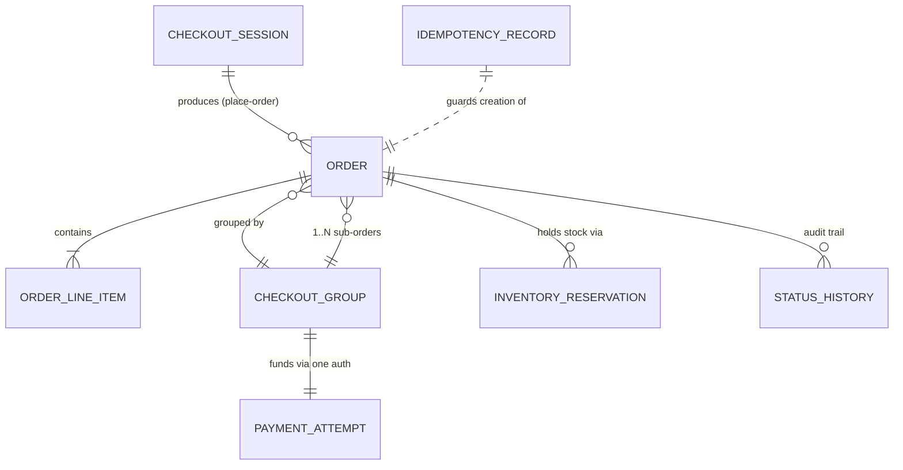

# Chapter 4 — Data Model

Chapter 3 fixed the contracts. A contract is the API that a client can call. This chapter fixes what sits behind those contracts.

We now look at the actual records that GlobalMart must store. These records make `place-order` safe. Safe means idempotent, auditable, and free of oversell or double-charge.

Idempotent means: if you call the same action many times, it happens only once. Auditable means: anyone can later check exactly what happened and when.

Chapter 3 answered "what can the buyer's app ask for". This chapter answers a harder question. What must GlobalMart never lose, never duplicate, and always be able to explain? Even three years later, to a court, a card network, or an angry seller.

Everything here builds on the canonical model in `_DESIGN-BRIEF.md` §4. We do not change that model. We only add column types, indexes, sharding keys, and the reasoning a senior engineer would give in an interview.

## 1. The Five Entities and How They Relate

Five entities carry the state of the checkout system. They fall into two very different groups, based on how long they live.

**Group 1: short-lived, single-owner records.** These are `CheckoutSession`, `InventoryReservation`, and `IdempotencyRecord`. All three have a TTL (time to live). TTL means a fixed time after which the record can be deleted. None of these three is the legal record of what happened.

**Group 2: durable, append-only records.** These are `Order` (with `OrderLineItem`) and `PaymentAttempt`. Durable means they are kept for a long time, here 7 years, for legal and financial reasons. Append-only means we only add new rows. We do not change or delete old ones.

Here is a simple diagram of how the entities connect.

```
 CheckoutSession (TTL ~30 min)
   session_id (PK)
   buyer_id
   cart_snapshot[]
   sub_orders_preview[]
   status, expires_at
        │
        │ place-order (idempotent, keyed)
        ▼
 checkout_group_id  ───────────────────────────────────────────┐
        │                                                       │
        ├──────────────┬──────────────┐                         │
        ▼              ▼              ▼                         │
   Order (seller A) Order (seller B) Order (seller C)            │
   order_id (PK)     order_id (PK)   order_id (PK)               │
   seller_id         seller_id       seller_id                  │
   status            status          status                    │
   status_history[]  ...             ...                       │
        │                                                        │
        ├─ 1:N ─▶ OrderLineItem (order_id FK, listing_id, qty, unit_price, tax)
        │
        ├─ 1:N ─▶ InventoryReservation (checkout_group_id FK, listing_id, seller_id, state)
        │
        └─ N:1 ─▶ PaymentAttempt (checkout_group_id FK) — ONE payment attempt funds ALL
                    sub-orders in the group; amount = sum of sub-order totals

 IdempotencyRecord (keyed by Idempotency-Key header, NOT by order)
   idempotency_key (PK)
   request_fingerprint
   response_snapshot
   state, expires_at
```

Here is the same picture as a mermaid ERD (entity-relationship diagram). An ERD is a standard drawing that shows how database tables link to each other.



One thing is important here. `IdempotencyRecord` does NOT point to `Order` with a foreign key. A foreign key is a column that links one table's row to another table's row.

We look up `IdempotencyRecord` by the client's `Idempotency-Key`. We do this before we even know if an order will exist. So it is a guard that sits in front of the write path. It is not a child record of the order. Think of it as its own separate store. Section 6 explains this in full.

## 2. One Cart, Many Sellers, Many Sub-Orders, One Group

A GlobalMart buyer sees one cart. The buyer does not think "my cart from seller X". But fulfillment, seller payouts, returns, and even payment capture all work seller by seller.

For example, a laptop sleeve from Seller A ships from a different warehouse than a phone case from Seller B. Seller A and Seller B also get paid on different payout ledger lines, even though both items were in the same cart.

The data model solves this problem with one simple rule. We never create one order row that mixes items from many sellers. Instead, we do this:

- When `place-order` starts, we create one `checkout_group_id`. This is a single ID that ties sibling sub-orders together.
- The Checkout Orchestrator (see Chapter 6) splits the cart into **one `Order` row per seller**. Each row gets its own `order_id`, its own `status`, and its own `status_history`. But all these rows share the same `checkout_group_id`.
- The buyer can call `GET /v1/orders/{id}` once per sub-order. Or the client app can fetch all sub-orders in a group, and show them as one card with several shipments inside.

Why does this design matter? Because of partial success. Partial success means some sellers' items succeed while others fail. The brief calls this out directly in §4 and §5.

Imagine Seller A's item sells out between the reservation step and the confirmation step. Meanwhile Seller B's and Seller C's items succeed. The schema must show "2 of 3 sub-orders confirmed, 1 cancelled". It must not hide or confuse the two that succeeded.

Because each sub-order is its own row, with its own state machine, this is simple. It is just three independent rows, each in its own state, coordinated by the same group ID.

| order_id | checkout_group_id | seller_id | status | reservation state |
|---|---|---|---|---|
| ord_9f2a | grp_7c31 | seller_A | `CANCELLED` | RELEASED |
| ord_9f2b | grp_7c31 | seller_B | `CONFIRMED` | COMMITTED |
| ord_9f2c | grp_7c31 | seller_C | `CONFIRMED` | COMMITTED |

Notice there is no "group status" column. A group status column would try to combine all three rows into one summary value. We deliberately do not store this.

Why not? Because a stored summary can go stale. The moment one sub-order's status changes, a cached group status can start to lie. So we compute the group view only at read time. We never write it as a stored fact.

The `checkout_group_id` is a **query key**, not an entity with its own state. This matches the saga design in Chapter 6. The saga coordinates the steps. But each participant, meaning each sub-order, owns its own durable status.

The payment side works the same way, from a different angle. **One `PaymentAttempt` funds the whole group.** GlobalMart authorizes the grand total once. Chapter 8 explains why: one call to the PSP (payment service provider) is simpler and safer than N separate calls that could each partly fail.

If Seller A's item later fails to reserve stock, the fix is a partial void or a partial capture. This happens against that same single `PaymentAttempt`. We do not create a second charge. So `PaymentAttempt.amount` is not fixed forever, even after the state becomes `CAPTURED`. The captured amount can be less than the authorized amount. And that difference itself must be logged, as Section 7 explains.

## 3. SQL Schema

The order and payment core uses a relational database. Section 8 explains why. Below is the actual DDL (data definition language, meaning the SQL statements that create tables).

We store money as whole numbers in the smallest currency unit, such as cents. Section 7 explains this choice. Every table also carries the keys needed for sharding and for the common queries described in Section 4.

```sql
-- ============================================================
-- ORDER — one row per seller sub-order. Source of truth.
-- ============================================================
CREATE TABLE orders (
    order_id            BIGINT UNSIGNED   PRIMARY KEY,   -- Snowflake-style, globally unique
    checkout_group_id   BIGINT UNSIGNED   NOT NULL,       -- groups sibling sub-orders
    buyer_id            BIGINT UNSIGNED   NOT NULL,
    seller_id           BIGINT UNSIGNED   NOT NULL,

    currency            CHAR(3)           NOT NULL,       -- ISO 4217, e.g. 'USD'
    subtotal_minor      BIGINT            NOT NULL,       -- integer minor units (cents)
    shipping_minor      BIGINT            NOT NULL DEFAULT 0,
    tax_minor           BIGINT            NOT NULL DEFAULT 0,
    discount_minor      BIGINT            NOT NULL DEFAULT 0,
    total_minor         BIGINT            NOT NULL,       -- subtotal+shipping+tax-discount

    status               ENUM('CREATED','RESERVED','PAYMENT_AUTHORIZED',
                                'CONFIRMED','CANCELLED','PAYMENT_FAILED',
                                'PARTIALLY_REFUNDED','REFUNDED','COMPLETED')
                          NOT NULL DEFAULT 'CREATED',

    shipping_address_json JSON             NOT NULL,
    payment_ref            BIGINT UNSIGNED,               -- FK -> payment_attempts.payment_id
    idempotency_key         VARCHAR(128)   NOT NULL,       -- the key that created this row

    created_at           TIMESTAMP(3)      NOT NULL DEFAULT CURRENT_TIMESTAMP(3),
    updated_at            TIMESTAMP(3)      NOT NULL DEFAULT CURRENT_TIMESTAMP(3)
                                             ON UPDATE CURRENT_TIMESTAMP(3),

    UNIQUE KEY uq_orders_idempotency (idempotency_key, seller_id),
    KEY idx_orders_group        (checkout_group_id),
    KEY idx_orders_buyer_created (buyer_id, created_at DESC),  -- order-history reads
    KEY idx_orders_seller_created (seller_id, created_at DESC) -- seller dashboards
) ENGINE=InnoDB;

-- Append-only audit trail — never UPDATE, only INSERT.
CREATE TABLE order_status_history (
    id            BIGINT UNSIGNED  AUTO_INCREMENT PRIMARY KEY,
    order_id      BIGINT UNSIGNED  NOT NULL,
    from_status   VARCHAR(32),
    to_status     VARCHAR(32)      NOT NULL,
    reason_code   VARCHAR(64),               -- e.g. 'INVENTORY_SHORTAGE', 'PSP_DECLINE'
    actor         VARCHAR(64)      NOT NULL,  -- 'checkout-orchestrator', 'ops-console:alice', ...
    occurred_at   TIMESTAMP(3)     NOT NULL DEFAULT CURRENT_TIMESTAMP(3),
    KEY idx_osh_order (order_id, occurred_at)
) ENGINE=InnoDB;

-- ============================================================
-- ORDER LINE ITEM — 1:N with orders
-- ============================================================
CREATE TABLE order_line_items (
    line_item_id     BIGINT UNSIGNED AUTO_INCREMENT PRIMARY KEY,
    order_id         BIGINT UNSIGNED NOT NULL,
    listing_id       BIGINT UNSIGNED NOT NULL,
    sku              VARCHAR(64)     NOT NULL,
    qty              INT UNSIGNED    NOT NULL,
    unit_price_minor BIGINT          NOT NULL,   -- price at moment of purchase, immutable
    tax_minor        BIGINT          NOT NULL DEFAULT 0,
    currency         CHAR(3)         NOT NULL,
    KEY idx_oli_order (order_id)
) ENGINE=InnoDB;

-- ============================================================
-- PAYMENT ATTEMPT — one per checkout_group_id (funds all sub-orders)
-- ============================================================
CREATE TABLE payment_attempts (
    payment_id         BIGINT UNSIGNED  PRIMARY KEY,
    checkout_group_id  BIGINT UNSIGNED  NOT NULL,
    buyer_id           BIGINT UNSIGNED  NOT NULL,

    psp                VARCHAR(32)      NOT NULL,   -- 'stripe', 'adyen', 'internal-wallet'
    psp_token          VARCHAR(128)     NOT NULL,    -- tokenized PAN reference, never a real PAN
    psp_reference       VARCHAR(128),                -- PSP's own transaction id, post-call

    amount_minor        BIGINT          NOT NULL,
    captured_minor       BIGINT          NOT NULL DEFAULT 0,  -- may be < amount_minor
    currency            CHAR(3)         NOT NULL,

    state                ENUM('INITIATED','AUTHORIZED','CAPTURED','PARTIALLY_CAPTURED',
                                'VOIDED','FAILED','REFUNDED') NOT NULL DEFAULT 'INITIATED',

    idempotency_key      VARCHAR(128)   NOT NULL,

    created_at           TIMESTAMP(3)   NOT NULL DEFAULT CURRENT_TIMESTAMP(3),
    updated_at            TIMESTAMP(3)  NOT NULL DEFAULT CURRENT_TIMESTAMP(3)
                                          ON UPDATE CURRENT_TIMESTAMP(3),

    UNIQUE KEY uq_payment_idempotency (idempotency_key),
    KEY idx_payment_group (checkout_group_id)
) ENGINE=InnoDB;

-- ============================================================
-- INVENTORY RESERVATION — transient hold, lives in the Inventory DB
-- but shown here for schema completeness (shares the group key)
-- ============================================================
CREATE TABLE inventory_reservations (
    reservation_id     BIGINT UNSIGNED PRIMARY KEY,
    checkout_group_id  BIGINT UNSIGNED NOT NULL,
    order_id            BIGINT UNSIGNED,             -- filled in once the sub-order is created
    listing_id          BIGINT UNSIGNED NOT NULL,
    seller_id            BIGINT UNSIGNED NOT NULL,
    qty                  INT UNSIGNED    NOT NULL,

    state                ENUM('HELD','COMMITTED','RELEASED','EXPIRED')
                          NOT NULL DEFAULT 'HELD',

    expires_at           TIMESTAMP(3)    NOT NULL,   -- ~15 min from creation
    created_at           TIMESTAMP(3)    NOT NULL DEFAULT CURRENT_TIMESTAMP(3),

    KEY idx_resv_listing_state (listing_id, state),   -- sweep + contention queries
    KEY idx_resv_group (checkout_group_id),
    KEY idx_resv_expiry (state, expires_at)            -- background TTL sweeper
) ENGINE=InnoDB;

-- ============================================================
-- IDEMPOTENCY RECORD — usually a KV store (Redis + durable backing),
-- SQL form shown for the durable-backup path
-- ============================================================
CREATE TABLE idempotency_records (
    idempotency_key      VARCHAR(128)  PRIMARY KEY,
    request_fingerprint   CHAR(64)      NOT NULL,     -- SHA-256 of normalized request body
    response_snapshot     JSON,                        -- cached response, once resolved
    state                  ENUM('IN_PROGRESS','COMPLETED','FAILED')
                            NOT NULL DEFAULT 'IN_PROGRESS',
    created_at             TIMESTAMP(3)  NOT NULL DEFAULT CURRENT_TIMESTAMP(3),
    expires_at              TIMESTAMP(3)  NOT NULL      -- TTL 24-48h, per brief §3
) ENGINE=InnoDB;
```

Let us look at a few design choices in this DDL. These are worth explaining out loud in an interview.

**Why `BIGINT UNSIGNED` primary keys, and not a simple auto-increment `INT`?** At 200 million orders a day, a 32-bit auto-increment number would run out of room in a few years, not decades. There is a second, bigger problem too. Sequential auto-increment IDs create a "hot" insert point. All new rows try to write near the same spot on one shard, at the same time. This slows things down.

Instead, GlobalMart uses Snowflake-style IDs. A Snowflake-style ID combines a timestamp, a shard number, and a counter into one number. The Order Service generates this ID before writing the row. This ID can then also be used as input for sharding, as we see in Section 4.

**Why no `FLOAT`/`DOUBLE` anywhere?** Every money column is a `BIGINT` storing minor units, meaning cents. Section 7 explains this fully.

**Why a `UNIQUE KEY` on `idempotency_key`?** We put this unique constraint on both `orders` (scoped per seller, since one `place-order` call creates several rows) and `payment_attempts` (one payment per key). This unique constraint is a safety net at the database level. Even if the application-level idempotency check in Section 6 has a race condition, the database will reject a duplicate insert with an error. It will never silently create a duplicate row.

**Why is `order_status_history` insert-only?** No `UPDATE`, no `DELETE`, ever. This table is the audit ledger. Section 5 explains why this matters.

## 4. Sharding Keys

Sharding means splitting one big table across many smaller databases, called shards, so no single machine holds all the data. Per the brief, the **Order DB is sharded into about 1,024 shards, by `hash(order_id)`**. A hash function turns an ID into a number, and we use that number to pick a shard.

Why this choice? Because of the two most common operations. `place-order` writes one row per sub-order and reads it right back. `GET /v1/orders/{id}` reads one row by its own ID. Both of these only touch one shard, as long as we shard by the value we are looking up with.

But sharding by `hash(order_id)` has two side effects. A good candidate should mention these before the interviewer asks, because the interviewer likely will ask about them.

**Side effect 1: queries across a whole group must fan out.** Fan out means one request turns into several parallel requests. The three sub-orders that share one `checkout_group_id` almost always land on three different shards. This happens because each `order_id` is generated separately, and the hash has no link to the group.

So "show me this checkout's full outcome" becomes a scatter-gather read. Scatter-gather means we send the same query to several shards at once, then combine the results. Here it touches up to N shards, where N is the number of sellers in the cart, usually 5 or fewer. This is acceptable for three reasons:

- N is small and limited. A real cart spans a handful of sellers, not thousands.
- For the flow that just placed the order, the Checkout Orchestrator already knows all the order IDs from the saga it just ran. No lookup is needed.
- For a later `GET` by group, we keep a small **group index** table. This table stores one row per `(checkout_group_id, order_id)` pair, and it is sharded by `hash(checkout_group_id)`. One lookup in this index gives us all N order IDs. We then read all N orders in parallel.

**Side effect 2: buyer order-history reads need a secondary index by `buyer_id`.** "Show me my last 20 orders" is the single most common read a logged-in buyer makes. But `hash(order_id)` spreads one buyer's orders evenly across all 1,024 shards. This is a problem. There are three possible solutions, and it is worth explaining why GlobalMart picks the third one.

1. *Scatter-gather across all 1,024 shards, then filter and sort.* This is correct, but far too slow. At 300K QPS (queries per second) peak, one page load would trigger 1,024 shard queries. That is wasteful.
2. *Shard by `buyer_id` instead of `order_id`.* This fixes the history-read problem. But it creates hot shards for power sellers on the inventory side. It also breaks the main `GET /v1/orders/{id}` path, because many callers, such as webhooks and PSP callbacks, only have the `order_id`, not the `buyer_id`.
3. **Build a separate secondary index table, `buyer_order_index`, sharded by `hash(buyer_id)`.** This is the choice GlobalMart makes. We fill this table asynchronously (soon after, not instantly) at order-creation time. Each row stores `(buyer_id, created_at, order_id, seller_id, status)`. Order-history reads then hit only this one index, on one shard, with a simple range scan sorted by `created_at`.

The main `orders` table stays sharded by `order_id`, for the fast, write-heavy checkout path. The index table is eventually consistent, meaning it may lag behind by a few seconds. This is fine, because the brief's consistency rule (§6) says order-history reads can tolerate eventual consistency. Only inventory, payment, and order-creation need strong consistency, meaning always up to date.

```sql
CREATE TABLE buyer_order_index (
    buyer_id     BIGINT UNSIGNED NOT NULL,
    created_at    TIMESTAMP(3)   NOT NULL,
    order_id      BIGINT UNSIGNED NOT NULL,
    seller_id      BIGINT UNSIGNED NOT NULL,
    status         VARCHAR(32)   NOT NULL,       -- denormalized snapshot, refreshed on change
    PRIMARY KEY (buyer_id, created_at, order_id)
    -- sharded by hash(buyer_id): one buyer's whole history is always on one shard
) ENGINE=InnoDB;
```

This is a classic sharded-SQL pattern. We pay a small extra cost on every write, so that the much more common read stays cheap and fast. The Inventory DB, covered in Chapter 7, makes the opposite trade-off. It shards by `listing_id`/`sku` (stock-keeping unit, meaning a specific product), because its main operation, reserving stock for one SKU, must never cross a shard boundary during a flash sale.

## 5. Order Status as an Explicit State Machine

A state machine is a model where a record can only be in one of a fixed set of states, and only certain moves between states are allowed. Here, `status` is not a free-text field. It is a fixed enum, meaning a small fixed list of allowed values.

Every time the status changes, the system must also insert one row into `order_status_history`, in the very same database transaction. A transaction means both changes succeed together, or both fail together.

Why keep both a status column and a history table? The current-status column makes simple reads fast, for example "give me all `CONFIRMED` orders for seller X". The history table records the full path the order took, and this path can never be edited or deleted later.

```
CREATED ──▶ RESERVED ──▶ PAYMENT_AUTHORIZED ──▶ CONFIRMED ──▶ COMPLETED
   │             │               │                  │
   │             │               │                  ├──▶ PARTIALLY_REFUNDED
   │             │               │                  └──▶ REFUNDED
   │             │               └──▶ PAYMENT_FAILED (compensate: release reservation)
   │             └──▶ CANCELLED (compensate: release reservation, void auth if taken)
   └──▶ CANCELLED (buyer abandoned / revalidation failed)
```

Here are the states, matching the saga steps in the brief (§5). A compensation is the fix-up action taken when a step fails partway through.

| State | Meaning | Entered from | Compensation on failure to advance |
|---|---|---|---|
| `CREATED` | Row exists; saga has started but stock is not yet held | — | mark `CANCELLED` |
| `RESERVED` | Stock is held for this sub-order | `CREATED` | release reservation → `CANCELLED` |
| `PAYMENT_AUTHORIZED` | Group-level payment auth succeeded, and covers this sub-order's share | `RESERVED` | release reservation, void auth → `CANCELLED` |
| `CONFIRMED` | Durable, buyer-visible, `order.placed` event sent | `PAYMENT_AUTHORIZED` | — (fixes now mean refund, not void) |
| `PAYMENT_FAILED` | Terminal failure branch | `RESERVED` | reservation released |
| `CANCELLED` | Terminal failure or abandon branch | any state before `CONFIRMED` | — |
| `PARTIALLY_REFUNDED` / `REFUNDED` | Money returned after confirmation | `CONFIRMED`/`COMPLETED` | out of scope in detail (refunds UI is out of scope per brief), but the state exists so other systems have a place to check |
| `COMPLETED` | Fulfillment finished (item delivered) | `CONFIRMED` | — |

The `order_status_history` table is what makes this auditable, not just consistent. A support agent, a chargeback dispute, or a regulator can rebuild the exact sequence of events. For example: "reserved at 14:02:01.334, authorized at 14:02:01.887, confirmed at 14:02:02.001, refunded at 14:02:02.001 plus 9 days, actor is cs-agent:bob, reason is BUYER_RETURN". All of this comes from a log that nothing in the system is allowed to change or delete.

This is the same posture as a financial ledger. In short: **checkout is a ledger system with an e-commerce interface on top.**

## 6. Idempotency Record Design

The `IdempotencyRecord` is what lets `place-order` be called safely, even from a phone on a weak network connection, even if the client retries the same call three times. It still produces exactly one set of sub-orders and exactly one payment capture. Its four fields each do a specific job.

- **`idempotency_key`** (primary key) — a unique ID that the client generates once per checkout attempt. It gets reused on every retry of that same attempt. The Checkout Orchestrator's first action, on receiving `place-order`, is to look up `idempotency:{key}`.
- **`request_fingerprint`** — a hash (a short fixed-length code computed from the data, here SHA-256) of the normalized request body. Normalized means put into one standard format first. This field catches a dangerous case: the same key being reused with a different request body. That could be a bug, or worse, a tampering attempt. If the fingerprint does not match, we reject the request with an error, instead of returning a cached answer for the wrong request. Same key plus same fingerprint means a safe retry. Same key plus different fingerprint means a hard error.
- **`response_snapshot`** — the exact response body we returned the first time this key was resolved. This includes order IDs, statuses, and totals. On a retry, if the state is `COMPLETED`, we return this saved snapshot directly. We do not run any part of the saga again. No second stock reservation call, no second payment authorization. This is what makes idempotency give "exactly-once effect", not just "eventually consistent retries". The real work happens once. Every later identical request is just a cache read.
- **`state`** (`IN_PROGRESS` / `COMPLETED` / `FAILED`) — this field solves the trickiest case. A retry can arrive while the first attempt is still running. For example, the client gives up after 2 seconds, but the server is still inside its 2.5-second call to the payment provider. If the record shows `IN_PROGRESS`, the second request knows to wait, poll, or return an "in progress" error. It must not start a second saga for the same intent. This is why we write the record with state `IN_PROGRESS` before the saga even starts, not after it finishes.
- **`expires_at` / TTL 24 to 48 hours** (from brief §2, §3) — this limits how long a client can safely retry the same key. It also limits storage. At about 220 million payment transactions per day (brief §2), a 24-to-48-hour TTL keeps the "hot" idempotency data around 250 to 400 GB. That size is small enough for Redis (an in-memory key-value store) to hold it as the primary store, as covered in Section 8.

```json
// idempotency:place-order:9f3c... -> value stored in Redis, mirrored to SQL backup
{
  "idempotency_key": "9f3c1b7e-...",
  "request_fingerprint": "b13f...c2 (sha256 of normalized body)",
  "state": "COMPLETED",
  "response_snapshot": {
    "checkout_group_id": "grp_7c31",
    "orders": [
      {"order_id": "ord_9f2a", "seller_id": "seller_A", "status": "CANCELLED"},
      {"order_id": "ord_9f2b", "seller_id": "seller_B", "status": "CONFIRMED"},
      {"order_id": "ord_9f2c", "seller_id": "seller_C", "status": "CONFIRMED"}
    ]
  },
  "created_at": "2026-07-15T14:02:01.334Z",
  "expires_at": "2026-07-17T14:02:01.334Z"
}
```

Notice this snapshot correctly saves the partial-success result from Section 2. A retry of this key will keep returning "2 confirmed, 1 cancelled" for as long as the TTL lasts. This is correct exactly-once behavior, even though the underlying saga touched three separate `Order` rows on three separate shards.

## 7. Money, Currency, and the Ledger Mindset

Three firm rules govern every amount column in this schema. All three come up often in interviews.

**Rule 1: never use floating-point numbers for money.** `FLOAT` and `DOUBLE` store numbers as binary fractions. This means `0.10 + 0.20` does not exactly equal `0.30`. Instead, it comes out as `0.30000000000000004`. At 200 million orders a day, with amounts being summed, taxed, discounted, and split across sellers, this tiny error adds up. It becomes real money lost or gained. Worse, for a marketplace, it can disagree with the amount the payment provider itself calculated. That creates a gap that can never be perfectly reconciled.

There are exactly two acceptable ways to store money:

- **Integer minor units** (used in this chapter's DDL). We store `total_minor` as a `BIGINT`, holding 1999 to mean $19.99. All the math becomes plain integer math: exact, fast, and directly comparable to what payment providers themselves use in their own APIs. Stripe, Adyen, and others all quote amounts in minor units, for this exact reason.
- **Fixed-point `DECIMAL(N, 2)`**. This is also exact, and it is easier to read in ad-hoc SQL queries, at a small extra storage and CPU cost compared to a raw integer. GlobalMart picks integer minor units mainly for performance and storage, at its 200-million-orders-a-day scale. Either choice, integer or DECIMAL, is defensible in an interview. Float is never defensible, and saying this without being asked is a strong signal of financial-systems experience.

**Rule 2: currency always travels with the amount, and is never assumed.** Every money-bearing table carries a `currency CHAR(3)` column right next to the amount. This is true even though a given buyer or order is almost always in a single currency. "Almost always" is exactly the kind of assumption that causes a silent mistake later. This could happen during a currency migration, a cross-border sale, or a seller payout in a different currency than the buyer paid in. Any math that combines rows, for example summing sub-order totals into a group total, must first check that the currencies match. It must never silently convert or combine mismatched currencies.

**Rule 3: every amount must be traceable, forwards and backwards, like a ledger.** This is the audit mindset the brief demands in §1, non-functional requirement 6: "every money movement traceable." In practice, this means:

- `payment_attempts.amount_minor` is the authorized amount. `captured_minor` is tracked as a separate field, and it can be less than the authorized amount. This happens on a partial capture, for example when one sub-order cancels after authorization (see Section 2). The gap between the two numbers is itself an auditable fact. It is never simply overwritten.
- `order_line_items.unit_price_minor` is a copy of the price at that moment in time. It is not a live link back to the catalog price. An order must always show what the buyer actually paid, forever, even if the catalog price changes an hour later. This is the same "copy it, don't link to it" idea that Chapter 3 used for `cart_snapshot` inside `CheckoutSession`.
- `order_status_history`, and any future refund or adjustment table, is append-only, both by team convention and by database rule. In production, no one is granted `UPDATE` or `DELETE` permission on these tables. This is enforced at the database level, not just by team discipline.
- Reconciliation jobs (see Chapter 8 and Chapter 10) regularly compare `payment_attempts` against the payment provider's own transaction log. They also compare `inventory_reservations` against the Inventory DB's committed state. Reconciliation means checking two independent records against each other to catch and fix drift. This matters because "traceable" must mean the data can be independently rebuilt and checked, not just written down somewhere once.

Put simply: **the order and payment core is not built like a normal app's "orders table". It is built like double-entry bookkeeping.** Double-entry bookkeeping is an accounting method where every change is recorded as a new fact, never erased. Every state change becomes a new fact added to a trail. The "current row" you see is just a summary, or projection, of that trail, kept for fast reads.

## 8. SQL vs. NoSQL — the Justified Split

GlobalMart does not pick one single type of database for the whole checkout system. It picks the right tool for each entity, based on what consistency and access pattern that entity actually needs.

The brief's consistency rule in §6 makes this choice almost automatic. We separate "needs strong consistency and relational integrity" from "needs raw speed on a simple key lookup with a TTL."

**Relational, sharded SQL, such as MySQL or PostgreSQL, is used for: `Order`, `OrderLineItem`, `PaymentAttempt`.**

- These are the entities that non-functional requirement 1 (brief §1) puts at the very top: no double-charge, no lost order, no oversell. This requires ACID transactions. ACID stands for Atomicity, Consistency, Isolation, Durability, meaning a set of guarantees that a group of changes either all happen or none happen. Creating an `Order` row, its `OrderLineItem` rows, and its `order_status_history` row must all commit together, or not at all, on one shard. This is exactly why Section 4 works hard to keep this write on a single shard.
- These entities also need strong foreign-key-style integrity. A line item without a matching order is a bug, not something we tolerate as normal. They also need rich, flexible querying for support tools, finance reconciliation, and analytics. SQL's relational query power is the right tool here, for example "give me all orders for seller X between two dates, where the status passed through PAYMENT_FAILED."
- Multi-row transactions matter here in a way key-value stores cannot cleanly offer. The saga step "create order, commit the reservation, update the payment reference" (brief §5, saga step 4) benefits from atomic multi-table writes within one shard.

**A key-value store, such as Redis with durable backing, is used for: `CheckoutSession`, `IdempotencyRecord`, and the hot path of `InventoryReservation`.** A key-value store saves data as simple key-to-value pairs, with no joins or complex queries.

- All three share the same shape: simple key lookup, short TTL, very high request rate, and no need for relational queries. `CheckoutSession` is read and written only by its `session_id`, has about a 30-minute TTL, and sees about 7,000 sessions per second on average (brief §2). This is a simple GET/SET pattern, not a join. `IdempotencyRecord` is looked up by exactly one key, right at the start of the hot path, and it must resolve in a few milliseconds even at 300K peak checkout-API QPS (brief §2). Redis's in-memory speed fits this far better than a round trip to a SQL database.
- `InventoryReservation`'s busy churn between HELD and RELEASED states, during a flash sale when thousands of buyers race for one SKU (see Chapter 7), is mostly simple increment and decrement operations on a per-SKU counter. This is exactly what Redis is built for, using commands like `DECR` or small Lua scripts for check-and-decrement logic. Once a reservation becomes `COMMITTED`, meaning it is now tied to a confirmed order, that durable and audit-relevant part gets mirrored into the SQL table from Section 3. So even here, the split is not "KV instead of SQL". It is "KV for the busy, short-lived contention, SQL for the durable, audited outcome."
- None of these three key-value records is the system's source of truth for money or stock. If Redis loses a `CheckoutSession`, the buyer just restarts checkout. That is annoying, but not incorrect. If Redis loses an `IdempotencyRecord` mid-flight, the durable SQL backup table from Section 3 is checked first, before we allow any retry to proceed. That is exactly why this backup table exists, even though Redis is the main store.

The general rule to say out loud in an interview: **use strong consistency and relational integrity exactly where money or stock correctness is on the line, meaning orders and payments. Use a fast key-value store exactly where the record is short-lived, looked up by one simple key, and safe to lose or rebuild from a backup.** This is the same CP-for-money, AP-elsewhere idea from the brief (§6), just applied one level down, at the storage-engine layer instead of the protocol layer.

---

## Interview Tips

- **Say "money is stored as an integer, in minor units" before anyone asks.** This is one of the fastest ways to show financial-systems maturity. If someone pushes on `DECIMAL` versus integer, the honest answer is that both are correct. Only `FLOAT`/`DOUBLE` is disqualifying. Know why: binary fractions cannot represent decimal cents exactly.
- **Mention `status_history` as an audit trail as soon as you draw the `Order` entity, without being asked.** A single, changeable `status` column, with no history table, is the most common gap candidates leave behind. Explaining it as "checkout is a ledger system" shows you understand this domain needs auditability by law, not just as good practice.
- **Draw the idempotency record with all four fields, and explain the `IN_PROGRESS` state specifically.** Most candidates remember "key maps to a cached response" but forget the race case, where a retry arrives while the original request is still running. Explaining that the record is written before the saga starts, not after, is what shows real hands-on experience with idempotency keys.
- If asked "why sharded SQL and not a distributed NoSQL store for orders," do not just say "for consistency." Name the specific thing you would lose: multi-table atomic commits within one shard (order, line items, and status history together), and a query surface that finance and support tools can actually use, which a plain key-value or wide-column store does not give you for free.
- Be ready for the common follow-up question: **"how do you find all of a buyer's orders, if you shard by order_id?"** This is the most common trap for this data model. The answer is a `buyer_id`-sharded secondary index, filled asynchronously, and eventually consistent. This is exactly Section 4 above. Naming this trade-off, write-side extra cost for read-side simplicity, shows you understand sharded-SQL design in general, not just this one schema.

## Key Takeaways

- Five entities split into two lifecycles: **short-lived, key-value style** (`CheckoutSession`, the hot path of `InventoryReservation`, `IdempotencyRecord`) and **durable, relational** (`Order`, `OrderLineItem`, `PaymentAttempt`). The split follows directly from which entities need ACID guarantees for money and stock correctness, versus which are short-lived, single-key, and safe to rebuild.
- **One cart becomes N sub-orders under one `checkout_group_id`.** Each seller's sub-order is a fully independent row, with its own status and its own status history. There is no combined "group status" column, because combining values belongs at read time, not write time. This is exactly how partial success, meaning 2 of 3 sellers confirm while 1 cancels, gets represented without any contradiction.
- **The Order DB shards by `hash(order_id)`** to keep the hot `place-order` and `GET /v1/orders/{id}` paths on a single shard. The cost is that we then need a `hash(checkout_group_id)`-sharded group index for cross-seller queries, and a `hash(buyer_id)`-sharded secondary index for order-history reads.
- **Status is a fixed enum, plus an append-only `status_history` table.** The current-status column keeps reads fast. The history table is the legal, replayable audit trail. Nothing in production ever updates or deletes a history row.
- **The idempotency record's four fields, key, request fingerprint, response snapshot, and state, together deliver exactly-once effect** on top of at-least-once delivery. The fingerprint catches misuse of the key. The state machine, moving from `IN_PROGRESS` to `COMPLETED` or `FAILED`, handles concurrent retries. The snapshot means the real side effects run exactly once, and every retry after that is just a cache read.
- **Money is always an integer in minor units, or a `DECIMAL`, never `FLOAT`/`DOUBLE`.** It is always paired with an explicit `currency` column. Every amount is a snapshot at one point in time, never a live link. The whole schema is built so it can be independently checked against the payment provider and the Inventory DB, because underneath the interface, checkout is a ledger.
