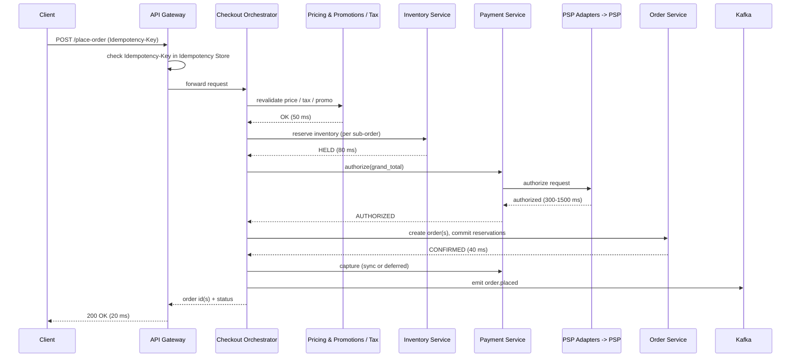
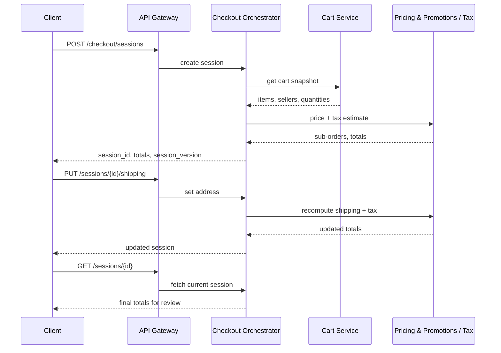

# Chapter 5 — High-Level Design

## 5.0 What this chapter covers

In Chapter 1 we listed what the checkout system must do. In Chapters 2, 3, and 4 we
worked out the scale, the APIs, and the data model. Now we put all of it together into
one picture: the high-level design.

This chapter answers one big question. How do all the pieces of GlobalMart Checkout fit
together to turn a shopping cart into a paid, confirmed order, safely, at 50,000 orders
per second at peak?

The short answer has three parts. First, we split the work into small, focused services.
Each service does one job well. Second, we use a stateless **Checkout Orchestrator** to
run the whole place-order flow as a **saga**. Third, we keep strong consistency only on
the money path (inventory and payment), and let everything else be eventually
consistent.

Let us define saga right now, in one simple sentence, because it is the most important
idea in this chapter. **A saga is a sequence of small steps, where each step has an
"undo" step to reverse it if a later step fails.** For example, if we reserve stock in
step 2 but the payment fails in step 3, we run the "undo" of step 2 and release the
stock. We will see this pattern in detail in Chapter 6. This chapter shows where it sits
in the overall architecture.

## 5.1 The full architecture

Here is the canonical architecture diagram from the design brief, expanded with more
detail. Read it from left to right. A client request enters from the top left and flows
down through layers of services.

```
                              ┌─────────────┐
                              │   Client    │  (web / mobile app)
                              └──────┬──────┘
                                     │ HTTPS
                              ┌──────▼──────┐
                              │  CDN / Edge │  (static assets, edge cache, DDoS shield)
                              └──────┬──────┘
                                     │
                              ┌──────▼──────┐
                              │ API Gateway │  (auth, rate limit, routing, idempotency check #1)
                              └──────┬──────┘
                                     │
                     ┌───────────────▼────────────────┐
                     │   Checkout Orchestrator (SAGA)  │
                     │  stateless, coordinates steps,  │
                     │  idempotent, no long-lived state │
                     └───────────────┬────────────────┘
                                     │
        ┌───────────┬───────────┬───┴───────┬───────────┬────────────┐
        │           │           │           │           │            │
   ┌────▼────┐ ┌────▼─────┐ ┌───▼───┐ ┌─────▼─────┐ ┌───▼────┐ ┌─────▼─────┐
   │  Cart   │ │ Pricing &│ │  Tax  │ │ Inventory │ │Payment │ │  Order    │
   │ Service │ │Promotions│ │Service│ │ Service   │ │Service │ │ Service   │
   └─────────┘ └──────────┘ └───────┘ └─────┬─────┘ └───┬────┘ └─────┬─────┘
                                             │           │            │
                                        ┌────▼────┐ ┌────▼─────┐ ┌────▼────┐
                                        │Inventory│ │   PSP    │ │ Order DB│
                                        │   DB    │ │ Adapters │ │(sharded,│
                                        └─────────┘ └────┬─────┘ │ strong) │
                                                          │      └─────────┘
                                                   ┌──────▼──────┐
                                                   │External PSPs │ (Stripe, Adyen, etc.)
                                                   └──────────────┘

        Idempotency Store (Redis + durable backup) ── used by Gateway, Orchestrator,
                                                        and every downstream call

                                     │
                              ┌──────▼──────┐
                              │    Kafka     │  (order.placed, saga events, outbox)
                              └──────┬──────┘
                                     │
                 ┌───────────────────┼───────────────────┐
                 │                   │                   │
          ┌──────▼──────┐    ┌───────▼───────┐   ┌───────▼───────┐
          │Notification │    │ Fulfillment    │   │  Analytics     │
          │  Service    │    │ (downstream,   │   │  (downstream,  │
          │             │    │  out of scope) │   │  out of scope) │
          └─────────────┘    └────────────────┘   └────────────────┘
```

The key idea is simple. The **Checkout Orchestrator** sits in the middle. It does not
store any long-term data itself. Instead, it calls out to smaller services, one after
another, and tracks how far the saga has progressed. Each smaller service owns one job
and one piece of data.

Why split into so many services? Three reasons.

First, **independent scaling**. Payment authorization is slow, 300 to 1500 milliseconds,
because it depends on an external PSP (Payment Service Provider, the company that
actually moves the money, like Stripe or Adyen). Inventory reservation is fast, around
80 milliseconds, because it is our own database. If these were one service, a slow
payment call would hold up fast inventory checks. Splitting them lets each scale and
tune independently.

Second, **independent failure**. If the Tax Service has a bug and starts erroring, we
want that to fail one step of the saga, not crash the whole checkout system. Small
services with clear boundaries limit the blast radius of any one failure. We look at
this in depth in Chapter 10.

Third, **clear ownership of data**. The Inventory Service is the only service allowed to
write to the Inventory DB. The Order Service is the only service allowed to write to the
Order DB. This avoids two services quietly disagreeing about the same row of data.

It is worth pausing on one more point from the design brief: this system is
deliberately **CP**, meaning it chooses Consistency over Availability, on the narrow
money path (inventory and payment), while staying flexible everywhere else. This is
the opposite choice from the companion GlobalMart Search handbook, which is
deliberately **AP**, choosing Availability over Consistency, because a search result
that is a few seconds stale is a minor inconvenience, but an inventory count that is a
few seconds stale can sell the same last unit to two different buyers. The lesson here
is not "CP is always better than AP" or the reverse. It is that the right choice
depends on what happens when you get it wrong. A stale search result costs nothing. A
double-sold item costs real money and a broken promise to a buyer. So checkout leans CP
exactly where money and stock are at stake, and leans AP (eventually consistent)
everywhere else, such as order-history reads and analytics, where staleness is cheap.

## 5.2 What each component does

This section gives a short, plain description of every component named in the
architecture. Keep these names in mind. We reuse them across every later chapter.

### API Gateway

The API Gateway is the single front door for every checkout API call. A client never
talks to internal services directly. The gateway does four things: it checks the
buyer's JWT (a signed login token) to confirm who is calling, it applies rate limits so
one buyer or one bot cannot flood the system, it routes the request to the Checkout
Orchestrator, and it does the first-line check of the `Idempotency-Key` header on
place-order calls. We explain this idempotency check in Section 5.6.

### Checkout Orchestrator (the saga coordinator)

This is the brain of checkout. The orchestrator is **stateless**, which means it does
not keep any checkout data in its own memory between calls. Instead, it reads and
writes state through the services below it, mainly through the Order DB and the
Idempotency Store. Because it is stateless, we can run thousands of orchestrator
instances behind a load balancer, and any instance can pick up any request.

The orchestrator's job is to run the saga: call each step in order, wait for the
result, and if a step fails, call the compensating (undo) steps in reverse order. It
does not know the internal logic of pricing or payment. It only knows the sequence and
how to react to success or failure. Chapter 6 covers the full state machine.

### Cart Service

The Cart Service holds the buyer's shopping cart before checkout starts: which
listings, which sellers, and what quantities. When the buyer starts checkout, the
orchestrator asks the Cart Service for a snapshot of the cart. This snapshot becomes
the starting point for a checkout session (see Chapter 4 for the `CheckoutSession`
schema).

### Pricing & Promotions Service

This service computes the authoritative price for every item at the moment of
checkout. The word "authoritative" means this is the price that is actually charged,
even if the price shown earlier on the product page was slightly different (for
example, a flash-sale price expired, or a coupon no longer applies). It also applies
discount codes and promotional rules. This re-pricing step is required by FR3 in
Chapter 1: prices and promotions can change between browsing and checkout, so we must
recompute them, not trust the old snapshot.

### Tax Service

The Tax Service calculates tax for each sub-order, based on the shipping address, the
seller's tax jurisdiction, and the item category. Tax rules vary a lot by country and
state, so this is kept as its own service with its own rule engine, separate from
pricing.

### Inventory Service

The Inventory Service is the guard against overselling. Overselling means selling more
units of an item than we actually have in stock. This service manages **reservations**:
a temporary hold on stock for a specific buyer's checkout attempt. A reservation says
"these 2 units of this SKU are set aside for this checkout, for the next 15 minutes."
The Inventory Service is the only thing that talks to the Inventory DB. We dedicate all
of Chapter 7 to how it prevents oversell even during flash sales.

### Payment Service

The Payment Service handles the money side: authorizing a charge, capturing it, voiding
it, and refunding it. "Authorizing" means asking the buyer's bank or wallet to confirm
the funds are available and to place a hold, without moving the money yet. "Capturing"
means actually pulling the money after the hold is confirmed. The Payment Service does
not talk to banks directly. It talks through PSP Adapters.

### PSP Adapters

A PSP (Payment Service Provider) is an external company, such as Stripe or Adyen, that
actually processes card and wallet payments on our behalf. Different PSPs have
different APIs. The PSP Adapters layer is a thin translation layer: it converts our
internal, standard payment calls (authorize, capture, void) into the specific API calls
each PSP expects. This means the Payment Service itself never needs to know which PSP
is being used underneath. If we add a new PSP, or a PSP has an outage and we fail over
to a backup PSP, we only change the adapter, not the whole Payment Service. Chapter 8
covers PSP integration and money correctness in full depth.

### Order Service

The Order Service is the only writer to the Order DB, which is the permanent,
source-of-truth record of every order ever placed. It creates order rows, moves an
order through its status lifecycle (CREATED, CONFIRMED, and so on, see Chapter 4), and
answers `GET /v1/orders/{id}` queries. Because a cart can have items from many sellers,
the Order Service can create multiple sub-orders, one per seller, all tied together
under one `checkout_group_id`.

### Notification Service

Once an order is placed, buyers and sellers need to know. The Notification Service
listens to Kafka events (mainly `order.placed`) and sends emails, push notifications,
and SMS messages. It runs after the order is already confirmed, so a slow or failed
notification never blocks or delays the order itself.

### Idempotency Store (Redis)

Idempotency means that doing the same operation twice has the same effect as doing it
once. For example, if a buyer's app retries a place-order call because the first
response was lost on the network, the buyer must not be charged twice. The Idempotency
Store is a fast key-value store, built on Redis (an in-memory database), with a durable
backup copy. It stores, for a given `Idempotency-Key`, the fingerprint of the original
request and a snapshot of the response. If the same key comes in again, we return the
saved response instead of redoing the work. Section 5.6 explains exactly where this
check happens.

### Kafka

Kafka is a distributed event log. Services write "events" to it (small messages
describing something that happened, like "order 123 was placed"), and other services
read those events later, at their own pace. We use Kafka for everything that does not
need to happen instantly: sending notifications, triggering fulfillment, and feeding
analytics. Using Kafka here means the checkout path itself does not wait for
notifications or analytics to finish. We expand on this in Section 5.7.

### Order DB

The Order DB is a sharded SQL database, meaning the data is split across roughly 1,024
separate database partitions (shards), each handling a slice of orders, hashed by
`order_id` (see Chapter 2 and Chapter 4). It gives strong consistency, meaning a write
is immediately visible to the next read of the same order. This strength matters
because an order record is a legal and financial document; we cannot allow it to be
lost or duplicated.

### Inventory DB

The Inventory DB is sharded by `listing_id` or SKU (stock keeping unit, a unique code
for one product a seller sells). It is the single place where "how many units are left"
is tracked, and it must also be strongly consistent. If two buyers grab the last unit
at the same time, this database is what decides, correctly, that only one of them
succeeds.

### Quick-reference table

Here is a one-line summary of every component, its data ownership, and whether it sits
on the synchronous critical path (the buyer waits for it) or off it. We explain the
sync/async split fully in Section 5.7, but it helps to see it here first, next to the
component list.

| Component | One-line job | Owns this data | Sync or async |
|---|---|---|---|
| CDN / Edge | Serves static assets, absorbs DDoS traffic near the buyer | none | N/A (in front of everything) |
| API Gateway | Authenticates, rate-limits, routes, first idempotency check | none | Sync |
| Checkout Orchestrator | Runs the saga steps and compensations | none (stateless) | Sync |
| Cart Service | Holds the pre-checkout shopping cart | Cart data | Sync (session build only) |
| Pricing & Promotions Service | Computes authoritative prices and discounts | Price/promo rules | Sync |
| Tax Service | Computes tax per sub-order | Tax rules | Sync |
| Inventory Service | Reserves, commits, releases stock | Reservations | Sync |
| Payment Service | Authorizes, captures, voids, refunds | Payment attempts | Sync (authorize), async (deferred capture) |
| PSP Adapters | Translates our calls into each PSP's own API | none | Sync |
| Order Service | Creates and updates orders | Order records | Sync |
| Notification Service | Sends emails/push/SMS after an order is placed | none | Async |
| Idempotency Store (Redis) | Remembers past request results by key | Idempotency records | Sync (looked up inline) |
| Kafka | Carries events from checkout to downstream consumers | Event log | Async |
| Order DB | Durable, strongly consistent order storage | Orders | Sync |
| Inventory DB | Durable, strongly consistent stock storage | Stock counts, reservations | Sync |

Notice that almost everything on the money path is synchronous. Only the Notification
Service and Kafka's downstream consumers (fulfillment, analytics) are purely
asynchronous. This is intentional, and Section 5.7 explains why.

## 5.3 The place-order flow: a numbered walkthrough of the saga

Now let us walk through the single most important request in the whole system:
`POST /v1/checkout/sessions/{id}/place-order`. This is FR5 from Chapter 1: turn a
reviewed, priced checkout session into one or more real, paid orders.

The saga has five main steps, run in order by the Checkout Orchestrator. If any step
fails, the orchestrator runs compensating steps in reverse order to undo everything
that already succeeded.

**Step 1 — Revalidate the session.**
The orchestrator asks the Pricing & Promotions Service and the Tax Service to
recheck the session: are prices still current, is the promotion code still valid, is
the buyer still eligible to buy these items (for example, some items have purchase
limits)? This step exists because time has passed since the buyer first saw the
checkout review page. Prices, promotions, or stock can have changed in that time.
Budget: about 50 ms.

**Step 2 — Reserve inventory.**
The orchestrator calls the Inventory Service, once for each sub-order (each seller's
part of the cart). The Inventory Service places a HELD reservation for each SKU and
quantity, with a 15-minute expiry. If any item is out of stock, this step fails for
that sub-order, and we may need to let the buyer know one seller's item is unavailable
while the rest of the cart proceeds (partial success, more in Chapter 6). Budget: about
80 ms.

**Step 3 — Authorize payment.**
The orchestrator calls the Payment Service for the grand total across all sub-orders.
The Payment Service goes through the PSP Adapters to the external PSP, which checks the
buyer's card or wallet and places a hold for the amount, without moving money yet. This
is the slowest and most variable step, because it depends on a system outside
GlobalMart. Budget: 300 to 1500 ms, and this dominates the overall latency budget.

**Step 4 — Create the order(s).**
Once payment is authorized, the orchestrator calls the Order Service to write the order
records to the Order DB, with status CONFIRMED, and to tell the Inventory Service to
commit the earlier HELD reservations (turning them from a temporary hold into a
permanent deduction from stock). Budget: about 40 ms.

**Step 5 — Capture payment and emit `order.placed`.**
The Payment Service either captures the payment immediately, or (more commonly, for
operational reasons we cover in Chapter 8 and Chapter 11) marks it for capture slightly
later, closer to fulfillment. Either way, once the order is durably CONFIRMED, the
orchestrator publishes an `order.placed` event to Kafka. Everything after this point
(notifications, fulfillment hand-off, analytics) happens asynchronously, off the
critical path. Response to the buyer: about 20 ms, plus a small buffer for network and
serialization overhead.

Here is the same flow as a sequence diagram, showing every hop:



Add up the numbers: 20 (gateway) + 50 (revalidate) + 80 (reserve) + 300 to 1500
(authorize) + 40 (persist) + 20 (response) gives us roughly 510 ms at the low end and
1,710 ms at the high end, comfortably inside the p99 budget of 2.5 seconds from Chapter
2, with headroom left as a buffer for retries, queueing, and network jitter. Notice how
one step, payment authorization, is responsible for most of the time and most of the
variability. This is why Chapter 8 spends so much attention on how to handle slow or
failing PSPs without blocking the whole saga.

### A worked example

Let's make this concrete with real numbers. Suppose a buyer, Priya, has a cart with
three items from two different sellers: a phone case from Seller A ($15), a charger
from Seller A ($20), and a pair of headphones from Seller B ($45). Her grand total is
$80, matching the average order value of about $60 to $80 mentioned in Chapter 2 for
GlobalMart-scale orders.

When Priya taps "place order," here is what happens, step by step, using the
`checkout_group_id` `cg_9182` to tie everything together:

1. **Revalidate.** The Pricing & Promotions Service confirms all three prices are
   still current. No promo code was applied, so this is a simple pass-through. Result:
   OK in 40 ms.
2. **Reserve inventory.** The Inventory Service creates two reservations: one for
   Seller A covering the phone case and charger (2 line items, 1 SKU each), and one for
   Seller B covering the headphones. Both get `state: HELD` and `expires_at` 15 minutes
   from now. Result: OK in 75 ms.
3. **Authorize payment.** The Payment Service asks the PSP Adapter to authorize $80 on
   Priya's saved card token. The PSP responds "authorized" with a `psp_reference`.
   Result: OK in 620 ms (a fairly typical value inside the 300 to 1500 ms range).
4. **Create orders.** The Order Service creates **two** order records under
   `checkout_group_id: cg_9182`, one per seller (`order_id: ord_A771` for Seller A,
   `order_id: ord_B402` for Seller B), each with `status: CONFIRMED`. Both reservations
   move from HELD to COMMITTED. Result: OK in 35 ms.
5. **Capture and emit.** Payment capture is deferred to closer to shipment (a common
   real-world pattern we explain in Chapter 8 and Chapter 11). The orchestrator emits
   one `order.placed` event to Kafka, carrying both order IDs.

Total time on the critical path: 40 + 75 + 620 + 35 = 770 ms, plus about 40 ms of
gateway and response overhead, for roughly 810 ms end to end. Priya sees "Order
placed" on her screen in well under a second, and two independent sellers now each
have a confirmed order to fulfill, both traceable back to the same checkout through
`cg_9182`.

### Handling partial success across multiple sellers

Now change the example slightly: suppose Seller B's headphones sold out one second
before Priya's reservation request arrived. Step 2 succeeds for Seller A but fails for
Seller B.

The orchestrator has a choice to make here, and this is a genuine design decision, not
an automatic rule. One option is to fail the entire place-order call, undo the
successful reservation for Seller A, and ask Priya to update her cart. The other
option is to let Seller A's sub-order proceed to payment and order creation, while
reporting Seller B's item as unavailable, so Priya still gets one confirmed order out
of two. GlobalMart favors the second option, partial success, because it maximizes
completed sales and gives the buyer a clear, itemized outcome instead of an all-or-
nothing failure. This means the saga must be able to run steps 3 and 4 with a reduced
set of sub-orders, and separately trigger the compensation (release) only for the
sub-order that failed. Chapter 6 covers exactly how the saga's state machine tracks
partial success on a per-sub-order basis, not just per checkout.

## 5.4 The browse-to-review sub-flow

Before place-order, the buyer goes through a lighter-weight flow: creating a session,
setting a shipping address, and reviewing totals. This corresponds to FR1 and FR2 from
Chapter 1, and it has a tighter latency target: p99 under 300 ms, because the buyer is
actively looking at a screen and waiting.

1. `POST /v1/checkout/sessions` — the orchestrator asks the Cart Service for the current
   cart, then asks Pricing & Promotions and Tax for an initial price and tax estimate,
   and returns a `CheckoutSession` with sub-orders and a `session_version`.
2. `PUT /v1/checkout/sessions/{id}/shipping` — the buyer sets an address; the
   orchestrator recomputes shipping cost and tax for that address.
3. `GET /v1/checkout/sessions/{id}` — the buyer reviews the final totals before
   confirming.



Notice this sub-flow does **not** touch the Inventory Service or the Payment Service at
all. It only reads and estimates. No stock is held and no money moves until the buyer
clicks the final "place order" button, which triggers the saga in Section 5.3. This
matters: browsing and revising a cart is cheap and can happen many times, but reserving
real stock and authorizing real money should happen only once, right before commitment.

## 5.5 Why a saga, and not one big distributed transaction

A natural first idea is: why not wrap "reserve inventory, charge payment, create order"
in one big database transaction, so it is all-or-nothing automatically? This is called
**two-phase commit**, or **2PC**, a classic protocol where all participants first agree
they *can* commit, and only then are told to actually commit.

We do not use 2PC here, for two simple reasons.

First, one of the participants is an **external PSP**. We do not control the PSP's
database. We cannot ask it to "prepare to commit and wait for our signal," because it
is a separate company's system with its own API, and most PSPs do not support that kind
of protocol at all. So a classic 2PC transaction across our inventory, our order table,
and an external PSP is simply not possible to build.

Second, even where 2PC is technically possible (say, across our own databases), it has
a real cost: every participant must hold locks while waiting for everyone else to agree.
If one participant is slow, all participants are stuck holding locks, which becomes a
bottleneck under high traffic. At 50,000 orders per second, that kind of blocking design
would collapse.

The saga pattern solves both problems. Instead of one all-or-nothing transaction, we
run a sequence of small, independent steps. Each step commits its own small piece of
work immediately (for example, the Inventory Service commits a HELD reservation on its
own). If a later step fails, we do not roll back a transaction. Instead, we run a
separate "undo" step, called a **compensating action**, such as releasing the
reservation or voiding the payment authorization.

This is a trade-off: for a short window, the system can be in a state where inventory is
held but payment has not yet succeeded. That is a temporary, visible, in-between state,
not a hidden database lock. We accept this in exchange for a system that can scale
horizontally and can talk to systems we do not control, like PSPs. Chapter 6 goes deep
into the saga's state machine and every compensating action. Chapter 11 compares saga
versus 2PC head-to-head as a trade-off discussion, useful for interviews.

To see why lock-holding is dangerous at our scale, picture a flash sale where 10,000
buyers try to buy the same hot SKU in the same second (this exact scenario is worked
out in full in Chapter 7 and Chapter 9). Under a 2PC design, each buyer's transaction
would need to lock the inventory row for that SKU while it waits for the payment
authorization step to finish, because 2PC cannot let go of a lock until every
participant has agreed. Since payment authorization can take up to 1.5 seconds, that
row would be locked by one buyer's transaction for up to 1.5 seconds, forcing the other
9,999 buyers to queue up behind it, one at a time. At 10,000 buyers per second, a
1.5-second lock is catastrophic: the queue only grows, and most buyers time out.

With the saga pattern, the Inventory Service commits its own small piece of work (the
reservation) in a few milliseconds and immediately releases any internal lock it used.
It does not wait for payment. This is what lets 10,000 buyers be processed within a
second or two instead of piling up behind a single slow external call.

## 5.6 Where idempotency lives

Idempotency is not one single check. It is layered, so that a retry is caught as early
as possible, but is still safe even if it slips past an earlier layer. Recall from
Section 5.2: idempotency means repeating the same operation has the same result as doing
it once.

**Layer 1 — API Gateway.** Every place-order request must carry an `Idempotency-Key`
header (see Chapter 3). The gateway does a fast lookup in the Idempotency Store. If the
key already has a stored response, the gateway returns that saved response immediately
and never even calls the orchestrator. This catches the common case: the client's app
timed out and retried the exact same request.

**Layer 2 — Checkout Orchestrator.** If the key is new, the orchestrator begins the
saga, but it also writes a record to the Idempotency Store right away, marking the key
as "in progress." If two retries somehow both reach the orchestrator at nearly the same
time (a race condition), only one of them wins this write and proceeds; the other waits
for, or reads, the final result.

**Layer 3 — Each downstream call.** Every step inside the saga is itself idempotent,
keyed by `checkout_group_id` combined with the `Idempotency-Key`. For example, if the
orchestrator crashes right after reserving inventory but before recording that fact, and
a retry re-runs the "reserve inventory" step, the Inventory Service recognizes the same
reservation request and does not create a second, duplicate reservation. The same
applies to the Payment Service authorizing a charge and the Order Service creating an
order.

This layered design matters because networks are unreliable. A request can time out on
the client side even though the server actually finished the work. Without idempotency
at every layer, a simple retry could reserve stock twice, charge a card twice, or create
two duplicate orders. Chapter 8 is dedicated to idempotency and money correctness in
full detail, including exact key formats and storage schemas.

Here is a concrete example of what an `IdempotencyRecord` looks like, matching the
schema from Chapter 4:

```jsonc
{
  "idempotency_key": "buyer_7841_place_order_9f3a",
  "request_fingerprint": "sha256(session_id + session_version + payment_token)",
  "response_snapshot": { "order_ids": ["ord_A771", "ord_B402"], "status": "CONFIRMED" },
  "state": "COMPLETED",
  "expires_at": "2026-07-16T09:14:00Z"
}
```

The client generates the key once, usually on the client device, and sends the exact
same key on every retry of the exact same logical request. Two things can now happen on
a retry. If the request body matches the stored `request_fingerprint`, we know it is a
genuine retry of the same request, and we return the saved `response_snapshot` without
redoing any work. But if a retry arrives with the same key but a *different* request
body (for example, the buyer somehow changed the cart between retries), the
`request_fingerprint` will not match. In that case, the system rejects the retry with a
conflict error instead of silently running a different operation under an old key. This
detail matters: an idempotency key protects against duplicate execution of the *same*
request, not as a general-purpose "replace my last request" mechanism.

## 5.7 Sync vs async: what waits, and what doesn't

Not every part of place-order needs to finish before we can tell the buyer "your order
is placed." We split the flow into a synchronous part and an asynchronous part.

**Synchronous (the buyer waits for this):** revalidation, inventory reservation, payment
authorization, and order creation. These four steps must all succeed, in order, before
we can honestly tell the buyer their order is confirmed. This is the critical path
described in Section 5.3, and it is what the 2.5-second p99 budget covers.

**Asynchronous (the buyer does not wait for this):** payment capture (in the deferred
case), fulfillment hand-off, notifications, and analytics. Once the order is CONFIRMED
in the Order DB, we publish `order.placed` to Kafka and respond to the buyer right away.
The Notification Service, the fulfillment system, and analytics pipelines pick up that
event whenever they are ready, independently of each other and independently of the
checkout path.

Why split it this way? Because the buyer only cares about one promise: "my order is
confirmed and my payment is authorized." Sending a confirmation email a few seconds
later makes no real difference to the buyer's experience, but it makes a huge difference
to our latency budget if we tried to wait for it synchronously. The same logic applies
even more strongly to analytics, which might take minutes to process and should never
be allowed to slow down or block an order.

This sync/async split is also a resilience boundary. If the Notification Service is
completely down, orders still get placed correctly; notifications simply queue up in
Kafka and get delivered once the service recovers. But if the Payment Service is down,
we cannot honestly confirm an order, so that part must stay synchronous.

### How we publish to Kafka safely: the outbox pattern

There is one subtle problem hiding in Step 5 of the saga. The Order Service writes the
order to the Order DB, and separately, the orchestrator publishes `order.placed` to
Kafka. These are two different systems. What if the order write to the Order DB
succeeds, but the process crashes right before the Kafka publish happens? The order
would exist, fully confirmed, but no downstream service would ever hear about it. No
notification, no fulfillment hand-off. This is called the "dual write" problem: writing
to two different systems is not itself atomic.

GlobalMart solves this with the **transactional outbox pattern**. Instead of writing to
the Order DB and Kafka as two separate steps, the Order Service writes the order row
**and** an "outbox" row, describing the event to publish, in the same local database
transaction. A separate, small background process reads new outbox rows and reliably
publishes them to Kafka, retrying until it succeeds, then marks them as sent. Because
the order and its outbox row are written together, in one transaction, we can never end
up with a confirmed order that has no corresponding event. We may occasionally publish
the same event twice if the background process retries after a partial failure, but
that is fine: Kafka consumers, like the Notification Service, are themselves built to
be idempotent, matching the same theme from Section 5.6.

## 5.8 How this design meets each Chapter 1 requirement

Let's map every functional and non-functional requirement from Chapter 1 to a concrete
piece of this architecture.

| Requirement | How this design satisfies it |
|---|---|
| FR1 — Create checkout session | Cart Service + Pricing & Promotions + Tax Service, called by the orchestrator to build a `CheckoutSession` (Section 5.4). |
| FR2 — Address & shipping selection | `PUT /sessions/{id}/shipping` re-runs Tax and shipping cost calculation (Section 5.4). |
| FR3 — Price, tax & promotions | Step 1 of the saga, "revalidate," always recomputes authoritative prices, never trusts the stale browsing snapshot (Section 5.3). |
| FR4 — Payment method | Payment method tokenization happens via `PUT /sessions/{id}/payment`, and the token is what the Payment Service later authorizes against (Chapter 3, Chapter 8). |
| FR5 — Place order (idempotent) | The full 5-step saga in Section 5.3, protected end-to-end by the layered idempotency design in Section 5.6. |
| FR6 — Inventory reservation | Step 2 of the saga, owned entirely by the Inventory Service and Inventory DB (Section 5.3; full depth in Chapter 7). |
| FR7 — Order lifecycle & status | Owned by the Order Service and Order DB, with `status_history` tracked per order (Chapter 4). |
| FR8 — Notifications & downstream events | The `order.placed` Kafka event, consumed by the Notification Service and by fulfillment/analytics, asynchronously (Section 5.7). |
| NFR1 — Correctness (no double-charge, no oversell) | Strong consistency in Inventory DB and Order DB, plus idempotency at every layer (Sections 5.2, 5.6). |
| NFR2 — High availability (99.99%) | Stateless orchestrator behind a load balancer, so any instance failing does not take down the service; more in Chapter 9 and Chapter 10. |
| NFR3 — Low latency | The latency budget mapped step-by-step to the saga in Section 5.3. |
| NFR4 — Surge tolerance | Each service (especially Inventory) scales independently; hot-SKU handling is covered fully in Chapter 7 and Chapter 9. |
| NFR5 — Consistency model (strong where it matters) | Strong consistency confined to Inventory DB and Order DB; everything else (order history reads, analytics) is eventually consistent (Section 5.2). |
| NFR6 — Auditability / PCI | PSP Adapters mean card data (PAN) never touches our servers; `status_history` and `PaymentAttempt` records give a full audit trail (Chapter 4, Chapter 8). |

## 5.9 A first look at where things can fail

This chapter is about the happy path: everything succeeds, in order. But a real system
must handle things going wrong at every step. Here is a short preview; Chapter 10 covers
each of these in full detail.

- **Step 2 fails (out of stock).** The orchestrator does not need to undo anything from
  step 1, because revalidation does not change durable state. It simply reports the
  failure, possibly for just one sub-order out of several sellers.
- **Step 3 fails (payment declined or PSP times out).** The orchestrator must release
  the inventory reservations from step 2. This is a compensating action.
- **Step 4 fails (Order DB write fails).** The orchestrator must void the payment
  authorization from step 3, and release the reservations from step 2. Two
  compensations, run in reverse order.
- **The orchestrator itself crashes mid-saga.** Because the orchestrator is stateless,
  a fresh instance can pick up where the crashed one left off, by reading saga progress
  from durable storage (the Order DB and the Idempotency Store) rather than from memory.
- **The PSP is slow or unreachable.** Because payment authorization already dominates
  the latency budget, a slow PSP is the single biggest risk to the 2.5-second target.
  We discuss retries, timeouts, and PSP fallback strategies in Chapter 8 and Chapter 10.

Here is the same preview as a quick-reference table, mapping each failure to its
compensation and to the chapter with full detail:

| Failure point | What the orchestrator does | Full detail in |
|---|---|---|
| Out of stock at step 2 | Report failure for that sub-order; no compensation needed yet | Chapter 6, Chapter 7 |
| Payment declined/timeout at step 3 | Release inventory reservations from step 2 | Chapter 6, Chapter 8 |
| Order DB write fails at step 4 | Void payment authorization from step 3, then release reservations from step 2 | Chapter 6, Chapter 10 |
| Orchestrator crashes mid-saga | A fresh, stateless instance resumes from durable saga state | Chapter 6, Chapter 9 |
| PSP slow or unreachable | Retry with backoff, or fail over to a backup PSP adapter | Chapter 8, Chapter 10 |
| Kafka publish fails after order is confirmed | Transactional outbox retries until the event is published | Section 5.7, Chapter 10 |

The overall principle: every step that changes durable state must have a way to be
undone, and the orchestrator must be able to resume or retry safely from any point,
because it never trusts its own memory alone.

### A word on reconciliation

Even with careful compensations, small gaps can still appear. A PSP might report an
authorization as successful just after our own request already timed out and triggered
a compensation on our side. Now our records say "voided" while the PSP's records say
"authorized." These rare mismatches are caught not by the saga itself, but by a
separate, always-running **reconciliation** job, which continuously compares our
payment and order records against the PSP's records and against the inventory ledger,
and repairs any drift it finds. Reconciliation is a safety net behind the saga, not a
replacement for it. Chapter 8 covers reconciliation in full, including how it detects
and fixes both missed compensations and duplicate charges.

## 5.10 A note on multi-region deployment

One question this chapter has not yet answered: where do all these services physically
run? GlobalMart serves buyers worldwide, so the honest answer is that this whole
architecture is deployed in multiple regions at once, often called active-active,
meaning more than one region can accept live traffic at the same time, not just one
primary region with cold backups.

We deliberately postpone the full multi-region design to Chapter 9, because it adds a
layer of complexity on top of everything in this chapter: which region a buyer's
request lands in, how a sharded Order DB and Inventory DB replicate across regions
without breaking strong consistency, and how a flash sale on one hot SKU is handled
when demand is arriving from many regions simultaneously. For now, treat every diagram
in this chapter as describing the logical architecture inside one region, understanding
that Chapter 9 will show how several such regions cooperate, and Chapter 10 will show
what happens when a whole region fails.

## Interview Tips

- **Draw the diagram top to bottom, and name every box.** Interviewers give strong
  credit for using precise, consistent names (Checkout Orchestrator, Inventory Service,
  PSP Adapters, and so on) instead of vague terms like "backend" or "microservice A."
- **Say the saga definition early, in one sentence.** "A saga is a sequence of steps,
  each with an undo step, used instead of a single distributed transaction." This shows
  the interviewer you understand the core trade-off immediately, without them having to
  ask.
- **Always explain the sync/async split.** A common interview trap is designing a
  checkout flow where the buyer waits for notifications or analytics. Point out
  explicitly which steps are synchronous (revalidate, reserve, authorize, create order)
  and which are asynchronous (capture-if-deferred, notify, fulfill, analyze).
- **Justify saga over 2PC with the PSP argument, not just "2PC doesn't scale."** The
  strongest argument is concrete: we do not control the external PSP's database, so a
  classic two-phase commit across our system and the PSP is not even possible to build,
  regardless of scale.
- **Mention idempotency the moment you draw the API Gateway**, and again at the
  orchestrator, and again at each downstream call. Interviewers listen for whether you
  treat idempotency as one checkbox or as a layered defense. It is layered.
- **Anchor every latency number to the budget from Chapter 2.** If asked "why does
  place-order take up to 2.5 seconds," walk through the five saga steps and point out
  that payment authorization (300 to 1500 ms) is the dominant, variable cost, not our
  own code.
- **Be ready to defend "strong consistency only where it matters."** If pushed on "why
  not make everything strongly consistent," explain that order-history reads and
  analytics do not affect correctness of money or stock, so eventual consistency there
  buys us availability and speed at no real risk.
- **Use the CP-vs-AP contrast with search if the interviewer knows both systems.**
  Saying "search is AP because staleness is cheap, checkout is CP because staleness on
  money and stock is expensive" is a strong, memorable one-liner that shows you
  understand consistency choices are about cost of being wrong, not a fixed rule.
- **If asked to draw partial success, do not skip it.** A cart with items from multiple
  sellers is core to this design, not an edge case. Show that one seller's item can be
  unavailable while the others complete, and that each sub-order is tracked and
  compensated independently under the same `checkout_group_id`.

## Key Takeaways

- The high-level design has three big ideas: a stateless **Checkout Orchestrator**
  running a **saga**, one focused service per job, and strong consistency confined to
  the money path (inventory and payment).
- A saga is a sequence of small steps, each with a compensating "undo" step, used
  instead of a single all-or-nothing distributed transaction.
- The place-order saga has five steps: revalidate, reserve inventory, authorize
  payment, create order(s), and capture payment plus emit `order.placed`. Payment
  authorization is the slowest and most variable step.
- The browse-to-review sub-flow is separate and lighter: it never touches inventory
  reservation or payment, so browsing and revising a cart stays cheap.
- We use a saga instead of two-phase commit mainly because we do not control the
  external PSP's database, and also because holding locks across many participants
  does not scale to 50,000 orders per second.
- Idempotency is layered: checked first at the API Gateway, tracked again at the
  Checkout Orchestrator, and enforced again at every individual downstream call.
- The flow splits cleanly into synchronous work the buyer waits for (revalidate,
  reserve, authorize, create order) and asynchronous work that happens after
  confirmation, via Kafka (capture-if-deferred, notify, fulfill, analyze).
- Every requirement from Chapter 1 maps to a specific, named piece of this
  architecture; nothing in the design is unaccounted for.
- This chapter only previews failure handling. Chapter 6 covers the saga's full state
  machine and compensations, Chapter 7 covers inventory reservation in depth, Chapter 8
  covers payment and idempotency in depth, and Chapter 10 covers failure handling across
  the whole system.
