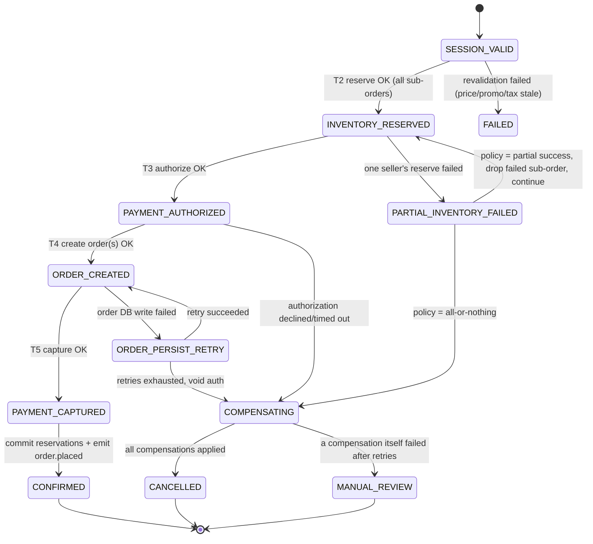

# Chapter 6 — Checkout Orchestration & the Saga

Chapter 5 showed the high-level picture. A **Checkout Orchestrator** sits in front of the Cart
Service, Pricing & Promotions Service, Tax Service, Inventory Service, Payment Service, and
Order Service. It coordinates the `place-order` call. This chapter opens that box and looks
inside.

If you can only study one chapter from this handbook before an interview, study this one.
`place-order` is the riskiest single call in the whole GlobalMart system. It moves money. It
moves inventory. And it must work correctly about 2,300 times a second on a normal day, and up
to 50,000 times a second at Black Friday peak. It must never charge a buyer twice. It must never
sell a seller's last item to two different buyers.

This is hard because of the shape of the problem, not because of a small mistake somewhere. The
operation touches data in several systems. Each system is owned separately. Each system scales
separately. One of these systems, the payment provider, is not even inside GlobalMart at all.

This chapter is about the pattern that makes this solvable. It is called the **saga**. We will
also look at the machinery a large checkout system needs to run sagas correctly. This includes a
state machine, an orchestrator, saved saga state, a recovery process, and idempotency keys on
every step. An idempotency key is a unique ID for a request. If the same request comes again with
the same key, the system does not repeat the action. It just returns the same result again.

---

## 6.1 The Core Problem: One Business Action, Many Systems of Record

`POST /v1/checkout/sessions/{id}/place-order` feels like one simple action to the buyer. The
buyer clicks a button and sees "Order Confirmed." But behind that click, the system must safely
change state in at least four different systems. Each of these systems can fail on its own.

| System | What changes | Owned by | Consistency needed |
|---|---|---|---|
| **Inventory DB** | Reduce available stock. Create a `HELD` reservation for each item, for each seller | Inventory Service | Strong — no overselling |
| **PSP (external payment provider)** | Authorize a charge now, capture it later, against the buyer's card or wallet | The payment network, not GlobalMart | Strong — no double charge |
| **Order DB** | Insert one `Order` row for each seller's part of the cart, under one `checkout_group_id` | Order Service | Strong — no lost or duplicate order |
| **Idempotency Store** | Record that this request's `Idempotency-Key` is being handled, or has been handled | Shared infrastructure | Strong — retries must be safe |

A normal database transaction (called ACID) needs every part of the change to happen in one
database, under one lock manager, and it either all happens or none of it happens. None of the
four rows above can work that way. Here is why.

- **Inventory DB and Order DB are different databases.** They are usually split into different
  shards too. A shard is one part of a database that is split across many machines to handle more
  load. The brief tells us that the Order DB has about 1,024 shards, split by `hash(order_id)`.
  The Inventory DB is split by `listing_id` or SKU. Locking rows across many shards at request
  time is slow and it hurts availability at this scale. Chapter 9 explains sharding and hot shards
  in more depth.
- **The PSP sits outside our company and our infrastructure.** It only offers an HTTP API. It has
  its own internal rules for consistency. It will never let GlobalMart's database treat it as a
  full partner in a two-phase commit, which we explain next. Money movement across a bank or card
  network is naturally a slow, async process. Even an "authorization" is just a promise from the
  issuing bank. It is not an instant, synchronous write to a shared ledger.
- **A cart from many sellers becomes many sub-orders.** If a buyer's cart has items from three
  sellers, checkout creates three sub-orders. Each sub-order touches a different seller's stock
  and a different partition of the Order DB. There is no single row, and no single shard, that
  represents "the whole order."

So the real question is not "how do we make this one big transaction atomic." Atomic means all
steps succeed together, or none of them happen. The real question is: **how do we make a
multi-step process behave correctly, with no double charge and no overselling, even when any step
can fail, time out, get retried, or the coordinator itself can crash in the middle?** This is
exactly the problem that the saga pattern was built to solve.

---

## 6.2 Why Not Two-Phase Commit (2PC / XA)?

It helps to be clear about why two-phase commit, often called 2PC or XA, is the wrong tool here.
Interviewers often ask "why not just use a distributed transaction?" so this answer is worth
knowing well.

**How 2PC works, in simple terms.** A coordinator asks every system taking part to "prepare."
Each system locks the rows it will change, writes an undo log, and votes yes or no. Only after
every system votes yes does the coordinator tell everyone to "commit." Every system keeps its
locks the whole time, from prepare until commit.

**Why this fails for GlobalMart's checkout:**

1. **It blocks by design.** Every system holds its locks for the full round trip to every other
   system and back. Now think about a hot flash-sale item. Its inventory row is exactly the kind
   of row we cannot afford to lock for a long time. The brief says payment authorization alone can
   take 300 to 1,500 milliseconds, and this is the slowest, most unpredictable part of the whole
   request. If we lock a hot SKU's row for 1.5 seconds while 50,000 orders per second are
   competing for it, the whole reservation system falls over.
2. **The PSP cannot join a 2PC transaction.** 2PC needs every participant to support prepare,
   commit, and rollback under the coordinator's control. Visa, a bank, or a wallet company will
   never offer that. A card authorization is a one-time, async decision made by systems GlobalMart
   does not run. There is no way to ask a bank to "prepare an authorization" and get a synchronous
   yes or no vote.
3. **The coordinator becomes a single point of failure that can freeze the whole system.** If the
   2PC coordinator crashes after some systems have locked their rows but before it says commit or
   abort, those systems stay locked, possibly forever. This is the well-known "2PC blocking
   problem." That is a direct threat to the 99.99% availability goal from Chapter 1. One stuck
   lock on a hot SKU does not just fail one buyer's checkout. It can block every other buyer trying
   to buy that same SKU.
4. **It does not fit with sharding or services owned by different teams.** 2PC assumes all
   participants sit inside one closed system, controlled by one coordinator. GlobalMart's
   Inventory DB, Order DB, and PSP adapters are owned by different teams. One of them, the PSP, is
   owned by an outside company. Forcing them all under one coordinator would undo the whole point
   of splitting checkout into independent, separately-scalable services.
5. **It trades away availability at the wrong moment.** The brief ranks correctness first, but
   availability is priority number two, right after it, because downtime means direct lost
   revenue. 2PC buys strong consistency by giving up availability exactly when things go wrong,
   during network delays or slow participants. That is exactly what happens during a flash sale.
   A saga gets the same real-world correctness, no double charge, no overselling, without this
   blocking failure mode.

| Point of comparison | 2PC / XA | Saga |
|---|---|---|
| Locking | Locks stay held across the whole multi-service round trip | Each local step commits and releases its locks right away |
| Can the PSP take part? | No, a PSP is not a 2PC resource manager | Yes, the PSP is just another local step: authorize, capture, or void |
| Coordinator crashes | Other systems may stay locked forever | Steps that already ran stay committed; the orchestrator resumes from saved state |
| Different teams or companies owning parts | Needs everyone under one administrative control | Each service owns its own local transaction and its own undo action |
| Recovering from failure | Abort and roll back, using the database's own rollback | Run explicit "undo" business actions, not a database rollback |
| Availability when something fails | Degrades badly, because of blocking | Degrades gently, because steps and undos can retry on their own |

The saga design gives up one thing that 2PC offers. For a short time, the system can be in a
"partly done" state that a very careful observer could notice. For example, inventory might be
held while payment has not been authorized yet. GlobalMart accepts this short window. The buyer
just sees "processing" during this time, and if something goes wrong, the undo steps close the
gap. In return, GlobalMart gets local commits that do not block, natural support for the PSP as
just another step, and a system that degrades gently instead of freezing. That trade is the right
one, because availability is priority two, right under correctness.

---

## 6.3 The Saga Pattern: Local Steps Plus Undo Steps

A **saga** is a list of local steps, call them `T1, T2, … Tn`. Each step commits on its own,
inside its own service and its own database. The saga also has a matching list of **undo steps**,
called **compensating actions**, `C1, C2, … Cn-1`. If a later step fails, the saga runs the undo
steps for the earlier steps that already succeeded.

An undo step is different from a database rollback. A rollback restores the old data exactly as
it was. An undo step is a brand new forward action with its own business meaning. For example:
*release the reservation*, *void the authorization*, *cancel the order*. These undo steps have
their own retry logic and their own need for idempotency, which we cover in section 6.11.

The design brief fixes GlobalMart's saga steps. We reuse them here exactly:

```
T1  Revalidate the session   (Pricing & Promotions, Tax, Cart — check price/promo/tax are still valid)
T2  Reserve inventory        (Inventory Service, once for each seller's sub-order)   → C2: release the reservation
T3  Authorize payment        (Payment Service → PSP, for the full amount)            → C3: void the authorization
T4  Create the order(s)      (Order Service, one row for each sub-order)             → C4: cancel the order
T5  Capture payment          (Payment Service → PSP)                                 → C5: refund
     + commit the reservations, publish order.placed
```

Undo steps run in **reverse order**, compared to the forward steps that already succeeded. If T3
fails, we only need `C2` because T1 has nothing worth undoing. If T4 fails, we need `C3` and then
`C2`, in that order.

### Orchestration versus choreography

There are two common ways to wire a saga together. This choice comes up often in interviews.

**Choreography** means there is no central coordinator. Each service listens for events from the
previous service and sends out its own event when it finishes. For example, the Inventory
Service reserves stock and publishes an event called `inventory.reserved`. The Payment Service
listens for that event, authorizes the payment, then publishes `payment.authorized`. The Order
Service listens for that, and so on. To handle failures, every service must also listen for
failure events and know how to undo its own work.

**Orchestration** means one central component, the **Checkout Orchestrator**, owns the whole
process. It calls each service directly, or through a command queue. It decides what happens
next, based on each response. It is the only part of the system that knows the full sequence of
steps and how to undo them.

| Point of comparison | Choreography | Orchestration |
|---|---|---|
| Coupling between services | Loose. Services only know about events, not about each other | Tighter. The orchestrator knows every service's API |
| Where does the workflow logic live? | Spread across every service's event handlers | Centralized in one place |
| Can we ask "what state is checkout #X in?" easily? | Hard. You must piece together events from many logs | Easy. It is one row in the orchestrator's saga state table |
| Undo ordering | Each service must separately know when and how to undo, and in what order compared to other services | The orchestrator drives all undos in the correct reverse order, in one place |
| Adding a new step, for example a fraud check | Touches every service that needs to know about the new event | Add one step to the orchestrator; other services do not need changes |
| Best fit | Simple workflows with loose coordination, for example "user signs up, then send a welcome email, then start a trial" | Workflows that need strict order, undos across many parties, and a very high correctness bar |

**GlobalMart chooses orchestration for the core checkout saga.** This is a deliberate choice, not
a default. Here is why, in simple terms:

1. **We need to see the state clearly, at any time.** At 50,000 orders per second, a support
   agent or an on-call engineer needs to answer "what state is `checkout_group_id = X` in, right
   now" with one lookup. With orchestration, that is one row in a table. With choreography, that
   answer needs digging through event logs from five different services.
2. **Undo ordering must be guaranteed from one place.** Say payment fails after three sellers'
   items were reserved. Something must know to release exactly those three reservations, in the
   right order, and touch nothing else. With choreography, this logic would need to be copied
   into every service that might need to undo something, and kept in sync everywhere. With
   orchestration, this logic lives in one piece of code, in one place, that owns the whole undo
   plan.
3. **This part of the system needs strong correctness, not loose coupling.** Checkout's top
   priority is correctness. Loose coupling is useful because it lets services scale and deploy
   independently. But that benefit is not worth losing clear visibility and guaranteed undo order,
   on the one workflow in the system where a bug means a double charge or an oversold item.
4. **Orchestration does not stop us from using choreography elsewhere.** GlobalMart is not
   against choreography everywhere. It uses choreography right after the saga's strict core
   finishes. Once the orchestrator reaches the `CONFIRMED` state, it publishes an `order.placed`
   event onto Kafka. Kafka is a message queue system used for passing events between services.
   The Notification Service, the Fulfillment system, and Analytics all pick this event up in a
   choreography style. They are fully decoupled from the orchestrator and from each other. This
   is the right place for loose coupling, because these systems do not need to take part in undo
   actions, and their own failures should never affect whether the order gets confirmed.

Here is a simple rule to say out loud in an interview: **use orchestration for steps that must
agree together on success or failure, and that can trigger each other's undo actions. Use
choreography for steps that come after, that are independent, and that are fine with being
eventually consistent.** Checkout's five-step money path clearly needs orchestration. Everything
that happens after `order.placed` fits choreography well.

---

## 6.4 The Checkout State Machine

The orchestrator's whole job is to move a `checkout_group_id` through a state machine, and save
every step change durably. A state machine is a model with a fixed set of states, plus rules for
which state can move to which other state. Below are the states in forward order, along with the
failure and undo states that branch off each one.



| State | We enter this state when | Success moves to | Failure or undo moves to |
|---|---|---|---|
| `SESSION_VALID` | Revalidation shows price, promotion, tax, and buyer eligibility are still correct since the session was last shown | `INVENTORY_RESERVED` | `FAILED`. Nothing to undo, nothing was committed yet |
| `INVENTORY_RESERVED` | Every sub-order's `reserve()` call returned `HELD`, with a reservation ID | `PAYMENT_AUTHORIZED` | `PARTIAL_INVENTORY_FAILED`, if at least one but not all sub-orders got reserved |
| `PARTIAL_INVENTORY_FAILED` | One or more sub-order reservations failed, for example out of stock, while others succeeded | `INVENTORY_RESERVED` again. Drop the failed sub-order, and continue with the rest. This is the partial-success policy | `COMPENSATING`. Release every held reservation. This is the all-or-nothing policy |
| `PAYMENT_AUTHORIZED` | The PSP approved an authorization for the total amount, which may be smaller if a sub-order was dropped | `ORDER_CREATED` | `COMPENSATING`, meaning release the reservations, on a decline or a timeout |
| `ORDER_CREATED` | Every surviving sub-order now has a saved `Order` row, with status `CREATED` | `PAYMENT_CAPTURED` | `ORDER_PERSIST_RETRY` on a short-lived DB failure. `COMPENSATING`, meaning void the authorization and release reservations, if retries run out |
| `PAYMENT_CAPTURED` | The PSP confirmed the capture, or the capture is planned for later. See Chapter 8 | `CONFIRMED` | Rare case. A capture failure after a successful authorize is treated as a retryable step, escalating to manual review, not a full rollback, because the money is already earmarked |
| `CONFIRMED` | Order rows switch to `CONFIRMED`, reservations switch to `COMMITTED`, and `order.placed` is published | This is a final, successful state | — |
| `COMPENSATING` | Any earlier step failed past its retry limit | `CANCELLED` once all undo actions are confirmed | `MANUAL_REVIEW`, if an undo action itself fails past its retry limit |
| `CANCELLED` | All undo actions for this saga are confirmed done | This is a final, clean failure state | — |
| `MANUAL_REVIEW` | An undo action could not be confirmed as done, for example the void call to the PSP kept erroring | Stays here until an operator or a reconciliation job resolves it | Resolved by reconciliation, see Chapters 8 and 10 |

Two states are worth calling out, because they would not exist in a simple "happy path only"
design. `PARTIAL_INVENTORY_FAILED` exists because GlobalMart sells through many sellers at once,
see sections 6.6 and 6.12. `ORDER_PERSIST_RETRY` and `MANUAL_REVIEW` exist because "just undo
everything" is not always the right answer once real money has already moved, see sections 6.8
and 6.11.

---

## 6.5 Walking the Happy Path

```
Buyer          API GW      Orchestrator     Inventory Svc     Payment Svc → PSP     Order Svc      Kafka
 │  place-order   │              │                │                  │                │            │
 │───(Idem-Key)──▶│──────────────▶│                │                  │                │            │
 │                │              │ 1. revalidate  │                  │                │            │
 │                │              │ (Pricing/Tax)  │                  │                │            │
 │                │              │──create saga──▶│ (save SESSION_VALID)                │            │
 │                │              │ 2. reserve × N sub-orders          │                │            │
 │                │              │───────────────▶│                  │                │            │
 │                │              │◀── HELD (×N) ──│                  │                │            │
 │                │              │ (save INVENTORY_RESERVED)          │                │            │
 │                │              │ 3. authorize the full amount       │                │            │
 │                │              │─────────────────────────────────▶│                │            │
 │                │              │◀──────── AUTHORIZED ─────────────│                │            │
 │                │              │ (save PAYMENT_AUTHORIZED)          │                │            │
 │                │              │ 4. create order × N sub-orders     │                │            │
 │                │              │────────────────────────────────────────────────────▶│            │
 │                │              │◀───────────────── CREATED (×N) ───────────────────│            │
 │                │              │ (save ORDER_CREATED)                │                │            │
 │                │              │ 5. capture                          │                │            │
 │                │              │─────────────────────────────────▶│                │            │
 │                │              │◀───────────── CAPTURED ──────────│                │            │
 │                │              │ commit reservations, mark orders CONFIRMED         │            │
 │                │              │ (save CONFIRMED)                    │                │            │
 │                │              │────────────────publish order.placed────────────────────────────▶│
 │◀────── 200 OK {order_ids, status: CONFIRMED} ───│                  │                │            │
```

Every arrow that says "save `<STATE>`" is a durable write. It goes to the saga-state table
**before** the orchestrator does the next step. This one detail is what makes crash recovery
possible, which we cover in section 6.10. The orchestrator itself keeps no long-lived data in its
own memory. If the server handling this request dies between step 3 and step 4, any other copy of
the orchestrator can read that saved row and pick the saga back up.

Here is simplified pseudo-code for the main loop. Each step is written as a small, safe-to-retry
unit:

```python
def run_saga(checkout_group_id, idempotency_key):
    saga = saga_store.load_or_create(checkout_group_id, idempotency_key)
    if saga.state == "CONFIRMED" or saga.state == "CANCELLED":
        return saga.result  # already finished, safe to just replay the result

    try:
        if saga.state in ("NEW",):
            revalidate(saga)                     # T1
            saga.transition("SESSION_VALID")

        if saga.state in ("SESSION_VALID",):
            results = [reserve_inventory(saga, so) for so in saga.sub_orders]  # T2
            saga = handle_reservation_results(saga, results)  # may -> PARTIAL_INVENTORY_FAILED

        if saga.state in ("INVENTORY_RESERVED",):
            auth = authorize_payment(saga)       # T3
            saga.transition("PAYMENT_AUTHORIZED", auth_ref=auth.psp_reference)

        if saga.state in ("PAYMENT_AUTHORIZED",):
            orders = [create_order(saga, so) for so in saga.sub_orders]       # T4
            saga.transition("ORDER_CREATED", order_ids=[o.id for o in orders])

        if saga.state in ("ORDER_CREATED",):
            capture_payment(saga)                # T5
            commit_reservations(saga)
            confirm_orders(saga)
            saga.transition("CONFIRMED")
            publish("order.placed", saga)

    except StepFailed as e:
        compensate(saga, failed_at=e.step)
    saga_store.persist(saga)                      # save every transition, always
    return saga.result
```

Every call inside this loop, `reserve_inventory`, `authorize_payment`, `create_order`,
`capture_payment`, and every undo function, is itself safe to retry with the same key. We explain
this in section 6.9. Because of that, this loop can be re-entered safely from any point, after a
crash, a timeout, or a retry from the client.

---

## 6.6 Failure Path A — Inventory Reservation Fails for One Seller (Partial Success)

**Scenario.** A buyer's cart has items from three sellers: A, B, and C. The orchestrator calls
`reserve()` for all three at the same time. A and C return `HELD`. B's item sold out one second
earlier, because a different buyer grabbed it during a flash sale. B returns
`INSUFFICIENT_STOCK`.

This is not just a technical failure question. It is a **product decision**, and the design brief
flags it directly. Should the whole checkout fail because one of three sellers is out of stock?
Or should A and C's orders go ahead, and only B gets dropped?

| Policy | What happens | Good points | Bad points |
|---|---|---|---|
| **All-or-nothing** | Release A and C's reservations too. The whole `place-order` request fails. The buyer sees "some items are no longer available," edits the cart, and tries again | Simple to understand. One confirmation email. No surprise about split shipments | Punishes the buyer just because sellers A and C were lucky. In a busy flash sale with a 3-seller cart, it is quite likely that at least one seller loses the race for stock. So this policy raises the failure and retry rate exactly when the site is busiest |
| **Best-effort partial success** | Drop B's sub-order. Continue with authorizing, capturing, and confirming A and C's sub-orders, still under the same `checkout_group_id`. B's sub-order gets its own `CANCELLED` status with a reason shown to the buyer | Gets the most sales completed. The buyer still receives the items that are available. This matches how large marketplaces like Amazon and AliExpress usually behave | The buyer must be told about this possibility up front, so it is never a silent surprise. It makes any promotion that spans multiple sellers more complex, see section 6.12. Support and notification flows must handle one `checkout_group_id` with mixed outcomes |

**GlobalMart's default policy is best-effort partial success.** This is shown to the buyer at
checkout time. The review screen can say something like "items are reserved separately per
seller. If one becomes unavailable, your other items will still be ordered." This fits the
multi-seller data model from the brief, where one `checkout_group_id` naturally maps to many
independent `Order` rows, each with its own status. GlobalMart also supports an override to
all-or-nothing for special cases, for example a bundled cross-seller promotion, covered in section
6.12.

Here is the undo sequence when the partial-success policy is active:

```
Orchestrator          Inventory Svc (A)   Inventory Svc (B)   Inventory Svc (C)
     │  reserve(A) ────────▶│                    │                   │
     │  reserve(B) ─────────────────────────────▶│                   │
     │  reserve(C) ─────────────────────────────────────────────────▶│
     │◀──── HELD ───────────│                    │                   │
     │◀── INSUFFICIENT_STOCK ────────────────────│                   │
     │◀───────────────────── HELD ───────────────────────────────────│
     │
     │  policy = partial success → drop sub-order B, recompute the total
     │  (nothing to undo for A or C — they stay HELD)
     │  saga.sub_orders = [A, C]; save PARTIAL_INVENTORY_FAILED → INVENTORY_RESERVED
     │  continue to authorize_payment(saga) for the A+C total only
```

If the policy were all-or-nothing instead, the last three lines above become an undo action.
`release(A)` and `release(C)` run. The saga moves from `PARTIAL_INVENTORY_FAILED` to
`COMPENSATING` to `CANCELLED`. The buyer sees one single failure message, with no partial charge,
because payment was never authorized at this point. Undoing here is cheap. It is just an
inventory rollback. There is no PSP call involved at all.

---

## 6.7 Failure Path B — Payment Is Declined After Inventory Is Reserved

**Scenario.** A and C's reservations succeed, from section 6.6, or all three succeed if no seller
was out of stock. The orchestrator calls `authorize_payment()` for the total amount. The PSP
returns `DECLINED`. This could be from insufficient funds, a risk block, or an expired card. The
exact reason does not change how the saga behaves.

At this point, **no order row exists yet, and no money has actually moved.** The only durable
side effect so far is the inventory hold. So the undo action here is simple: release every
reservation this saga created.

```
Orchestrator                                   Inventory Svc          Payment Svc → PSP
     │ authorize(total) ────────────────────────────────────────────────────▶│
     │◀───────────────────────────────────── DECLINED ─────────────────────│
     │ saga.transition(PAYMENT_AUTHORIZED_FAILED)
     │ undo: release(A), release(C)   [reverse order of T2]
     │────── release(A) ─────────────────────▶│
     │────── release(C) ─────────────────────▶│
     │◀──────────── RELEASED (×2) ────────────│
     │ saga.transition(CANCELLED)
     │ respond 402 { reason: "payment_declined" } to the buyer
```

Two points worth mentioning in an interview:

- **The reservation TTL is a safety net. The undo action is the fast path.** TTL means
  time-to-live, a limit on how long something is allowed to exist before it expires
  automatically. Reservations have a TTL of about 15 minutes, from the brief's data model. This
  exists so that if the undo action itself never runs, for example the orchestrator crashes or the
  release call is lost, the reservation still expires on its own and the stock becomes available
  again. The undo action makes stock available again in milliseconds. The TTL is just the
  backstop, not the main way this gets fixed.
- **This is the cheapest failure path in the entire saga.** Nothing has touched the Order DB, and
  no money actually moved. An authorization that gets declined was never real money in motion.
  This is exactly why authorization happens before order creation in the fixed step order: fail as
  early as possible, on the step that is easiest and cheapest to reverse.

---

## 6.8 Failure Path C — Order DB Write Fails After Payment Is Authorized

**Scenario.** Inventory is `HELD`. The PSP has already returned `AUTHORIZED`, meaning the buyer's
funds are earmarked. Now the write of the `Order` row or rows to the sharded Order DB fails. Maybe
a shard is briefly unreachable, or there is a deadlock, or a timeout.

This is the most interesting failure path in the whole saga. Unlike section 6.7, **something
irreversible has already happened outside our own systems.** The PSP is holding an authorization
against the buyer's card. The simple answer, "just undo everything, void the auth, release the
reservations," is correct, but it is not always the best answer. It is worth thinking through both
choices, because interviewers like to ask exactly this: "what if the DB write fails after you have
already authorized the card?"

| Option | How it works | When it is the right choice |
|---|---|---|
| **Retry the write** | Treat the Order DB write as a step that can be retried, with backoff, meaning waiting a bit longer between each try. Try a handful of times over a span of a few hundred milliseconds up to a few seconds. Use a fixed order ID, built from `checkout_group_id` and `seller_id`, as the idempotency key, so a retried insert is a safe no-op if an earlier attempt actually succeeded | The failure is almost always temporary, for example a shard failover, brief overload, or lock contention. Order DB writes rarely fail because the business logic is wrong. They usually fail because of short infrastructure problems. Authorizations usually stay valid for about 7 days before the card network auto-expires them, so there is plenty of safety margin to keep retrying. Retrying keeps the buyer's place and avoids trying a second authorization, which brings its own risk of being declined, of triggering fraud rules, and of frustrating the buyer |
| **Void the authorization and fail** | Immediately call void or cancel on the PSP authorization. Release the reservations. Fail the saga. Tell the buyer to safely retry `place-order`, using the same `Idempotency-Key` | Only do this after the retry limit for the write is used up, for example after N attempts or after a fixed time window. At that point, something more serious is likely wrong, for example the shard being down for a long time, or a schema problem. Holding an authorization indefinitely against a buyer's card, with no order ever created, is the worse outcome |

**GlobalMart's rule is: retry first, void only as the last resort.** The state machine shows this
with the `ORDER_CREATED` to `ORDER_PERSIST_RETRY` cycle. This retry loop has both a maximum number
of attempts and a maximum wall-clock time, tied to the orchestrator's own step timeout, covered in
section 6.10. Only after that budget runs out does the saga move to `COMPENSATING`, which then
runs `void_authorization` followed by `release_reservation`, in the reverse order of T3 and T2. The
idea to say out loud in an interview is: **prefer to finish the forward path instead of undoing
it, whenever the failure looks temporary and the cost of waiting a little longer is small.** An
authorization hold is cheap and has a known limit, measured in days. A second authorization
attempt, or an abandoned checkout, is not cheap. This is the exact opposite of section 6.7, where
the smart move was to fail fast, because nothing expensive had happened yet.

```
Orchestrator                              Order Svc / Order DB          Payment Svc → PSP
     │ create_order(A), create_order(C) ─────────▶│
     │◀────────────── DB timeout ─────────────────│
     │ retry #1 (backoff 100ms) ───────────────────▶│
     │◀────────────── DB timeout ─────────────────│
     │ retry #2 (backoff 300ms) ───────────────────▶│
     │◀───────────── CREATED (×2) ─────────────────│      ← succeeded before the budget ran out
     │ saga.transition(ORDER_CREATED) → continue to capture

     ── OR, if all retries fail ──

     │ retry #N ────────────────────────────────────▶│
     │◀────────────── DB timeout ─────────────────│
     │ retry budget used up → saga.transition(COMPENSATING)
     │ void(auth_ref) ──────────────────────────────────────────────────────▶│
     │◀───────────────────────────────────────────────────────── VOIDED ────│
     │ release(A), release(C) ────▶│ (Inventory Svc)
     │ saga.transition(CANCELLED); respond 500/503, buyer is safe to retry place-order
```

---

## 6.9 Idempotency Inside the Saga

Every step in this saga can be retried. It might be retried by the orchestrator's own recovery
logic, by a client retry after a timeout, or by a load balancer that replays a request by mistake.
None of these retries are allowed to cause a double reservation, a double authorization, or a
double insert. The fix, used consistently across this whole handbook, is to use **idempotency
keys that are built from the `checkout_group_id`, not randomly created on every attempt.**

| Step | Idempotency key | What happens on a retry |
|---|---|---|
| The whole saga (`place-order`) | The client-supplied `Idempotency-Key` header, saved in the Idempotency Store together with the eventual response | The same request replays the saved response, without running anything again. See Chapters 3 and 8 |
| Reserve inventory, per sub-order | `reservation_id = hash(checkout_group_id, seller_id, listing_id)` | The Inventory Service writes to this fixed key. A retried `reserve()` call for the same sub-order either finds the existing `HELD` row and returns it, or safely creates it once |
| Authorize payment | `payment_idempotency_key = checkout_group_id`, one authorization per saga, for the full amount | The PSP's own idempotency logic, covered in Chapter 8, makes sure a retried `authorize()` call with the same key returns the original authorization, instead of creating a second one |
| Create order, per sub-order | `order_id = hash(checkout_group_id, seller_id)` | A retried insert with the same key is a no-op, or is handled with an upsert, "insert or update," so it never creates a duplicate row |
| Capture payment | `checkout_group_id`, tied to the specific `psp_reference` from the authorize step | A retried capture against an already-captured authorization returns the existing capture. It never captures twice |
| Undo actions: release, void, cancel | The same fixed keys as the forward step they are undoing | Releasing an already-`RELEASED` reservation, voiding an already-`VOIDED` authorization, or cancelling an already-`CANCELLED` order are all safe no-ops |

Because every key is built from fixed data, not created fresh on each attempt, the orchestrator
can call any step as many times as it needs, with no extra coordination. This is what "safe to
retry" really means in practice, not just as a slogan.

**Resuming a half-finished saga after a crash follows directly from this.** Say the orchestrator,
or a fresh copy of it, needs to pick up a saga again. This could be because the client retried
`place-order` with the same `Idempotency-Key`, or because a recovery sweeper, covered in section
6.10, found the saga stuck. The orchestrator does not start over from `T1`. It reads the saved
`SagaState` row, sees for example `state = PAYMENT_AUTHORIZED`, and re-enters the loop starting at
`if saga.state in ("PAYMENT_AUTHORIZED",): create_order(...)`. Even if it mistakenly called
`reserve_inventory()` again for a sub-order that was already `HELD`, the fixed key makes that call
a safe no-op. The design has two layers on purpose: "resume from the right place" and "it is fine
even if you do not resume from the right place" are both true at the same time. This is exactly
why idempotency keys matter more than clever resume logic. The resume logic is a nice optimization.
The idempotency keys are the actual correctness guarantee.

---

## 6.10 The Orchestrator Crashing Mid-Saga: Saved State, a Recovery Sweeper, and Timeouts

The design brief clearly says the orchestrator holds **no long-lived state of its own.** This is
not a small implementation detail. It is the exact property that allows the orchestrator to scale
horizontally, meaning run on many identical machines, and to recover from crashes. Every fact
about how far a saga has progressed lives in a durable **SagaState** table. This table is written
before the orchestrator acts on that information, never after.

```jsonc
// SagaState — durable, one row per checkout_group_id
{ "checkout_group_id", "idempotency_key", "state": "PAYMENT_AUTHORIZED",
  "saga_version": 4,                      // an optimistic lock number, goes up on every change
  "sub_orders": [ {seller_id, state, reservation_id, order_id} ],
  "auth_ref", "grand_total", "currency",
  "owner_lease": {"orchestrator_id", "expires_at"},
  "step_deadline": "2026-07-15T10:14:32.500Z",
  "attempt_count": 1,
  "created_at", "updated_at" }
```

Three mechanisms work together here.

1. **Save before you act.** Every state change in the pseudo-code from section 6.5 is saved to
   the database **before** the orchestrator moves on to the next call. If the process dies right
   after saving `PAYMENT_AUTHORIZED`, but before calling `create_order`, the saved record is
   completely clear: payment succeeded, but order creation never even started. Any orchestrator
   instance can then correctly pick this up and continue at "create order."
2. **A recovery sweeper.** This is a background process that keeps scanning the `SagaState` table
   for rows stuck in a non-final state, such as `SESSION_VALID`, `INVENTORY_RESERVED`,
   `PAYMENT_AUTHORIZED`, `ORDER_CREATED`, or `COMPENSATING`, where the `step_deadline` has already
   passed. This is the sign of a saga that started a step and never reported finishing it, most
   likely because the orchestrator instance crashed, or a downstream call hung. For each such row,
   the sweeper takes the `owner_lease`. This is an optimistic lock, using the `saga_version` number,
   so two sweeper instances cannot both drive the same saga at the same time. Then it re-runs the
   same `run_saga()` loop from section 6.5. Because every step is safe to retry, as explained in
   section 6.9, this loop safely resumes, or safely tries again, whatever step was in progress.
3. **Per-step timeouts.** These are sized to how long each step normally takes, based on the
   brief's latency budget:

   | Step | Typical time it takes | Timeout before we call the step "stuck" |
      |---|---|---|
   | Revalidate: Pricing, Tax, Cart | About 50 ms | 500 ms |
   | Reserve inventory, per sub-order, done in parallel | About 80 ms | 800 ms |
   | Authorize payment, external PSP | 300 to 1,500 ms | 5 s. This is the slowest, most unpredictable part of the whole request |
   | Create the order(s) | About 40 ms | 1 s, plus the fixed retry budget from section 6.8 |
   | Capture payment | Similar to authorize | 5 s |
   | Any undo action | Similar to its matching forward step | Same rough size, with its own separate retry budget, see section 6.11 |

   A short timeout on a fast, local step, like reserve or order create, lets the sweeper reclaim a
   stuck saga quickly. A longer timeout on the PSP call avoids a mistake where the sweeper races
   ahead of a slow-but-successful authorization and duplicates it. That risk is also reduced
   further by the PSP-side idempotency key from section 6.9, which is the real safety net for this
   race condition.

The `owner_lease` deserves special mention. Without it, a sweeper and the original orchestrator
instance, which might not actually be dead, just slow, could both try to drive the same saga at
the same time. The lease, protected by the `saga_version` check on every write, guarantees that
only one actor drives a given `checkout_group_id` forward at any moment. A simple conditional
update, for example `WHERE saga_version = 4`, is enough to make this safe. It fails automatically
if someone else already moved the saga forward. No separate distributed lock system is needed
just for this.

---

## 6.11 What If an Undo Step Itself Fails?

Undo steps are just ordinary calls to ordinary services, so they can fail for ordinary reasons.
The PSP's void endpoint might time out. The Inventory Service might be briefly unreachable. A
network problem might block the call entirely. A saga design that assumes undo steps always
succeed is not a complete design. This is the detail that separates "I know the basic saga
pattern" from "I have thought about what happens when the pattern itself has a bad day." Good
interviewers will ask exactly this question.

Here is the layered answer:

1. **Retry with backoff and jitter**, just like any other step. Jitter means adding a small random
   delay to avoid many retries all happening at the exact same moment. A void or release call gets
   several attempts, spread over a window of seconds rather than milliseconds, because for an undo
   step, correctness matters more than speed. The buyer is not actively waiting on this call.
2. **Once retries run out, escalate to `MANUAL_REVIEW`, never just give up silently.** The
   `SagaState` row moves from `COMPENSATING` to `MANUAL_REVIEW`, and this gets surfaced on an
   operational queue for a human to check. Meanwhile, the buyer sees an honest message, "order
   could not be completed," instead of a false confirmation that does not match reality.
3. **Reconciliation is the final backstop, not the first line of defense.** Reconciliation means a
   background job that regularly compares our own records against an outside source of truth, to
   catch and fix any mismatch. Chapter 8 covers this in detail. A continuous job compares
   GlobalMart's `PaymentAttempt` records against the PSP's own ledger, and compares Inventory's
   reservation table against the expected state, looking for exactly this kind of mismatch. For
   example, an authorization still open at the PSP with no confirmed order behind it, or a
   reservation still `HELD` long after its saga should have finished. Chapter 10 covers the
   operational side of this: dead-letter queues for undo messages that failed, alerting rules, and
   the on-call playbook for handling `MANUAL_REVIEW` sagas.

Reconciliation is the right backstop, not a sign of a badly designed system, because reservation
TTLs from section 6.7, and authorization expiries, already limit the damage automatically for two
of the three kinds of resources. A `HELD` reservation that never gets released still clears itself
in about 15 minutes. An authorization that never gets voided still expires on its own within days.
Reconciliation exists to catch the remaining cases, for example a captured payment with no
matching confirmed order, where nothing expires on its own and a human or an automated repair job
must actively issue a refund. Saga undo actions, TTLs, and reconciliation form three layers, each
one catching fewer cases but covering a wider scope. Most problems are caught by the undo action
itself. The rest are caught by TTL expiry. The last remaining few are caught by reconciliation. No
single layer is expected to be perfect on its own.

---

## 6.12 Multi-Seller Partial Success: A Real Product Decision

Section 6.6 introduced partial success as the answer to one specific failure, an inventory
shortage. It is worth stepping back and looking at the bigger picture. This is not just a small
inventory edge case. It is a design choice that touches pricing, promotions, notifications, and
refunds. It should be decided on purpose, together with the product team, not discovered later by
accident in an incident report.

**Why this is built into the system, not just a side effect.** The data model fixes this from the
start. One `checkout_group_id` groups together many independent `Order` rows, one for each
seller, and each with its own status. That data model itself is the decision that partial success
is possible. The only remaining question is what policy to apply on top of it.

**What partial success affects, beyond just inventory:**

- **Promotions that span multiple sellers.** Imagine a cross-seller discount, for example "$10 off
  orders that include items from 2 or more sellers," calculated back at `SESSION_VALID`. This
  discount might no longer be valid once one seller's sub-order gets dropped. The orchestrator
  must run Pricing & Promotions again, against only the sub-orders that survived, before
  authorizing payment. Recomputing the total is not optional. It is a required part of the
  continue-after-drop path shown in section 6.6's state machine.
- **Shipping cost bundling.** Free-shipping rules calculated across the whole cart can change when
  a sub-order drops below its own threshold on its own.
- **Notifications and what the buyer expects.** A buyer who ordered from three sellers, and got
  two confirmations and one cancellation, needs one clear, combined message. For example, "2 of 3
  items confirmed, 1 item unavailable, and you were not charged for it." They should not get three
  separate, confusing emails. This is handled by the Notification Service, downstream of the
  `order.placed` and `order.cancelled` events, but it depends on the orchestrator sending events
  for each sub-order, all tagged with the shared `checkout_group_id`.
- **Refund or goodwill policy**, if the sub-order that got dropped had contributed to a bundle
  discount that the buyer was expecting on the sub-orders that survived, and that discount is now
  invalid.

**GlobalMart's policy, stated simply:** the default is best-effort partial success, applied to
each sub-order. The system recomputes pricing, promotions, and shipping against only the surviving
sub-orders, before authorizing payment. The system tells the buyer about the possibility of
partial fulfillment at the review step. There is an explicit all-or-nothing override for carts
where a promotion is tied together across sellers in a way that makes partial fulfillment
meaningless, for example a "buy this bundle from these two sellers together" promotion. The
default favors completing more sales and keeping buyers happy, over the simplicity of an
all-or-nothing story. The override exists because sometimes "simple to reason about" has to win,
specifically when the promotion logic itself cannot be split cleanly by seller.

---

## Interview Tips

- **"Why not 2PC or XA for checkout?"** Start with the PSP. It simply cannot take part in a 2PC
  protocol that we do not control. Then bring up the blocking problem. 2PC holds locks across the
  full round trip, including a 300 to 1,500 millisecond external call, and that is not acceptable
  on hot flash-sale inventory rows at 50,000 orders per second. Finish with the availability point.
  Correctness is priority one, but availability is priority two for a reason, and 2PC's blocking
  failure mode threatens both at once. A stuck lock stalls other buyers too, not just the one who
  crashed.
- **"Saga versus 2PC, what do you actually give up?"** Be honest about this. You give up a brief,
  externally-invisible in-between state, and "undo" becomes an explicit business action instead of
  a free database rollback. In exchange, you get non-blocking local commits, natural support for an
  outside, non-transactional participant like the PSP, and graceful degradation instead of hard
  blocking.
- **"Orchestration or choreography, and why?"** Do not present this as one universal rule. Present
  it as a fit for the specific workflow. Use orchestration for the core money and inventory saga,
  because of the need for visibility, centralized undo ordering, and a strict correctness bar. Use
  choreography for what happens after `order.placed`, such as Notification, Fulfillment, and
  Analytics, because those are independent, fine with eventual consistency, and safe to decouple.
  If asked "would choreography ever work for the core saga," the honest answer is yes, at smaller
  scale or with a lower correctness bar, but the cost of debugging and of guaranteeing undo order
  grows with the number of participants and the strictness of the correctness requirement. Checkout
  has both of those in a big way.
- **"How does the orchestrator resume after it crashes mid-saga?"** Give a two-part answer. First,
  saved `SagaState` is written before every state change, so where the saga was is never lost.
  Second, every step uses a fixed, safe-to-retry key, so it is safe to resume from roughly the
  right place, even if a recovery sweeper accidentally calls a step twice. Mention the sweeper
  clearly: a loop that checks for "non-final state, past its step deadline." Also mention the
  `owner_lease` and `saga_version` optimistic lock, which stops two recovery attempts from racing
  each other.
- **"What if an undo step fails?"** This is the question that shows real depth. Retry with backoff
  first. Escalate to a manual-review or dead-letter state once retries run out. Name reconciliation
  as the final backstop, and mention that TTLs on reservations and expiries on authorizations
  already limit the damage even before reconciliation ever runs. Do not claim that undo steps
  always succeed. That is the wrong answer.
- **A strong one-line summary, if asked to sum up the chapter:** "Checkout cannot get atomicity
  for free, because it spans systems that do not share one transaction protocol, and one
  participant is completely outside the company. So it fakes atomicity with a saga: local commits,
  explicit undo actions, one orchestrator that always knows exactly where things stand, and
  idempotency keys strong enough that any single step, or the whole workflow, is safe to retry from
  any point."

---

## Key Takeaways

- Checkout's `place-order` touches the Inventory DB, an external PSP, the Order DB, and the
  Idempotency Store. These are four separately-failing systems that cannot share one ACID
  transaction.
- Two-phase commit is the wrong tool here. It blocks under lock contention on hot items, the PSP
  simply cannot be a 2PC participant, and a coordinator crash risks freezing every buyer competing
  for the same inventory, not just the one failed request.
- The saga pattern replaces one big distributed transaction with a chain of local steps, reserve,
  authorize, create order, capture, plus matching undo actions, release, void, cancel, that run in
  reverse order when a step fails.
- GlobalMart uses orchestration for the core saga, through the Checkout Orchestrator, for clear
  visibility and centralized undo ordering. It uses choreography for everything that happens after
  `order.placed`, such as Notification, Fulfillment, and Analytics, where loose coupling is fine.
- The checkout state machine has clear states for a partial multi-seller failure
  (`PARTIAL_INVENTORY_FAILED`), a temporary retryable failure (`ORDER_PERSIST_RETRY`), and an
  undo action that itself failed (`MANUAL_REVIEW`). It is not just a happy path plus one generic
  "failed" state.
- Each failure path needs a different answer. Fail fast and undo cheaply when nothing expensive
  has happened yet, for example inventory-only, or before authorization. Retry before undoing when
  an expensive, hard-to-reverse step, like an authorization, has already succeeded and the failure
  looks temporary.
- Multi-seller partial success is a product decision, built into the data model itself, where one
  `checkout_group_id` maps to many independent `Order` rows. GlobalMart defaults to best-effort
  partial fulfillment with recomputed pricing, with an all-or-nothing override for bundled
  promotions.
- Every saga step is safe to retry, because it uses a fixed key built from `checkout_group_id`,
  never a randomly generated one per attempt. This is what makes both client retries and
  orchestrator crash recovery safe by design, not just safe because of careful sequencing.
- The orchestrator itself holds no state. All saga progress lives in a durable `SagaState` table.
  A recovery sweeper resumes sagas that are stuck past their step deadline. An `owner_lease` with
  an optimistic version number stops two recovery attempts from racing each other.
- Undo actions can fail too. Retry with backoff, escalate to manual review once retries run out,
  and treat reconciliation, covered in Chapters 8 and 10, as the last-resort backstop, not the main
  mechanism.
