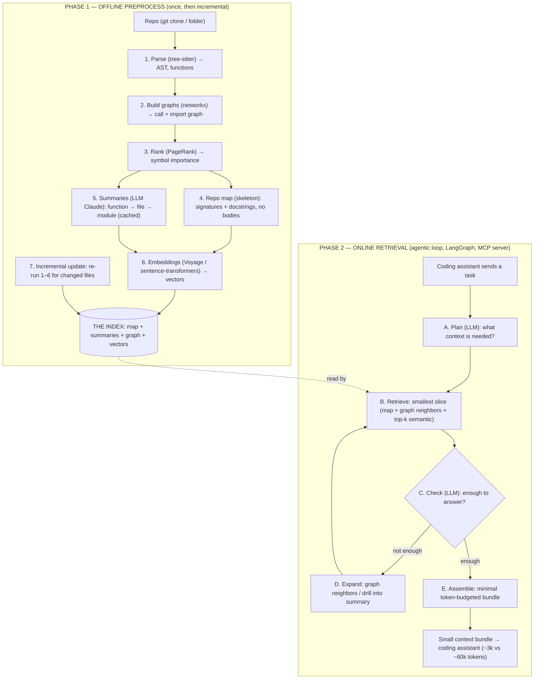

# Context Distiller — Flow Diagram

*Two phases. Phase 1 runs once (and then only on changed files). Phase 2 runs every time a coding
assistant asks for context. Simple English labels.*

---

## Full flow (ASCII)

```
================================  PHASE 1: OFFLINE PREPROCESS  ================================
(run once, then only on changed files)

        ┌───────────┐
        │   REPO    │  git clone / local folder
        └─────┬─────┘
              ▼
      [1] PARSE (tree-sitter)            ── each file → AST → list of functions/classes (file+line)
              ▼
      [2] BUILD GRAPHS (networkx)        ── call graph ("who calls who") + import graph
              ▼
      [3] RANK (PageRank)                ── score each symbol's importance (central code ranks high)
              ▼
      ┌───────┴─────────────────────────────────────────────┐
      ▼                                                       ▼
[4] REPO MAP (skeleton)                            [5] SUMMARIES (LLM: Claude)
signatures + docstrings,                           short summary per function → file → module
NO function bodies (10–30x smaller)                (cached, built once)
      │                                                       │
      └───────┬───────────────────────────────────┬──────────┘
              ▼                                     ▼
      [6] EMBEDDINGS                        (all outputs stored together)
      chunk code+summaries → vectors                │
      (Voyage / sentence-transformers)              ▼
              └──────────────────────────►  ┌───────────────────────┐
                                             │     THE INDEX         │
                                             │ map + summaries +     │
                                             │ graph + vector store  │
                                             └───────────┬───────────┘
                                                         │
      [7] INCREMENTAL UPDATE  ◄───── on each commit, re-run 1–6 for CHANGED files only
                                                         │
=========================================================│====================================
================================  PHASE 2: ONLINE RETRIEVAL  =================================
(the agentic loop — runs per task, LangGraph)            │
                                                         ▼
   Coding assistant (Claude Code / Copilot / Cursor)
        │  task: "add rate limiting to the login endpoint"
        ▼
   ┌─────────────────────  MCP SERVER  ─────────────────────┐
   │                                                         │
   │   [A] PLAN (LLM)                                        │
   │       decide what context is needed                     │
   │              │                                          │
   │              ▼                                          │
   │   [B] RETRIEVE  ◄───────────────── reads THE INDEX      │
   │       smallest useful slice:                            │
   │       repo map + graph neighbors + top-k semantic hits  │
   │              │                                          │
   │              ▼                                          │
   │   [C] CHECK (LLM)  ── "is this enough to answer?"       │
   │          │                    │                         │
   │      not enough              enough                     │
   │          │                    │                         │
   │          ▼                    ▼                         │
   │   [D] EXPAND               [E] ASSEMBLE                 │
   │   fetch graph neighbors    build the minimal,           │
   │   / drill into a summary   token-budgeted bundle        │
   │          │                    │                         │
   │          └──── loop back to [B]/[C]                     │
   │                               ▼                         │
   └───────────────────────────────┼─────────────────────────┘
                                    ▼
                        SMALL CONTEXT BUNDLE  →  back to the coding assistant
                        (e.g. ~3,000 tokens instead of ~60,000)
```

---

## Same flow (Mermaid — renders in GitHub, VS Code, and most Markdown viewers)



---

## How to read it (one line)
**Phase 1** builds a compact **index** of the repo once (parse → graph → rank → skeleton + summaries
→ embeddings). **Phase 2** is the agentic loop: the LLM **plans** what it needs, **retrieves** a small
slice from the index, **checks** if that is enough, **expands** only if needed, then **assembles** the
smallest bundle and serves it. The loop (`Check → Expand → Retrieve`) is where the LLM is the **brain**,
and it is what keeps the token count low.
