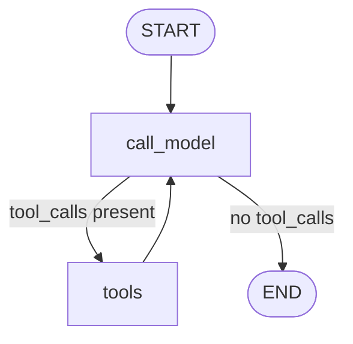

# Chapter 11 — LangGraph

Chapter 10 showed LangChain: chains, runnables, and a prebuilt agent executor. That
executor hides its loop from you. It decides when to call a tool, when to stop, and how
to store history. This works for simple agents. It gets hard to control once your agent
needs to pause for a human, save its progress, or run different steps depending on what
happened before.

This chapter covers **LangGraph**, a library built on top of LangChain. LangGraph makes
you draw the agent's loop as a graph. A graph is a set of steps, called **nodes**, joined
by **edges** that say what runs next. You see every step. You control every branch. This
is why LangGraph is the framework this handbook uses for the GlobalMart Assistant capstone
in Chapters 16 and 17.

## 11.1 Why a Graph Fits an Agent

Recall from Chapter 7: an agent is a loop. It calls a model, the model may ask for a tool,
the agent runs the tool, and the loop repeats until the model is done. In plain Python,
that loop looks like a `while` statement with an `if` inside it:

```python
while True:
    response = call_model(messages)
    if response.stop_reason == "tool_use":
        messages = run_tools_and_append(response, messages)
        continue
    break
```

This works. But as an agent grows, the `while` loop grows too. You add a check before a
refund. You add a step that saves progress. You add a branch for "the user asked something
unrelated, skip tools." Soon the loop is a wall of `if` statements, and it is hard to say,
just by reading it, "what are all the paths this agent can take?"

A graph makes the paths visible. Each step is a small function (a node). Each possible
next step is a line on a diagram (an edge). You can draw the agent before you code it:

```
        ┌─────────────┐
        │  call_model │◄──────────┐
        └──────┬──────┘           │
               │                  │
       tool call requested?       │
         /            \           │
       yes             no         │
        │               │         │
        ▼               ▼         │
  ┌───────────┐      ┌─────┐      │
  │ call_tools│──────┴─────►│ END │
  └─────┬─────┘             └─────┘
        └──────────────────────────┘
        (loop back to call_model)
```

This is the same loop as the `while` statement. Nothing magic happens underneath. The
value of LangGraph is that the loop is now **data**, not buried control flow. You can
inspect it, pause it, save it, and resume it, because LangGraph treats "where am I in the
graph" and "what do I know so far" as first-class, storable facts. That is the whole
chapter in one sentence: LangGraph turns an agent's loop into an explicit, inspectable,
pausable state machine.

Install what you need:

```bash
pip install langgraph langchain-anthropic
```

## 11.2 The Core Ideas: Nodes, Edges, State

LangGraph has four building blocks. Learn these and you can read any LangGraph program.

**State.** A *state* is a shared object that flows through the graph. Every node reads
it and returns updates to it. Think of it as a form that gets passed from desk to desk;
each desk (node) fills in a new field or appends to an existing one. In Python, state is
usually a `TypedDict`:

```python
from typing import Annotated, TypedDict
from langgraph.graph.message import add_messages

class AgentState(TypedDict):
    messages: Annotated[list, add_messages]
```

`messages` will hold the running conversation: user turns, model turns, tool results.
`Annotated[list, add_messages]` tells LangGraph: "when a node returns new messages, do
not overwrite the list — append to it, and merge tool results into the right message."
`add_messages` is a **reducer**: a small function that says how to combine an old value
in the state with a new one a node returns. Without a reducer, LangGraph just replaces
the field.

**Node.** A *node* is a Python function that takes the state and returns a partial
update to it:

```python
def greet(state: AgentState) -> dict:
    return {"messages": [("assistant", "Hello! How can I help?")]}
```

A node does one job: call a model, run a tool, check a condition, write a log line. Keep
nodes small. That is what makes the graph easy to read.

**Edge.** An *edge* connects one node to the next. A normal edge always goes to the same
place. A **conditional edge** picks the next node by running a function against the
current state — this is how a graph branches:

```python
def should_continue(state: AgentState) -> str:
    last_message = state["messages"][-1]
    if last_message.tool_calls:
        return "tools"
    return "end"
```

`should_continue` does not do any work itself. It only looks at state and returns a
label. LangGraph uses that label to decide which node runs next.

**Graph.** You wire nodes and edges together with `StateGraph`, then `compile()` it into
a runnable object:

```python
from langgraph.graph import StateGraph, START, END

builder = StateGraph(AgentState)
builder.add_node("greet", greet)
builder.add_edge(START, "greet")
builder.add_edge("greet", END)
graph = builder.compile()

result = graph.invoke({"messages": []})
print(result["messages"])
```

`START` and `END` are special markers built into LangGraph. Every graph starts at `START`
and finishes when it reaches `END`. This four-line skeleton — state, node, edge,
conditional edge — is all you need. The rest of this chapter is that skeleton, applied to
a real agent.

One more habit worth building early: draw the graph before you trust it. LangGraph can
render the wiring you just built, so you can check it matches the diagram in your head
before you spend a single token on a real run:

```python
print(graph.get_graph().draw_ascii())
# or, in a notebook: graph.get_graph().draw_mermaid_png()
```

This catches a common mistake: forgetting an edge, so a node has no way out and the
graph hangs, or wiring a conditional edge's labels to the wrong node names, so a branch
silently goes nowhere near where you intended.

## 11.3 Building the GlobalMart Agent as a Graph

Now build the GlobalMart Assistant from Chapters 7–9 again, this time as a LangGraph
graph. It will have two working nodes (call the model, run a tool) and one conditional
edge (loop back, or stop).

### Step 1: define the tools

These are the same tools from Chapter 8, defined the LangChain way with the `@tool`
decorator, plus one new, riskier tool: `issue_refund`. We add the risky tool now because
Section 11.4 uses it to show human approval.

```python
from langchain_core.tools import tool

@tool
def search_products(query: str) -> str:
    """Search the GlobalMart catalog for products matching a query."""
    return f"Found 3 products matching '{query}': SKU-101, SKU-204, SKU-330."

@tool
def get_order_status(order_id: str) -> str:
    """Look up the shipping status of a GlobalMart order."""
    return f"Order {order_id} is out for delivery, arriving tomorrow."

@tool
def create_support_ticket(user_id: str, issue: str) -> str:
    """File a support ticket for a GlobalMart customer."""
    return f"Ticket created for user {user_id}: '{issue}'."

@tool
def issue_refund(order_id: str, amount: float) -> str:
    """Refund money to the customer for an order. This moves real money."""
    return f"Refunded ${amount:.2f} for order {order_id}."

tools = [search_products, get_order_status, create_support_ticket, issue_refund]
```

Each tool's docstring becomes its description. The model reads these descriptions to
decide which tool fits the user's request. This is the same idea as Chapter 3's
`input_schema`, just written with a decorator instead of raw JSON.

### Step 2: define the state and the model node

```python
from typing import Annotated, TypedDict
from langgraph.graph.message import add_messages
from langchain_anthropic import ChatAnthropic

class AgentState(TypedDict):
    messages: Annotated[list, add_messages]

llm = ChatAnthropic(model="claude-opus-4-8")
llm_with_tools = llm.bind_tools(tools)

SYSTEM_PROMPT = (
    "You are the GlobalMart support assistant. Use tools to look up orders, "
    "search products, file tickets, or issue refunds. Only issue a refund "
    "after you are sure it is justified."
)

def call_model(state: AgentState) -> dict:
    messages = state["messages"]
    response = llm_with_tools.invoke([("system", SYSTEM_PROMPT)] + messages)
    return {"messages": [response]}
```

`bind_tools` attaches the tool definitions to the model, the same way `tools=[...]` did
on the raw Anthropic client in Chapter 3. `call_model` is one node: it reads the
conversation so far, calls Claude, and returns the model's reply as a state update.

### Step 3: define the tool-running node

LangGraph ships a ready-made node for this, `ToolNode`, which reads the tool calls on
the last message, runs the matching Python functions, and returns their results as
`ToolMessage` objects:

```python
from langgraph.prebuilt import ToolNode

tool_node = ToolNode(tools)
```

You could also write this node by hand — loop over `response.tool_calls`, call the
matching function, wrap the result in a `ToolMessage` — the same pattern as Chapter 8's
manual tool loop. `ToolNode` just saves you that boilerplate. Under the hood it is still
a plain function: state in, state update out.

### Step 4: the conditional edge that creates the loop

```python
def should_continue(state: AgentState) -> str:
    last_message = state["messages"][-1]
    if getattr(last_message, "tool_calls", None):
        return "tools"
    return "end"
```

If the model's last reply asked for a tool, go run the tool. Otherwise, the model gave a
final answer, so stop.

### Step 5: wire the graph

```python
from langgraph.graph import StateGraph, START, END

builder = StateGraph(AgentState)
builder.add_node("call_model", call_model)
builder.add_node("tools", tool_node)

builder.add_edge(START, "call_model")
builder.add_conditional_edges(
    "call_model",
    should_continue,
    {"tools": "tools", "end": END},
)
builder.add_edge("tools", "call_model")  # loop back after running a tool

graph = builder.compile()
```

The last line, `add_edge("tools", "call_model")`, is the loop. After a tool runs, control
always goes back to `call_model`, so the model can see the tool's result and decide what
to do next — answer the user, or call another tool. This is exactly the ReAct loop from
Chapter 7, now drawn as a graph:



### Step 6: run it

```python
result = graph.invoke({
    "messages": [("user", "What is the status of order 4471?")]
})
print(result["messages"][-1].content)
```

`invoke` runs the graph start to finish and returns the final state. Behind the scenes,
LangGraph called `call_model`, saw a tool call for `get_order_status`, ran `tools`, went
back to `call_model`, and stopped once Claude answered in plain text. You never wrote
that control flow — the graph did, from the edges you defined.

Walk through what `result["messages"]` actually holds after that call, because it is the
same pattern from Chapter 3, just accumulated by the graph instead of by hand:

1. A human message: `"What is the status of order 4471?"`.
2. An AI message with no text and one tool call: `get_order_status(order_id="4471")`.
   This is what made `should_continue` return `"tools"`.
3. A tool message: the string `get_order_status` returned, tagged with the matching
   `tool_call_id` so Claude knows which call it answers.
4. A final AI message with plain text: `"Order 4471 is out for delivery, arriving
   tomorrow."` This time `should_continue` sees no tool calls and returns `"end"`.

Four messages, two trips through `call_model`, one trip through `tools`. If the user had
asked two things — order status *and* a product search — step 2 would carry two tool
calls at once, `ToolNode` would run both, and you would see two tool messages before the
final answer. The loop shape does not change; only how many times each node fires does.

This is a small graph: two working nodes and one branch. Real agents add more nodes —
a router node (Chapter 9), a safety-check node (Chapter 14), a summarizer node for long
histories (Chapter 13) — but the pattern stays the same. Every new capability is one more
node and one more edge, not one more `if` buried in a loop.

## 11.4 Human-in-the-Loop: Approve Before You Refund

`issue_refund` moves real money. You do not want an LLM to call it on its own, no matter
how good your prompt is. **Human-in-the-loop** means the graph pauses before a risky step
and waits for a person to approve it, before continuing.

LangGraph supports this with an **interrupt**: a point where the graph stops running and
returns control to your application, without losing its place. To use interrupts, the
graph needs a **checkpointer** — covered fully in Section 11.5 — because pausing only
works if the graph's state is saved somewhere while it waits.

The simplest way is `interrupt_before`, set at compile time, naming a node that should
never run without a stop first:

```python
from langgraph.checkpoint.memory import MemorySaver

checkpointer = MemorySaver()

builder = StateGraph(AgentState)
builder.add_node("call_model", call_model)
builder.add_node("tools", tool_node)
builder.add_edge(START, "call_model")
builder.add_conditional_edges(
    "call_model", should_continue, {"tools": "tools", "end": END}
)
builder.add_edge("tools", "call_model")

graph = builder.compile(checkpointer=checkpointer, interrupt_before=["tools"])
```

Now every run pauses right before the `tools` node — before any tool, including
`issue_refund`, actually executes. Runs need a **thread ID**: an identifier for one
conversation, so LangGraph knows which saved state to resume.

```python
config = {"configurable": {"thread_id": "ticket-8821"}}

state = graph.invoke(
    {"messages": [("user", "Please refund order 4471 for $49.99, it arrived broken.")]},
    config=config,
)
print(state["next"])  # ('tools',)  -- the graph is paused here
```

At this point the graph has stopped. `state["next"]` tells you which node is waiting to
run. Your application can now show the pending tool call to a human reviewer:

```python
last_message = state["messages"][-1]
for call in last_message.tool_calls:
    print(f"Pending action: {call['name']}({call['args']})")
# Pending action: issue_refund(order_id='4471', amount=49.99)
```

If a person approves, resume the same thread by calling `invoke` again with the same
`config` and no new input — LangGraph continues exactly where it paused:

```python
final_state = graph.invoke(None, config=config)
```

If a person rejects it, do not resume with `None`. Instead, update the state to remove
the tool call, or add a message explaining the rejection, then continue from there. A
common pattern is to inject a `ToolMessage` saying "the human rejected this action" in
place of running the real tool, so the model can respond to the customer sensibly instead
of retrying the refund.

For finer control than "pause before this whole node," newer LangGraph versions offer an
`interrupt()` function you call *inside* a node. It pauses only that node, and lets you
pass a payload describing what needs approval, then resume by passing the human's answer
back in:

```python
from langgraph.types import interrupt, Command

def call_tools_with_approval(state: AgentState) -> dict:
    call = state["messages"][-1].tool_calls[0]
    if call["name"] == "issue_refund":
        decision = interrupt({"action": call["name"], "args": call["args"]})
        if decision != "approve":
            return {"messages": [("tool", "Refund was rejected by a human reviewer.")]}
    return tool_node.invoke(state)

# resume after a human decides:
graph.invoke(Command(resume="approve"), config=config)
```

Either style works. `interrupt_before` is simpler and good for "pause before this whole
step." `interrupt()` is more flexible and good when only one tool out of several needs
approval, as in the refund example above.

In practice, `interrupt_before=["tools"]` is often too blunt: it pauses for *every* tool,
including harmless ones like `search_products`, which frustrates users waiting on a
simple lookup. A cleaner production pattern splits tools into two groups and routes
between them with a conditional edge, so only the risky group ever reaches a human:

```python
RISKY_TOOLS = {"issue_refund"}

def route_after_model(state: AgentState) -> str:
    last_message = state["messages"][-1]
    calls = getattr(last_message, "tool_calls", None)
    if not calls:
        return "end"
    if any(c["name"] in RISKY_TOOLS for c in calls):
        return "risky_tools"
    return "safe_tools"

builder.add_node("safe_tools", ToolNode([search_products, get_order_status, create_support_ticket]))
builder.add_node("risky_tools", ToolNode([issue_refund]))
builder.add_conditional_edges(
    "call_model", route_after_model,
    {"safe_tools": "safe_tools", "risky_tools": "risky_tools", "end": END},
)
builder.add_edge("safe_tools", "call_model")
builder.add_edge("risky_tools", "call_model")

graph = builder.compile(checkpointer=checkpointer, interrupt_before=["risky_tools"])
```

Now a status lookup runs straight through with no pause, and only a refund stops for
approval. This is a good example of the theme from Section 11.1: a new safety rule cost
one more node and one more branch, not a rewrite of the loop.

## 11.5 Checkpointing and Persistence

A **checkpoint** is a saved copy of the graph's state at one point in its run. A
**checkpointer** is the component that writes and reads checkpoints. You already used
one, `MemorySaver`, to make human-in-the-loop work. `MemorySaver` keeps checkpoints in
your process's memory — good for local testing, gone the moment the process restarts.

Production agents need checkpoints to survive a crash or a deploy. LangGraph ships a
SQLite-backed checkpointer for this, and a Postgres one for multi-server deployments:

```python
from langgraph.checkpoint.sqlite import SqliteSaver

checkpointer = SqliteSaver.from_conn_string("globalmart_agent.db")
graph = builder.compile(checkpointer=checkpointer)
```

Now every step of every run is written to disk, keyed by `thread_id`. This buys you three
things that matter in production:

1. **Crash recovery.** If your process dies mid-run — mid-refund-approval, say — the next
   process to start can call `graph.invoke(None, config={"configurable": {"thread_id": ...}})`
   and pick up exactly where the graph left off. No lost work, no duplicated tool calls.
2. **Long pauses.** Human-in-the-loop in Section 11.4 might wait minutes or days for a
   reviewer. The state sits safely on disk the whole time; nothing needs to stay "in
   memory" waiting.
3. **Time travel and debugging.** `graph.get_state_history(config)` returns every past
   checkpoint for a thread. You can replay a run step by step to see exactly what the
   model saw at each point — very useful when a customer disputes what the agent decided.

```python
for past_state in graph.get_state_history(config):
    print(past_state.values["messages"][-1])
```

Chapter 13 goes deeper on checkpointing at scale — for example, using Postgres so many
server instances share one store of in-flight conversations. For this chapter, remember
the rule: **no checkpointer, no pause, no resume, no crash recovery.** If your agent needs
any of those, pick a persistent checkpointer before you need it, not after an incident.

## 11.6 Streaming Updates

Users should see the agent working, not stare at a blank screen while it calls a model,
then a tool, then the model again. LangGraph's `stream()` method returns each step as it
happens, instead of waiting for the whole graph to finish.

```python
config = {"configurable": {"thread_id": "chat-99"}}

for update in graph.stream(
    {"messages": [("user", "Where is my order 4471, and search for a phone case too.")]},
    config=config,
    stream_mode="updates",
):
    for node_name, node_output in update.items():
        print(f"[{node_name}] -> {node_output}")
```

`stream_mode="updates"` yields one event per node as it finishes — good for showing a
progress trail like "Checking order status... Searching products... Done." Other modes
matter too:

- `stream_mode="values"` yields the *entire* state after each node, useful when the UI
  wants the full running conversation, not just what changed.
- `stream_mode="messages"` streams the model's reply token by token, the same
  word-by-word feel as Chapter 1's `client.messages.stream`, but now coming from inside a
  graph node.

Combine `stream_mode=["messages", "updates"]` (pass a list) to get both token-level text
and node-level progress in one loop — typical for a chat UI that shows live text plus a
"using tool: get_order_status" indicator.

Streaming matters more than it looks. Chapter 12 measures latency as what the user
perceives, not just total run time. A GlobalMart request that calls the model twice and
a tool once might take four or five seconds end to end. Shown as a blank screen, that
feels slow. Shown as "Checking order status..." followed by the answer typing out, it
feels fast, even though the total time is the same. Streaming is a cheap latency fix that
costs a few lines of code, not a faster model.

## 11.7 LangGraph vs. Plain LangChain Agents

Chapter 10 covered LangChain's built-in agent executor. Both it and LangGraph can build
the same GlobalMart agent. The difference is how much control you get, and how much you
pay for it in code.

| | Plain LangChain agent | LangGraph |
|---|---|---|
| Control flow | Hidden inside the executor | Explicit nodes and edges you write |
| Branching logic | Limited to "call tool or stop" | Any branch you can write as a function |
| Cycles / loops | Built in, but fixed shape | You define the loop's exact shape |
| Human-in-the-loop | Not built in | Built in, via `interrupt` |
| Pause / resume / crash recovery | Not built in | Built in, via checkpointers |
| Streaming granularity | Coarse (final answer, some callbacks) | Fine — per node, per token, or both |
| Best for | A quick tool-using assistant, few steps | Long, branching, or risky multi-step agents |
| Code to write | Very little | More, but all of it is visible |

LangGraph is not a rival to LangChain — it is built on top of it. The tools you defined
with `@tool`, the `ChatAnthropic` model wrapper, the message types — all of that is
LangChain, unchanged. LangGraph only replaces the *executor*, the piece that decides what
runs next. This means moving from a plain LangChain agent to LangGraph is not a rewrite.
You keep your tools and your model setup, and you replace `AgentExecutor.invoke(...)`
with a small `StateGraph` that spells out the same loop by hand.

The rule of thumb from the design brief still applies: **use the simplest thing that
works.** A short FAQ bot with one or two tools and no risky actions is fine as a plain
LangChain agent, or even a raw loop from Chapter 7. Reach for LangGraph when any of these
are true: the agent has more than a couple of branches, a step needs human approval, a
run might take minutes or days and must survive a restart, or you need to see and log
exactly what happened at every step. The GlobalMart Assistant, once it can issue refunds
and file tickets, meets all four — which is why Chapters 16 and 17 build it on LangGraph.

## What You Built / Learned

- Why an agent's loop-and-branch behavior maps naturally onto a graph, and how a graph
  makes that behavior explicit instead of hidden inside a library.
- The four LangGraph building blocks: **state** (the shared object flowing through the
  graph), **nodes** (functions that read and update state), **edges** (what runs next),
  and **conditional edges** (functions that pick the next node based on state).
- A full GlobalMart agent built as a graph: a `call_model` node, a `tools` node built
  from `ToolNode`, and a conditional edge that loops back until the model stops asking
  for tools.
- **Human-in-the-loop**: pausing the graph with `interrupt_before` or `interrupt()` so a
  person can approve a risky action, like `issue_refund`, before it runs.
- **Checkpointing**: saving graph state with `MemorySaver` (dev) or `SqliteSaver`
  (production), keyed by `thread_id`, so a run can pause for a human, crash, and resume
  without losing progress.
- **Streaming**: `graph.stream()` with `"updates"`, `"values"`, or `"messages"` modes, to
  show live progress instead of a blank screen.
- When to reach for LangGraph instead of a plain LangChain agent: branching, approval
  steps, long-running work, or the need for detailed, per-step visibility.

## Production Notes & Pitfalls

- **Keep nodes small and single-purpose.** A node that calls the model, checks a policy,
  and logs a metric is three nodes wearing one coat. Split them. Small nodes are easier
  to test alone, easier to retry alone, and easier to read in a graph diagram.
- **Every risky tool needs an approval path, not just a good prompt.** A refund, a
  deletion, an email to a customer — treat these the way Chapter 14 treats untrusted
  input: assume the model will eventually call the tool when it should not, and put a
  human or a hard rule in front of it, not just wording in the system prompt.
- **Pick your checkpointer before you need it.** `MemorySaver` silently loses everything
  on restart. Teams find this out during an incident, when a paused refund approval
  vanished because the server redeployed. Use a durable checkpointer (SQLite for a single
  box, Postgres for many) anywhere a pause might outlive the process.
- **`thread_id` design matters.** One thread per customer conversation is the usual
  choice. Reusing a `thread_id` across unrelated conversations mixes their state
  together; generating a new one per message loses the ability to resume anything. Pick
  a stable ID — a conversation or ticket ID — and keep using it for that whole
  interaction.
- **Interrupts pause the graph, not your application.** After `interrupt_before` or
  `interrupt()` fires, your calling code must actually store the pending decision
  somewhere (a queue, a ticket, a webhook) and call `invoke` again later. LangGraph does
  not send the notification for you — it only stops and waits.
- **Watch for infinite loops.** A conditional edge that always routes back to `call_model`
  because of a bug (say, `should_continue` misreads the response format) will loop until
  it hits a token or cost limit — or never stops. Set a step counter in state and add a
  hard edge to `END` after N steps as a safety net, the same way Chapter 12 recommends
  timeouts for any long-running call.
- **Streaming and checkpointing interact.** If you stream a run and the client
  disconnects mid-stream, the checkpoint still has the full state up to the last
  completed node. Resuming after a dropped connection is just another `invoke` with the
  same `thread_id` — treat "client went away" the same as "process crashed."
- **A graph is not free complexity.** For a two-step, no-branching, no-approval flow,
  LangGraph adds ceremony (state schema, node functions, wiring) that a five-line loop
  does not need. Reach for it when the agent's shape earns it — see the comparison table
  in Section 11.7 — not by default.
