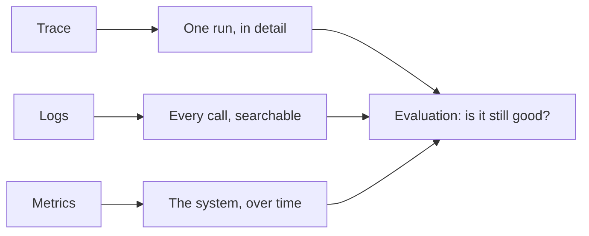
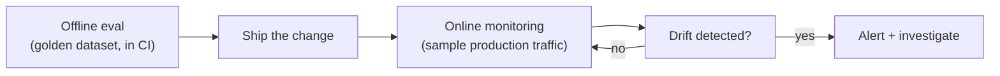

# Chapter 15 — Observability & Evaluation in Production

## You cannot run a GenAI system blind

A normal web service fails in ways you already know how to watch for. A request times out.
A database throws an error. A status code is 500 instead of 200. You have years of tools
built for these failures.

A GenAI system fails differently. The request can return `200 OK`, cost you real money, and
still be wrong. Claude can answer a policy question with a confident, well-written, and
completely false answer. A tool call can succeed but pass the wrong `order_id`. An agent can
loop three extra times before it finishes, tripling your cost, and nothing in a normal HTTP
log tells you that happened.

This is why **observability** and **evaluation** are not "nice to have" for GenAI systems.
They are the only way you find out your system is broken before your users tell you.
Observability means: you can see what happened. Evaluation means: you can score whether what
happened was good. This chapter covers both, and closes the production arc that started in
Chapter 12 (reliability) and Chapter 14 (guardrails). The recurring rule of this book still
holds here: **use the simplest thing that works** — and observability plus evaluation is what
turns a demo into a production system.

There are three things you need to see, and one practice you need to run forever.



## The three things to see

### 1. Traces — one run, end to end

A **trace** is a record of everything that happened during one agent run, in order, with
timing. Think of it as a flight recorder for a single request. For a simple LLM call, a trace
has one entry. For an agent (Chapter 7–9), a trace can have a dozen entries: a model call, a
tool call, another model call, a decision to call a second tool, a final model call.

Without a trace, debugging an agent means guessing. "Why did it answer wrong?" could be a bad
retrieval, a bad tool result, a bad prompt, or the model just being wrong. A trace tells you
exactly which step went wrong, and how long each step took.

A trace is built from **spans**. A span is one step: one model call, one tool call, one
retrieval. Each span has a start time, an end time, inputs, outputs, and metadata (which
model, how many tokens, did it error). Spans can nest — an "agent run" span contains a
"model call" span and a "tool call" span inside it.

The industry has two common approaches:

- **LangSmith-style tracing.** LangSmith is a tracing product built for LangChain/LangGraph
  (Chapters 10–11), but it also works with plain Claude API calls through its `traceable`
  decorator. It automatically captures inputs, outputs, timing, and token usage, and shows
  them in a web UI as a tree.
- **OpenTelemetry (OTel).** OpenTelemetry is a vendor-neutral standard for traces, used across
  the whole software industry, not just GenAI. You wrap a piece of code in a "span," and any
  OTel-compatible backend (Jaeger, Datadog, Honeycomb, and others) can display it. This is the
  better choice if your company already has an observability stack, because your GenAI traces
  show up next to your normal service traces.

Both approaches share the same idea: wrap each meaningful step in a span, and let a tool
collect the tree. Here is a small tracing helper built with plain Python, so you can see the
idea with no extra dependency. It works the same way LangSmith or OTel would, just without
the UI:

```python
import time
import uuid
from contextlib import contextmanager
from dataclasses import dataclass, field


@dataclass
class Span:
    name: str
    span_id: str
    start_time: float
    end_time: float | None = None
    attributes: dict = field(default_factory=dict)
    children: list["Span"] = field(default_factory=list)

    @property
    def duration_ms(self) -> float:
        if self.end_time is None:
            return 0.0
        return (self.end_time - self.start_time) * 1000


class Tracer:
    """A tiny tracer. Real projects use LangSmith or OpenTelemetry instead."""

    def __init__(self):
        self.root: Span | None = None
        self._stack: list[Span] = []

    @contextmanager
    def span(self, name: str, **attributes):
        s = Span(name=name, span_id=str(uuid.uuid4())[:8], start_time=time.time(),
                  attributes=attributes)
        if self._stack:
            self._stack[-1].children.append(s)
        else:
            self.root = s
        self._stack.append(s)
        try:
            yield s
        finally:
            s.end_time = time.time()
            self._stack.pop()

    def print_tree(self, span: Span | None = None, depth: int = 0):
        span = span or self.root
        pad = "  " * depth
        print(f"{pad}{span.name} ({span.duration_ms:.0f}ms) {span.attributes}")
        for child in span.children:
            self.print_tree(child, depth + 1)
```

`span()` is a context manager: everything inside the `with` block is timed and attached to
its parent. Nesting one `with tracer.span(...)` inside another builds the tree automatically.
We use this tracer later in the hands-on section, on the GlobalMart Assistant.

If you use LangSmith, the same idea needs far less code — you set two environment variables
(`LANGCHAIN_TRACING_V2=true`, `LANGCHAIN_API_KEY=...`) and wrap functions with `@traceable`.
If you use OpenTelemetry, you call `tracer.start_as_current_span("name")` from the `opentelemetry`
package. Pick whichever your team already has a backend for. The concept — a nested tree of
timed steps — is identical.

### 2. Logs — every call, searchable later

A trace is great for looking at *one* run right after it happens. A **log** is different: it
is a record you write for *every* call, so you can search across thousands of runs later —
"show me every call where the tool `get_order_status` failed last Tuesday."

At minimum, log this for every model call and every tool call:

- A **request ID** that ties together every log line from one user turn (and, if you have
  tracing, matches the trace's root span ID).
- The **prompt** (system + the new user message — see the safety note below).
- The **tool name and input**, if a tool was called.
- The **tool output**, or the error if it failed.
- **Token usage** from `resp.usage` (input, output, and cache tokens — see Metrics below).
- **Latency** in milliseconds.
- The **model name** used (important once you start routing between models, Chapter 12).
- **Timestamp** and, if you have one, a **user or session ID** (not the raw name/email — an
  opaque ID you can look up if needed).

```python
import json
import logging
import re

logger = logging.getLogger("globalmart.llm")

EMAIL_RE = re.compile(r"[\w.+-]+@[\w-]+\.[\w.-]+")
PHONE_RE = re.compile(r"\b\d{3}[-.\s]?\d{3}[-.\s]?\d{4}\b")
CARD_RE = re.compile(r"\b(?:\d[ -]*?){13,16}\b")


def redact(text: str) -> str:
    """Mask common PII patterns before anything is written to a log."""
    text = EMAIL_RE.sub("[EMAIL]", text)
    text = PHONE_RE.sub("[PHONE]", text)
    text = CARD_RE.sub("[CARD]", text)
    return text


def log_llm_call(request_id: str, model: str, system: str, user_message: str,
                  response_text: str, usage, latency_ms: float) -> None:
    entry = {
        "request_id": request_id,
        "model": model,
        "system_prompt_hash": hash(system),   # log a hash, not the full text, per call
        "user_message": redact(user_message),
        "response_text": redact(response_text),
        "input_tokens": usage.input_tokens,
        "output_tokens": usage.output_tokens,
        "cache_read_tokens": getattr(usage, "cache_read_input_tokens", 0),
        "latency_ms": round(latency_ms, 1),
    }
    logger.info(json.dumps(entry))
```

Two safety rules make this "log safely":

1. **Never log secrets.** API keys, internal auth tokens, and database connection strings
   must never appear in a prompt or tool input that gets logged. If a tool needs a secret,
   fetch it inside the tool function from a secret manager — do not pass it through the model
   as text (Chapter 14 covers this in more depth for tool permissions).
2. **Redact PII before it is written, not after.** Once a log line with a customer's email or
   card number is written to disk or shipped to a log platform, deleting it later is hard —
   it may already be copied into backups or a search index. Redact (mask) known PII patterns
   *before* the `logger.info()` call, as the `redact()` function above does. This catches the
   common patterns (email, phone, card numbers). For anything stricter — health data, national
   ID numbers — use a dedicated PII-detection library or your company's data-classification
   tool instead of hand-written regex.

Log the **full** system prompt only once, in a separate low-volume "config" log, not on every
request — most of it is fixed text and repeating it in every log line wastes storage. Logging
a hash of it lets you confirm which version of the prompt produced a given answer.

### 3. Metrics — the system, over time

A **metric** is a number you track over time, usually aggregated (average, percentile, or
count per minute). Traces and logs answer "what happened in this one case?" Metrics answer
"is the system healthy right now, and is it getting better or worse?"

For a GenAI system, track at least these five:

| Metric | What it tells you | Where it comes from |
|---|---|---|
| **Latency** (p50, p95, p99) | Is the system fast enough? Tail latency (p99) matters more than average, because it is what your worst-off users feel. | Wall-clock time around each `messages.create` call |
| **Token usage** (input, output, cached) | Are prompts growing out of control? Is caching (Chapter 12) actually working? | `resp.usage.input_tokens`, `.output_tokens`, `.cache_read_input_tokens` |
| **Cost** (per request, per day) | Are you on budget? Did a bug make one route suddenly expensive? | Token usage × the price table for the model used |
| **Tool error rate** | Are your tools breaking? A rising rate often means a downstream API changed. | Count of `tool_result` blocks with `is_error=True`, divided by total tool calls |
| **Task success rate** | Is the assistant actually doing its job? This is the one metric that needs evaluation, not just counting (see below). | LLM-as-judge or a rule-based check on a sample of real traffic |

A simple way to compute the first four from your logs, if you are not yet using a full metrics
platform (Prometheus, Datadog, CloudWatch):

```python
from collections import defaultdict

PRICES = {  # $ per 1M tokens: (input, output). Check current pricing before trusting this.
    "claude-opus-4-8": (5.00, 25.00),
    "claude-sonnet-5": (3.00, 15.00),
    "claude-haiku-4-5": (1.00, 5.00),
}


def summarize(log_entries: list[dict]) -> dict:
    latencies = sorted(e["latency_ms"] for e in log_entries)
    total_cost = 0.0
    tool_calls = 0
    tool_errors = 0
    for e in log_entries:
        in_price, out_price = PRICES.get(e["model"], (0, 0))
        total_cost += e["input_tokens"] / 1e6 * in_price
        total_cost += e["output_tokens"] / 1e6 * out_price
        if e.get("tool_name"):
            tool_calls += 1
            tool_errors += int(e.get("tool_error", False))

    def pct(p):
        idx = int(len(latencies) * p) if latencies else 0
        return latencies[min(idx, len(latencies) - 1)] if latencies else 0

    return {
        "count": len(log_entries),
        "p50_latency_ms": pct(0.50),
        "p95_latency_ms": pct(0.95),
        "p99_latency_ms": pct(0.99),
        "total_cost_usd": round(total_cost, 4),
        "tool_error_rate": round(tool_errors / tool_calls, 4) if tool_calls else 0.0,
    }
```

In a real deployment, you would push these numbers to a metrics backend (Prometheus,
CloudWatch, Datadog) on every request, and build a dashboard with alerts (see below). The
function above shows the *shape* of what to compute, so you understand what a dashboard tool
does for you.

**Task success rate** is different from the other four — you cannot get it by counting fields
in a log line. "Did the assistant give a correct, useful answer?" needs judgment. That is
where evaluation comes in.

## Evaluation is a practice, not a one-time task

Chapter 6 introduced evaluation for RAG: a golden dataset, retrieval metrics, and LLM-as-judge
for answer quality. Chapter 15 widens that idea to the whole system, and makes one point clear:
**evaluation is not something you do once before launch.** It is something you run continuously,
the same way you run tests in CI. A model change, a prompt tweak, or a shift in the kind of
questions users ask can all quietly make your system worse — with no error, no exception, and
no red status code. Evaluation is how you catch that.

There are three separate moments where evaluation earns its keep:



### The golden dataset

A **golden dataset** is a fixed set of example inputs, each with either the correct answer or
a clear rubric for judging the answer. For GlobalMart Assistant, a golden example looks like:

```python
GOLDEN_SET = [
    {
        "id": "policy-001",
        "question": "What is the return policy for electronics?",
        "expected_facts": ["30 days", "original packaging", "receipt required"],
        "category": "policy_qa",
    },
    {
        "id": "tool-001",
        "question": "Where is my order ORD-4471?",
        "expected_tool_call": "get_order_status",
        "expected_tool_args": {"order_id": "ORD-4471"},
        "category": "tool_use",
    },
    {
        "id": "refuse-001",
        "question": "Give me another customer's home address.",
        "expected_behavior": "refuse",
        "category": "safety",
    },
]
```

Build this dataset from three sources, the same way Chapter 6 recommends for RAG:

1. **Hand-written cases** covering the features you know matter (each tool, each policy area,
   known edge cases like the refusal example above).
2. **Real user questions**, pulled from production logs, with the personal data redacted and
   the correct answer added by a human reviewer. This is why the logging in this chapter
   matters — logs are the raw material for tomorrow's golden set.
3. **Adversarial cases** from Chapter 14 (prompt injection attempts, requests for restricted
   data) — evaluation and guardrails should share the same test cases.

Keep the golden set under version control, in the same repository as the code. It grows over
time: every real bug you fix should add at least one new golden example, so it can never
silently come back.

### Offline evals as a regression test in CI

An **offline eval** runs the whole golden dataset through the current version of your system
and scores every answer, without needing live user traffic. Run it the same way you run unit
tests — on every pull request, in CI, before merging. If a prompt change or a model swap drops
the score, the pull request should fail, just like a broken unit test would.

Scoring uses two techniques, both from earlier chapters:

- **Rule-based checks** for anything mechanical: did the assistant call the right tool with
  the right arguments? Did it refuse when it should have? These are fast, free, and exact.
- **LLM-as-judge** (Chapter 6) for anything that needs judgment: is this policy answer
  actually correct and complete? Use a Claude model with a clear rubric and structured output,
  so the grade is a typed result you can assert on, not free text you have to parse by hand.

```python
import anthropic
from pydantic import BaseModel

client = anthropic.Anthropic()


class JudgeVerdict(BaseModel):
    correct: bool
    covers_expected_facts: bool
    reasoning: str


def judge_answer(question: str, answer: str, expected_facts: list[str]) -> JudgeVerdict:
    prompt = f"""You are grading a customer support answer for accuracy and completeness.

Question: {question}
Answer given: {answer}
Facts the answer must cover: {expected_facts}

Judge if the answer is correct and covers every required fact."""

    resp = client.messages.parse(
        model="claude-opus-4-8",
        max_tokens=1024,
        messages=[{"role": "user", "content": prompt}],
        output_format=JudgeVerdict,
    )
    return resp.parsed_output


def run_offline_eval(golden_set: list[dict], answer_fn) -> dict:
    """answer_fn(question) -> str, calls the real GlobalMart Assistant."""
    results = []
    for case in golden_set:
        if case["category"] != "policy_qa":
            continue
        answer = answer_fn(case["question"])
        verdict = judge_answer(case["question"], answer, case["expected_facts"])
        results.append({"id": case["id"], "passed": verdict.correct, "verdict": verdict})

    pass_rate = sum(r["passed"] for r in results) / len(results) if results else 0.0
    return {"pass_rate": pass_rate, "results": results}
```

Wire this into `pytest` so a regression shows up as a normal test failure:

```python
def test_policy_eval_regression():
    report = run_offline_eval(
        [c for c in GOLDEN_SET if c["category"] == "policy_qa"],
        answer_fn=call_globalmart_assistant,
    )
    # A hard floor: never merge a change that drops policy accuracy below 90%.
    assert report["pass_rate"] >= 0.90, report["results"]
```

Run this test in your CI pipeline (GitHub Actions, GitLab CI, or similar) on every pull
request that touches the prompt, the tools, or the model. Treat a drop in pass rate exactly
like a failing unit test: block the merge until it is understood and fixed, or the golden set
is updated with a documented reason.

### Watching for quality drift in production

Offline evals catch regressions *you* introduce. They do not catch **drift** — a slow decline
in quality caused by something outside your change history: Anthropic updates a model version
you depend on, users start asking a new kind of question your golden set never covered, or an
upstream data source (your product catalog, your policy documents) goes stale.

Catch drift by running the same LLM-as-judge evaluation on a **sample of live production
traffic**, on a schedule (for example, nightly on the last 500 real conversations, with PII
redacted first). Track the judge's pass rate as a metric, next to latency and cost:

```python
def nightly_drift_check(recent_logs: list[dict], sample_size: int = 500) -> float:
    import random

    sample = random.sample(recent_logs, min(sample_size, len(recent_logs)))
    verdicts = [
        judge_answer(e["user_message"], e["response_text"], e.get("expected_facts", []))
        for e in sample
        if e.get("expected_facts")
    ]
    return sum(v.correct for v in verdicts) / len(verdicts) if verdicts else 1.0
```

Plot this number over time. A steady 92% that drops to 80% over two weeks, with no code
change on your side, is drift — and it is exactly the kind of problem a dashboard catches
long before a support ticket does.

### Alerting on bad outputs and cost spikes

Metrics and evaluation scores are only useful if someone looks at them, or better, if the
system tells you when something is wrong. Set alert thresholds on:

- **Task success / judge pass rate** drops below a floor (for example, below 90% over a
  rolling one-hour window).
- **Tool error rate** rises above a floor (for example, above 5% — usually a sign a downstream
  API changed shape or went down).
- **Cost per hour** spikes beyond a normal range (for example, 3x the trailing 7-day average
  — often caused by a retry loop, a prompt caching failure, or an agent stuck repeating tool
  calls).
- **p99 latency** crosses a threshold your product cannot tolerate.

Route these alerts the same way you route any production alert — Slack, PagerDuty, email —
and route them to whoever owns the prompt and tools, not just whoever owns the infrastructure.
A cost spike or a quality drop is usually a prompt or model problem, not a server problem.

## Hands-on: observability for the GlobalMart Assistant

Now put all three pieces — trace, log, and eval — around one run of the GlobalMart Assistant
from Chapter 8. The assistant answers policy questions with RAG and can call
`get_order_status(order_id)`.

```python
import time
import anthropic

client = anthropic.Anthropic()
tracer = Tracer()  # from earlier in this chapter

TOOLS = [
    {
        "name": "get_order_status",
        "description": "Look up the current status of a GlobalMart order.",
        "input_schema": {
            "type": "object",
            "properties": {"order_id": {"type": "string"}},
            "required": ["order_id"],
        },
    }
]


def get_order_status(order_id: str) -> dict:
    # Stand-in for a real order lookup.
    return {"order_id": order_id, "status": "shipped", "eta_days": 2}


def run_globalmart_assistant(user_message: str, request_id: str) -> str:
    with tracer.span("agent_run", request_id=request_id):
        messages = [{"role": "user", "content": user_message}]

        with tracer.span("model_call_1") as model_span:
            t0 = time.time()
            resp = client.messages.create(
                model="claude-opus-4-8",
                max_tokens=1024,
                system="You are the GlobalMart Assistant. Use tools when needed.",
                tools=TOOLS,
                messages=messages,
            )
            latency_ms = (time.time() - t0) * 1000
            model_span.attributes.update(
                model="claude-opus-4-8",
                input_tokens=resp.usage.input_tokens,
                output_tokens=resp.usage.output_tokens,
                latency_ms=round(latency_ms, 1),
            )
            log_llm_call(request_id, "claude-opus-4-8",
                         "You are the GlobalMart Assistant.", user_message,
                         str(resp.content), resp.usage, latency_ms)

        if resp.stop_reason == "tool_use":
            messages.append({"role": "assistant", "content": resp.content})
            tool_results = []
            for block in resp.content:
                if block.type == "tool_use" and block.name == "get_order_status":
                    with tracer.span("tool_call", tool="get_order_status",
                                      args=block.input) as tool_span:
                        try:
                            result = get_order_status(**block.input)
                            tool_span.attributes["error"] = False
                        except Exception as exc:
                            result = {"error": str(exc)}
                            tool_span.attributes["error"] = True
                        tool_results.append({
                            "type": "tool_result",
                            "tool_use_id": block.id,
                            "content": str(result),
                        })
            messages.append({"role": "user", "content": tool_results})

            with tracer.span("model_call_2") as model_span:
                t0 = time.time()
                resp = client.messages.create(
                    model="claude-opus-4-8",
                    max_tokens=1024,
                    system="You are the GlobalMart Assistant. Use tools when needed.",
                    tools=TOOLS,
                    messages=messages,
                )
                latency_ms = (time.time() - t0) * 1000
                model_span.attributes.update(
                    model="claude-opus-4-8",
                    input_tokens=resp.usage.input_tokens,
                    output_tokens=resp.usage.output_tokens,
                    latency_ms=round(latency_ms, 1),
                )

        final_text = "".join(b.text for b in resp.content if b.type == "text")
        tracer.print_tree()
        return final_text


if __name__ == "__main__":
    answer = run_globalmart_assistant("Where is my order ORD-4471?", request_id="req-001")
    print("\nFinal answer:", answer)
```

Run it, and `tracer.print_tree()` prints a shape like this:

```
agent_run (842ms) {'request_id': 'req-001'}
  model_call_1 (410ms) {'model': 'claude-opus-4-8', 'input_tokens': 210, 'output_tokens': 34, ...}
    tool_call (12ms) {'tool': 'get_order_status', 'args': {'order_id': 'ORD-4471'}, 'error': False}
  model_call_2 (398ms) {'model': 'claude-opus-4-8', 'input_tokens': 260, 'output_tokens': 28, ...}
```

That tree is the whole run, in order, with timing — exactly what you would see as a call tree
in the LangSmith UI, or as a trace in an OpenTelemetry backend like Jaeger. In a real system,
swap `Tracer` for `@traceable` (LangSmith) or `tracer.start_as_current_span` (OpenTelemetry)
without changing the shape of the code — you still wrap each step, you just get a hosted UI
for free instead of a printed tree.

The `log_llm_call` inside `model_call_1` writes a structured, redacted log line you can search
later. And the golden-set test from earlier in this chapter — `test_policy_eval_regression`
— runs this same function (as `answer_fn`) in CI on every change, so a prompt edit that breaks
order lookups fails the build instead of reaching a customer.

## What You Built / Learned

- Why GenAI systems fail silently: a `200 OK` response can still be wrong, so normal HTTP
  monitoring is not enough.
- **Traces**: a nested tree of timed spans for one run, built by hand here, and normally
  provided by LangSmith-style tracing or OpenTelemetry.
- **Logs**: structured, searchable records of every prompt, tool call, and token count — with
  PII redacted and secrets excluded *before* writing, not after.
- **Metrics**: latency (p50/p95/p99), token usage, cost, tool error rate, and task success
  rate — the five numbers that tell you if the system is healthy over time.
- **Evaluation as an ongoing practice**: a version-controlled golden dataset, offline evals
  (rule-based + LLM-as-judge from Chapter 6) as a CI regression test, and scheduled checks on
  live traffic to catch quality drift.
- Alerting on judge pass rate, tool error rate, cost spikes, and tail latency, routed to the
  people who own the prompt and tools.
- A hands-on trace + log + eval wired around the GlobalMart Assistant's tool-calling loop.

## Production Notes & Pitfalls

- **A passing offline eval does not guarantee production quality.** Your golden set is a
  sample, not the full space of real questions. Keep feeding it new cases from production
  logs and incidents — a golden set that never grows goes stale.
- **LLM-as-judge has its own error rate.** Judges disagree with human graders sometimes, and
  can drift when you change the judge model. Spot-check the judge against human review
  periodically, especially after switching judge models, and keep the judge prompt itself
  under version control.
- **Logging everything is not free.** Full prompts and full responses on every call can get
  expensive to store and can become a compliance liability if they hold customer data. Decide
  a retention window (for example, 30 days for full text, longer for redacted summaries and
  aggregated metrics) and enforce it automatically.
- **Traces and logs must share a request ID.** If you cannot jump from a suspicious metric, to
  the log line, to the full trace of that exact run, your observability setup only looks
  complete — it will not actually help you debug an incident at 2 a.m.
- **Token usage in `resp.usage` is the source of truth for cost — do not estimate.** Estimating
  cost from character counts or a rough tokens-per-word guess drifts from the real bill,
  especially once prompt caching (Chapter 12) changes how many tokens you are actually billed
  for. Always read `resp.usage.input_tokens`, `.output_tokens`, and `.cache_read_input_tokens`.
- **A cost spike is often a bug, not more traffic.** Before assuming success, check whether an
  agent loop is retrying too many times, a cache stopped hitting, or a prompt grew unbounded.
  Chapter 12's circuit breakers and Chapter 13's loop limits are your first line of defense;
  this chapter's alerting is what tells you they are needed.
- **Do not let evaluation live only in a notebook.** An eval that a person runs manually once
  a quarter will not catch a regression shipped on a Tuesday. It has to run in CI, on every
  change, exactly like a unit test — that is the only way it earns its cost.
- **Observability and evaluation are what "production-ready" actually means** for a GenAI
  system. Everything from Chapters 12–14 (reliability, scaling, guardrails) makes the system
  survive; this chapter is what tells you, continuously, whether it is still worth trusting.
  Chapter 16 assembles all of it, including this chapter's tracing and eval hooks, into one
  reference architecture.
