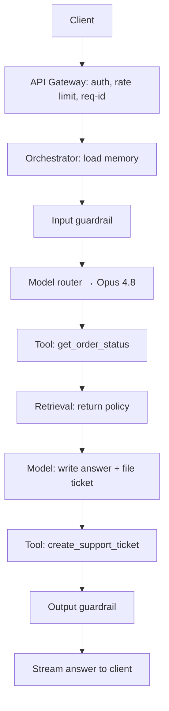

# Chapter 16 — Reference Architecture

The last fifteen chapters each added one piece. You learned to call the model
(Chapter 1), prompt it well (Chapter 2), get structured output and call tools
(Chapter 3), retrieve documents with RAG (Chapters 4–6), build an agent loop
(Chapters 7–9), use LangChain and LangGraph (Chapters 10–11), make it reliable and
cheap (Chapters 12–13), make it safe (Chapter 14), and watch it in production
(Chapter 15). This chapter puts every piece into one picture.

This is a *reference architecture*: a clean, labeled map of a production agentic
system, drawn once so you can copy it. We build it around the **GlobalMart
Assistant** — the assistant that answers questions from GlobalMart's documents and
takes actions like checking an order or filing a support ticket. First we draw the
whole system. Then we walk each box, one at a time. Then we follow one real request
from the user's screen all the way through and back. At the end, we show where each
earlier chapter lives on the map, how to deploy the shape, and when to build it
yourself versus buying a hosted option.

Keep the running theme in mind: **use the simplest thing that works**, and
**evaluation plus observability are what make it production.** A reference
architecture is not a shopping list. It is the full set of boxes you *might* need.
A small assistant uses a few of them; a large one uses all. Read it as a menu, not a
mandate.

## 16.1 The Whole Picture

Here is the full system in one diagram. Requests flow from top to bottom, then back
up. Each box is a component we explain in Section 16.2.

```
                        ┌──────────────────────────┐
                        │   Client (web / mobile)  │
                        └────────────┬─────────────┘
                                     │  HTTPS request
                                     ▼
                        ┌──────────────────────────┐
                        │       API Gateway        │   auth, rate limits,
                        │  (auth · rate limit)     │   request IDs
                        └────────────┬─────────────┘
                                     │  validated request + job on a queue
                                     ▼
   ┌─────────────────────────────────────────────────────────────────────┐
   │                     Agent Orchestrator (LangGraph)                    │
   │      the loop: read state → call model → run tools → repeat           │
   │                                                                       │
   │   ┌───────────────┐   ┌──────────────┐   ┌───────────────────────┐   │
   │   │  Input        │   │ Model Router │   │  Output guardrail      │   │
   │   │  guardrail    │──►│  + caching   │──►│  (check before trust)  │   │
   │   └───────────────┘   └──────┬───────┘   └───────────────────────┘   │
   └──────────────┬───────────────┼──────────────────┬────────────────────┘
                  │               │                  │
          ┌───────▼──────┐  ┌─────▼──────┐   ┌────────▼─────────┐
          │  Tool layer  │  │  Claude    │   │   Memory store   │
          │  internal +  │  │  (Opus /   │   │  short-term +    │
          │  MCP tools   │  │  Sonnet /  │   │  long-term       │
          └──────┬───────┘  │  Haiku)    │   └──────────────────┘
                 │          └────────────┘
         ┌───────▼────────┐
         │  RAG / Retrieval Service       │
         │  embeddings → vector store     │
         │  → re-ranker                   │
         └────────────────────────────────┘

   ┌───────────────────────────────────────────────────────────────────┐
   │   Observability + Evaluation (wraps everything above)              │
   │   tracing · logs · metrics · offline evals · regression tests     │
   └───────────────────────────────────────────────────────────────────┘
```

Two ideas hold this together. First, the **orchestrator is the brain**: it runs the
loop and decides what happens next. Everything else is a service it calls. Second,
**observability wraps the whole thing**: every box writes traces, logs, and metrics
to one place, so you can see one request cross many boxes.

## 16.2 The Components, One by One

### The client and API layer

The *client* is whatever the user touches: a web chat window, a mobile app, or
another backend calling your service. The client never talks to Claude directly. It
talks to your **API layer** — a small set of HTTP endpoints you own, such as
`POST /chat` and `GET /chat/{id}`.

Why put an API layer in front? Three reasons. It hides your model keys, so they
never reach the browser. It lets you change the model or framework behind the scenes
without touching the client. And it gives you one place to shape every request and
response. Keep this layer thin. Its only job is to accept a request, hand it off, and
stream the answer back.

### The API gateway (auth and rate limiting)

The *gateway* sits between the client and the orchestrator. It does the boring,
critical jobs that protect the system before any expensive work starts.

- **Authentication:** confirm who the caller is (a signed token, an API key). Reject
  unknown callers here, cheaply, before a single model token is spent.
- **Authorization:** confirm this caller may do this action. A normal user may ask
  questions; only a support agent may trigger a refund tool.
- **Rate limiting:** cap how many requests one caller can send per minute. This stops
  one user, or one bug, from draining your budget or your model quota.
- **Request IDs:** stamp every request with a unique ID. That ID follows the request
  through every box below, so a trace (Chapter 15) can stitch the whole journey back
  together.

The gateway is normal backend engineering, not AI. That is the point: put the well-
understood controls at the edge, so the AI parts inside stay simple.

### The agent orchestrator (a LangGraph app)

The *orchestrator* is the heart of the system. It runs the agent loop from
Chapters 7–11, built as a LangGraph graph (Chapter 11). A *graph* is the loop drawn
as nodes (steps) and edges (what runs next), so every path is visible and every run
can be paused, saved, and resumed.

The orchestrator holds the **state** for one conversation: the messages so far, which
tools have run, and where the loop is. On each turn it does this:

```
read state → input guardrail → call model (via router) →
  model asks for a tool?  → run tool → append result → loop back
  model gives an answer?  → output guardrail → return
```

Because it is a LangGraph app, it gets two production features for free from
Chapter 11: **checkpointing** (save state to a store after every step, so a crash or a
deploy does not lose an in-flight conversation) and **human-in-the-loop** (pause
before a risky tool, wait for a person to approve). The orchestrator does not *do* the
work of retrieval, tools, or safety itself. It *coordinates* those services and keeps
the state straight.

### The tool layer (internal tools + external via MCP)

*Tools* are the functions the agent can call to act or fetch fresh data (Chapter 8).
GlobalMart has three: `get_order_status`, `create_support_ticket`, and
`search_products`. The tool layer splits into two kinds.

**Internal tools** are functions you own, running in your own code. They call your own
databases and services. You control their input schema, their permissions, and their
errors.

**External tools** come from other systems through **MCP** — the Model Context
Protocol, the standard way to plug in outside tools and data (Chapter 8, §4 of the
design brief). Instead of writing a wrapper for every external system, you connect to
an MCP server that already exposes those tools. A shipping partner, for example, might
run an MCP server that offers a `track_parcel` tool.

```
                 ┌───────────────── Tool Layer ─────────────────┐
   orchestrator  │  Internal (your code)     External (via MCP)  │
       ─────────►│  get_order_status         track_parcel        │
                 │  create_support_ticket    ...partner tools    │
                 │  search_products                              │
                 └───────────────────────────────────────────────┘
```

Every tool call passes through a permission check (see guardrails, below). A tool that
"moves real money," like a refund, needs the approval path, not just a good prompt.

### The RAG / retrieval service (vector store + re-ranker + embeddings)

The *retrieval service* answers "what does GlobalMart's documentation say about X?"
It is the RAG pipeline from Chapters 4–6, running as its own service the agent calls
like any other tool. It has three parts in a row:

```
   query ─► [embeddings model] ─► [vector store] ─► [re-ranker] ─► top passages
            Voyage AI /            Chroma (dev) /     cross-encoder
            sentence-transformers  pgvector (prod)
```

- **Embeddings model:** turns text into a list of numbers that captures its meaning.
  Remember from the design brief: Claude does **not** make embeddings. Use a dedicated
  provider — **Voyage AI** (`voyage-3`) by default, or `sentence-transformers` for a
  free local option. Never call `client.embeddings` on the Anthropic client; it does
  not exist.
- **Vector store:** holds those numbers and finds the closest matches to a query.
  **Chroma** for development; **pgvector** (Postgres) for production.
- **Re-ranker:** takes the top matches and re-orders them by true relevance, so the
  best passages sit at the top (Chapter 5). This is the single biggest quality win in
  most RAG systems.

The agent sends a question in; the service returns a few strong passages; the agent
puts them in the prompt. Keeping retrieval as its own service means you can re-index or
swap the embeddings model without touching the agent.

### The memory store (short- and long-term)

*Memory* is what the agent remembers (Chapter 8). It has two shelves.

**Short-term memory** is the current conversation: the messages in this chat session.
It lives with the LangGraph state, keyed by a `thread_id`, and it is what
checkpointing saves. When the chat ends, or gets very long, this is trimmed or
summarized.

**Long-term memory** is what should outlive one conversation: a user's stated
preferences, past issues, key facts. It lives in a durable store (a database, or a
vector store for "remember things like this"). The agent reads from it at the start of
a chat and writes to it when something worth keeping shows up.

```
   short-term (this chat)          long-term (across chats)
   ─────────────────────           ─────────────────────────
   messages in thread_id           "prefers email over SMS"
   trimmed / summarized            "had a damaged-item refund in March"
   saved by checkpointer           stored in DB / vector store
```

For very long single sessions, the Claude API also offers server-side **context
editing** and **compaction** to keep the conversation inside the context window
(Chapter 13). Use those for a run that will not fit; use the memory store for facts
that must survive across runs.

### The model router with caching

Not every step needs the strongest, most expensive model. The *model router* picks the
cheapest model that can do each step well (Chapter 12), following the design brief's
tiers:

| Tier | Model ID | Use it for |
|---|---|---|
| Cheap, fast | `claude-haiku-4-5` | Routing, classification, simple sub-tasks |
| Balanced | `claude-sonnet-5` | High-volume steps that need real quality |
| Most capable | `claude-opus-4-8` | The agent's main reasoning (the default) |

The router logic is small: use Haiku to classify or route, Sonnet for medium steps,
Opus for the hard reasoning. A tiny sketch:

```python
def route(step_kind: str) -> str:
    if step_kind == "classify":
        return "claude-haiku-4-5"
    if step_kind == "bulk_summarize":
        return "claude-sonnet-5"
    return "claude-opus-4-8"  # default: the main agent brain
```

Two kinds of **caching** sit next to the router and cut both cost and latency:

- **Prompt caching:** mark the large, stable part of the prompt (the system prompt, the
  tool list, a big policy document) with `cache_control={"type": "ephemeral"}`. The API
  stores it, so the next call that shares that prefix skips re-processing it. Check it
  worked with `resp.usage.cache_read_input_tokens`.
- **Semantic caching:** if a new question means almost the same as one you already
  answered, return the stored answer instead of calling the model again. You match "same
  meaning" with embeddings — the same tool the retrieval service uses.

```
   request ─► semantic cache?  ── hit ──► return stored answer (no model call)
                  │ miss
                  ▼
             model router ─► Claude call (with prompt cache on the stable prefix)
```

### The guardrails layer

*Guardrails* are the checks that stop bad input, bad output, and bad actions
(Chapter 14). They are not one box; they are checks placed at three points in the flow.

- **Input checks** run before the model: length limits, format checks, and a quick scan
  for obvious prompt-injection attempts ("ignore previous instructions").
- **Output checks** run before you trust the answer: is it valid JSON where JSON is
  required, does it leak PII, does it stay on topic.
- **Tool permission checks** run before any tool executes: is this caller allowed to use
  this tool, and does a risky tool (a refund) need human approval first.

```
   input ─►[input check]─► model ─►[output check]─► respond
                                   │
                          tool call │─►[permission check]─► run tool
```

Guardrails are mostly plain Python — regex, allow-lists, Pydantic models. You rarely
need a separate "AI security platform" to get most of the value. The key design rule:
**never let untrusted text (a user message, a retrieved document, a tool result) act as
an instruction the agent must obey.**

### The observability and evaluation stack

This stack wraps every other box (Chapter 15). It is how you know the system works, and
how you find out fast when it breaks.

- **Tracing:** one record of a whole request as it crosses boxes — gateway, orchestrator,
  each model call, each tool, each retrieval — tied together by the request ID. When a
  user says "the assistant gave me a wrong refund," a trace shows exactly what happened.
- **Logs:** the detailed events inside each box (prompts, tool inputs, errors). Redact PII
  before you store them.
- **Metrics:** the numbers you watch on a dashboard — latency, cost per request, tool
  error rate, cache hit rate, refusal rate.
- **Offline evals:** a test set of known-good questions and answers (a "golden set") you
  run on every change, so a new prompt or model does not quietly make things worse. This
  is the regression safety net that makes a system safe to change.

Tracing tells you what happened in production. Evals tell you whether a change is safe
*before* it ships. You need both.

## 16.3 One Request, End to End

Now follow a single real request through every box. A GlobalMart customer types:

> "My order 4471 arrived damaged. Where is it, and can I get help?"

1. **Client → Gateway.** The web app sends `POST /chat` with the message and the user's
   token. The gateway checks the token (auth), confirms the user is under their rate
   limit, and stamps a request ID: `req-8821`. It puts the job on a queue and returns a
   stream the client will read from.
2. **Gateway → Orchestrator.** The LangGraph app starts a turn for this `thread_id`. It
   loads short-term memory (this chat has no earlier messages) and long-term memory
   (this user "prefers email"). A trace opens under `req-8821`.
3. **Input guardrail.** The message is a normal length, has no injection patterns, and
   passes. It moves on.
4. **Model router → Claude.** This is the main reasoning step, so the router picks
   `claude-opus-4-8`. The system prompt and tool list are prompt-cached, so only the new
   message is fully processed. Claude reads the message and decides it needs two things:
   the order status, and the return policy.
5. **Tool call: `get_order_status`.** Claude returns a `tool_use` block. The permission
   check confirms this user may read their own order. The internal tool runs, hits the
   orders database, and returns "out for delivery, arriving tomorrow." The result is
   appended to state; the loop goes back to the model.
6. **Retrieval call.** Claude next needs policy text, so it calls the retrieval service
   with "return policy for damaged electronics." The service embeds the query (Voyage),
   searches pgvector, re-ranks the hits, and returns the two best passages. These go into
   the prompt.
7. **Model call again.** With the order status and the policy passages in context, Claude
   writes a final answer: where the order is, and the steps to return a damaged item. It
   also decides to file a ticket, so it calls `create_support_ticket`. That tool runs
   after its permission check passes.
8. **Output guardrail.** The final answer is checked: no leaked PII, on topic, and the
   ticket ID is a valid format. It passes.
9. **Orchestrator → Gateway → Client.** The answer streams back to the user's screen.
   The checkpointer saves the final state. The trace for `req-8821` closes, recording
   every model call, tool call, token count, and cost.



One request touched almost every box. That is normal. The orchestrator drove it; every
other box was a service it called; observability recorded the whole path.

## 16.4 Where Each Chapter Lives on the Map

This is the payoff of the book. Each earlier chapter is one box, or one check inside a
box.

| Chapter | Topic | Box on the map |
|---|---|---|
| 1 | LLM & the Python SDK | The Claude call inside the model router |
| 2 | Prompting | The system prompt in the orchestrator |
| 3 | Structured output & tool calling | Tool layer + output guardrail (valid JSON) |
| 4 | RAG fundamentals | Retrieval service: embeddings + vector store |
| 5 | Advanced RAG & re-ranking | The re-ranker in the retrieval service |
| 6 | Evaluating RAG | Offline evals for retrieval quality |
| 7 | From calls to agents | The orchestrator's loop |
| 8 | Tools & memory | Tool layer + memory store |
| 9 | Multi-agent & patterns | Extra nodes in the orchestrator (router, planner) |
| 10 | LangChain | Building blocks inside the orchestrator |
| 11 | LangGraph | The orchestrator itself (graph, checkpointing, HITL) |
| 12 | Reliability, cost & latency | Model router + caching + retries |
| 13 | Scaling & long-running agents | The queue, the state store, context editing |
| 14 | Guardrails & security | The guardrails layer (all three check points) |
| 15 | Observability & evaluation | The stack that wraps everything |

If you built each chapter's code, you already built the pieces. This chapter is the
wiring diagram that says how they connect.

## 16.5 The Deployment Shape

How do you run this in production? The shape is simpler than the component list
suggests. Three rules cover most of it.

**Keep the services stateless.** The gateway, the orchestrator workers, the retrieval
service, and the tool workers should hold no important state in memory. Any one of them
can be killed and restarted, and you can run many copies behind a load balancer. This
is what lets you scale out and survive a crash.

**Put long jobs on a queue.** An agent turn can take many seconds — several model calls,
several tool calls. Do not make the client hold a connection open and hope. Accept the
request fast, put the work on a **queue**, and let a pool of workers pick it up. The
client reads the answer from a stream or polls for it. This smooths out traffic spikes
and lets you retry a failed job cleanly.

**Put all the state in a state store.** Because the services are stateless, the state has
to live somewhere durable. That is the **state store**: the LangGraph checkpoints (an
in-flight conversation), the long-term memory, and the vector store. Use Postgres
(with pgvector) for most of it; it can hold checkpoints, memory, and vectors in one
place for a mid-size system.

```
   clients ─► load balancer ─► [gateway copies]
                                     │ enqueue
                                     ▼
                              ┌────────────┐        ┌──────────────────┐
                              │   queue    │──jobs─►│ orchestrator      │
                              └────────────┘        │ worker copies     │
                                                    └───────┬──────────┘
                                                            │ read / write
                                                            ▼
                                        ┌───────────────────────────────┐
                                        │  State store (Postgres +      │
                                        │  pgvector): checkpoints,      │
                                        │  memory, vectors              │
                                        └───────────────────────────────┘
```

Stateless services plus a queue plus one durable state store: that is the whole
deployment shape. Everything else — auto-scaling, health checks, blue-green deploys —
is standard backend practice, which is exactly why we push the state out of the services
and into the store.

## 16.6 Build vs. Buy: Self-Built or Managed Agents

You do not have to build every box yourself. The Claude API offers **Managed Agents**: a
hosted option where Anthropic runs the agent loop and hosts a sandbox where tools run.
This is a real build-vs-buy line, so draw it on purpose.

| | Self-built (this chapter) | Managed Agents (hosted) |
|---|---|---|
| The loop | You run it (LangGraph orchestrator) | Anthropic runs it |
| Tool sandbox | You host and secure it | Anthropic hosts it |
| Control over each step | Full — every node is yours | Less — the platform owns the loop |
| State & checkpointing | You own the store | Managed by the platform |
| Best when | You need custom flow, custom infra, or tight control | You want a stateful agent fast, with less code to own |

The handbook's main path is **self-built**, because it teaches you how every box works
and gives you full control — which you need for GlobalMart's custom tools, custom
guardrails, and custom retrieval. But the honest senior answer is: if you want a hosted,
stateful agent and do not need to own the loop, Managed Agents is often the *simplest
thing that works*, and simplest wins. Choose self-built when the control earns its cost.
Choose managed when it does not.

## What You Built / Learned

- **The full map of a production agentic system**, drawn as one diagram: client, API
  gateway, agent orchestrator, tool layer, retrieval service, memory store, model
  router with caching, guardrails, and the observability stack that wraps them all.
- **What each box does and why it exists** — for example, why the client never calls
  Claude directly, why retrieval is its own service, and why the orchestrator only
  *coordinates* instead of doing every job itself.
- **How one real request flows** through every box for the GlobalMart Assistant, and
  back to the user, with a trace recording the whole path.
- **Where every earlier chapter (1–15) lives** on the map — each chapter is one box or
  one check inside a box, which is what makes the book click together.
- **The deployment shape:** stateless services, a queue for long jobs, and one durable
  state store (Postgres with pgvector) that holds checkpoints, memory, and vectors.
- **The build-vs-buy line:** self-built with LangGraph for full control, versus Managed
  Agents when you want a hosted stateful agent with less code to own.

## Production Notes & Pitfalls

- **The orchestrator should coordinate, not compute.** The most common design mistake is
  stuffing retrieval, tool logic, and safety checks inside the agent loop itself. Keep
  them as separate services the orchestrator calls. Then you can scale, test, and change
  each one alone. A fat orchestrator is a system you cannot reason about.
- **Put the boring controls at the edge.** Auth, rate limits, and request IDs belong in
  the gateway, before any model token is spent. Teams that skip this find out during an
  incident — one runaway client draining the whole model budget in an hour.
- **No request ID, no debugging.** If a request does not carry one ID across every box,
  you cannot build a trace, and you cannot answer "what did the agent actually do?" when a
  customer disputes an action. Stamp the ID at the gateway and thread it everywhere.
- **Prompt-cache the stable prefix, and verify it.** Put `cache_control` on the frozen
  system prompt and tool list, not on the varying user message. Then check
  `resp.usage.cache_read_input_tokens` is above zero. A silent invalidator — a timestamp
  in the system prompt, an unsorted tool list — quietly turns caching off and doubles your
  bill with no error.
- **Route models by measured need, not by habit.** Do not default every step to Opus.
  Route classification and routing to Haiku, high-volume medium work to Sonnet, and only
  the hard reasoning to Opus. But measure first: a step you *think* needs Opus may pass its
  eval on Sonnet at a third of the cost.
- **Guardrails are checks at points, not one wall.** Spread them: input before the model,
  output before you trust it, permission before every tool. The riskiest gap is treating a
  retrieved document or a tool result as trusted instructions — that is how prompt
  injection turns a helpful agent into a harmful one.
- **Pick a durable state store before you need it.** An in-memory checkpointer loses every
  paused conversation on a deploy. Use Postgres from the start for checkpoints, memory, and
  vectors, so a restart is a non-event, not an outage.
- **The queue is not optional at scale.** Without it, a traffic spike or a slow tool ties
  up connections and cascades into timeouts. Accept fast, queue the work, stream the
  result. This one change turns a fragile synchronous service into a resilient one.
- **Ship nothing without offline evals.** Tracing tells you what already broke;
  evals stop the break before it ships. A golden set that runs on every prompt and model
  change is the difference between a demo and a production system. That is the theme of the
  whole book: evaluation and observability are what make it production.
```